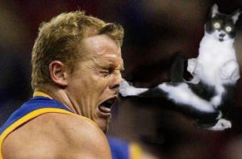

What happens when Texas Ranger and Hello Kitty tag team for a co-Q beat-down at Phoenix? ...

... a little Texas Kung fu kitty cat knockout.

It was wet when YHC rolled into Bond Park for Phoenix this morning. The rain was beating down on the entire drive there, but then on cue the rain let up as we started the workout, and it was a beautiful morning. YHC led the first half and Hello Kitty took over. Here's how it went.

Warm-up: SSH, Good Mornings, cotton-pickers, arm circles, plank jacks, and mountain climbers.

Thang 1: Starting at one end of the parking lot we began to bear crawl and at each parking line we did a merkin and proceeded that way from one end of the parking lot to the other. After that we moseyed over to the closest rock inventory and each grabbed a coconut size rock. Then, back at the parking lot we did bear crawl from one end to the other while rolling, pushing, or throwing the rock along. At the other end of the parking lot we switched to lunge-walking and holding the coconut up in the air back to the original starting spot. We then returned the rocks and did balls to the wall for a 10 count down the line.

Thang 2: We moseyed to the closest park entrance and formed three groups of three. Man 1 stayed at the entrance doing curbies and dippies alternating sets of 10. Man 2 and 3 ran down the long hill along the road where at the bottom Man 2 stayed to do jump squats and dying cockroaches while Man 3 ran back up the hill to switch with Man 1. We did this several rotations until it was Hello Kitty's turn to step up.

Hello Kitty then led us on a mosey through the park with intervening sets of exercises in sets of descending 10's. First set of exercises was curls and tricep presses with a non-traveling rock, starting at 10 reps each, then 9 reps, then 8 reps, then so forth down to 1 rep each. Mosey down to the famous kiosk and there did another descending 10 set with merkins and squats. Moseyed a little more over to a picnic shelter and another descending 10 set with left-right-step-ups and dips. We then moseyed over to the beach at Bond Park lake for a little reflection time on the work of Christ in our lives.

We then moseyed all the way back to the stop sign line where usually we do a Billy run back to the flag, but instead, Kitty had us lock arms and we ran back to the flag all together. Back at the flag, it was 7:30 on the dot.

COT: Announcements included April 14th the Bull happening; next Saturday F3 dads at Bond Park; in 3 weeks Chinese Downhill has the Q at Whiplash (also a prayer request). Prayers / Praises included Callahan's M expecting their second 2.0, Congratulations!

NMS: It was a lot of fun doing the co-Q with Hello Kitty. Makes me think that we should do more co-Q at AO's. It's also way to encourage newer PAX members to step up.

Also, Biner brought the weight-vest (extra 20 pounds of weight) and we passed it around between 4 different guys throughout the work-out. It really reminded me that we are called to bear each other's burdens. When one guy was about spent with the weight-vest another HIM grabbed it and carried the load. That's brotherhood; that's F3.
