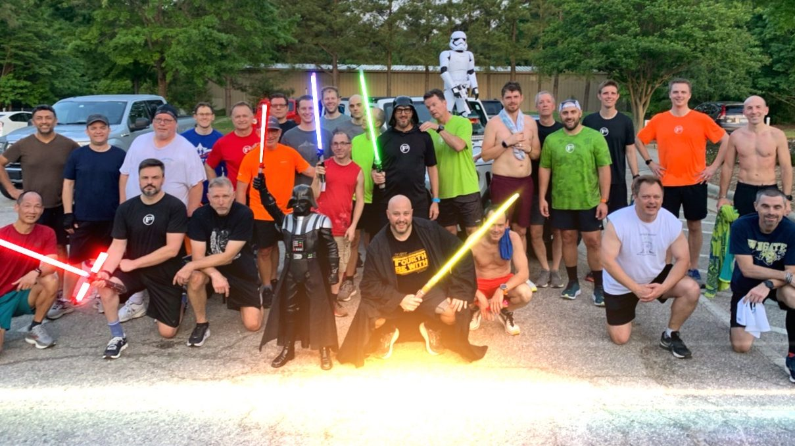
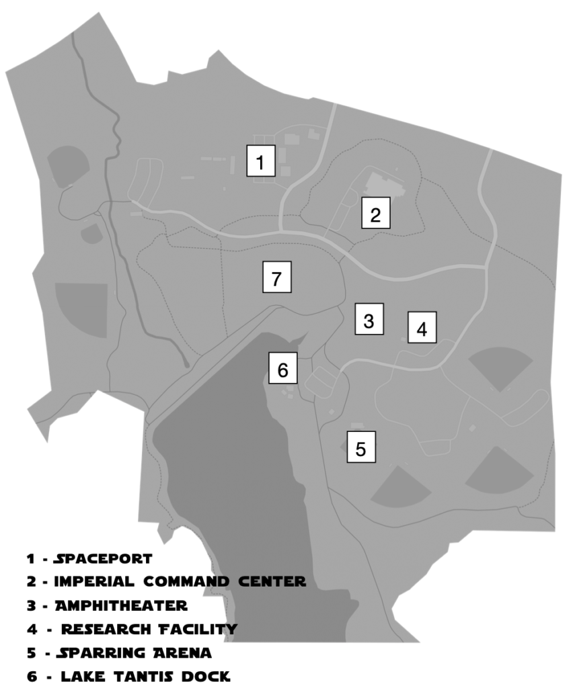
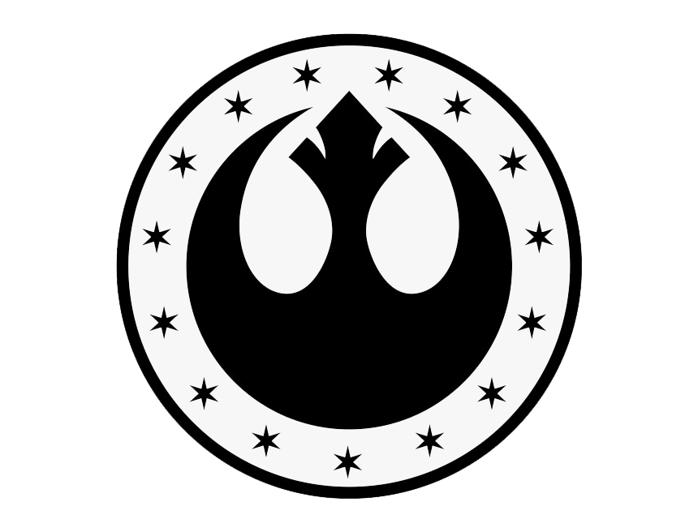
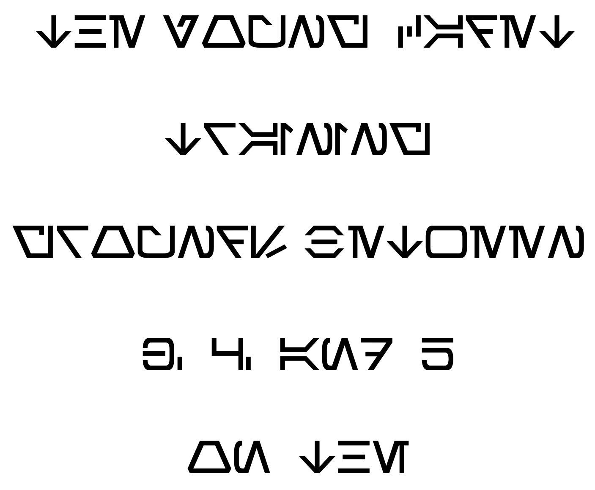
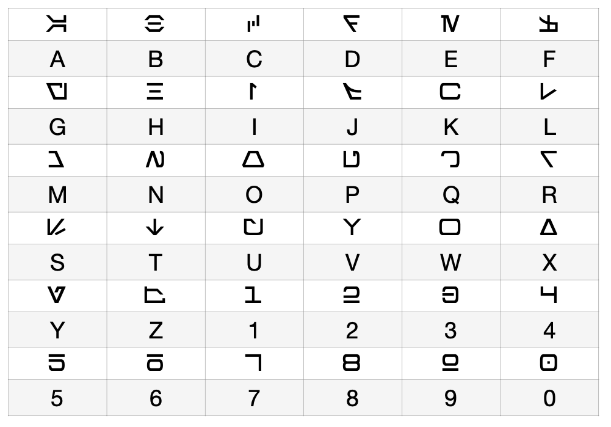
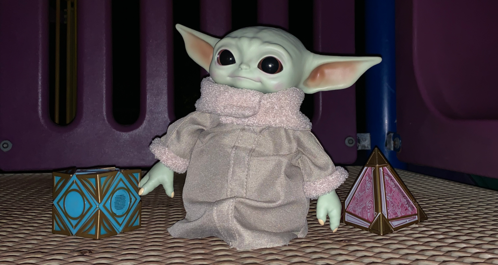

(This Backblast is long….)

**Pre-Thang**

**A Long Time Ago in a Galaxy Far Away….**

**May the 4th Be With You CARPEX Challenge**

**It is chaotic times in galaxy**. The Empire as fallen. The New Republic is moving fast to gain control of former Imperial facilities. Mon Mothma has charged the New Republic Eclipse Team travel to the planet Wayland, located in the Inner Rim, to lock down a former Imperial Research Facility. Intelligence indicates there are lost artifacts that are very important to Imperial loyalists. Eclipse Team must collect as many artifacts that before the get into the wrong hands. 

A elite Squadron of Imperial Troopers that have been dispatched by Moff Gideon, the leader of a remnant of the fallen Galactic Empire, intercepted the transmission on the New Republic’s plans. The Squadron is now heading to Wayland to secure the artifacts before the New Republic soldiers can get to them first. 

Moff Gideon has also placed a bounty for the artifacts and have hired two Bounty Hunters as a contingency plan. They are heading to the planet to pick up the score now. 

Who will secure the artifacts first? The Light Side or the Dark Side or maybe a Bounty Hunter will get his reward.

**The Thang (Cue Star Wars Montage)  
**  
PAX divided into 3 groups: Eclipse Team of the New Republic (Light Side), the Squadron of Imperial Stormtroopers (Dark Side), or two Bounty Hunters.  

Each Team chooses a leader that is responsible to read the first mission report that leads to another clue and a task, then another, etc.  Each Team had to use the following map:

**The Light Side Mission Log**  
  

START: Welcome to the LIGHT SIDE!

The Galactic Republic has fallen and the Empire is on the rise. You are a new Soldier of the New Republic Eclipse Team sent by Mon Mother to secure the former Empire’s Research Facility on Wayland. 

You first objective is to secure as many “artifacts” that were lost. This is top priority before any former Empire sympathizers get their hands on these valuable assets! 

Beware! Not only do you need to watch out for the Troopers but watch out for Bounty Hunters that are looking for these artifacts for themselves. 

Use your map to start your Mission and as a reference moving forward. Now as a Unit move on to the _Amphitheater (3)._ 

Amphitheater (3) 

You are standing where Emperor Palpatine himself would come and meet with the scientists and those stationed at this Research Facility. Can you feel the Dark Side? Don’t idle here long. 

Back to the task! Intelligence suggests that there is an elite group of Storm Troopers on planet lurking around the facility. Stay sharp! 

Line-up the Soldiers and and perform 20 Han to Leia (Homer to Marge weighted) and 20 Force Irkins (Irkin with a push-up in air then down) Repeat each x3 

Great job! Search the area to see if an artifact was left behind.  
  
Troopers are nearby. Scare them away and have the Soldiers make a lot of noise while doing 50 Jawa Humpers (Monkey Humpers). 

Head to the _Lake Tanis Dock (6)_ meet-up with the Ghost Team to secure the dock. Be careful. This facility is too quiet! 

Lake Tanis Dock (6) 

Ghost Team is no where to be found. 

This area has seen a lot of tragedy. The Empire used to send their test subjects to their death in these waters. 

The waters are too calm. Be alert and prepare the Soldiers for any sudden battle. 

Have the Soldiers do Chewbacca Walkers x 20 OYO (beat chest, down to plank, merkins walking to the right, up and beat chest, down for merkins to the left, thats 1) and 100 Skywalkers in cadence (Flutter kicks). 

After the Soldiers are in order, retrieve the artifact and move on to the _Research Facility (4)._ 

Research Facility (4) 

The Imperial Troopers were just here. There must have been a battle with the Ghost Team here. You can smell the burns on the walls from blasters. 

Stay nimble! Have the Soldiers do 10 Jedi Merkins (Merkin with a push up in air then down) then 10 Boosters (Dips), then 20 Trooper Marches (Step-Ups) Repeat x3. 

Look to see if there is an artifact that was left behind. 

Your intelligence droids just informed you that there is movement around the old _Sparring Arena (5)_. Head to the arena and investigate. 

Sparring arena (5) 

No sign of the Storm Troopers. There must have been some malfunction with the intelligence droid. 

Nevertheless, your Team must to be ready for any battle. These are the same grounds were where Clone Troop 99 trained before they defected to the Rebel Alliance after Order 66. 

Line up the Soldiers beside one marker (Home base) and perform a Drill (7s) with Star Jumps on one side (Home Base) and then Sandcrawl (Crab Walk) to the other marker (First Base) and do Wookie Squats (Squat Jumps - you are trying to reach the top of Chewbacca’s head). 

After the Soldiers are in order, retrieve the artifact within the arena. 

Then head over to the old _Walker Yard (7)_ and see if there are any old Imperial AT-ATs or AT-STs that can help you move faster on your mission. 

Walker Yard (7) 

No sign of any AT-ATs or AT-STs or any speeders that could help you with your mission. 

There are signs that the former Imperial surface ships were here earlier are now gone. They must be on the move to secure the artifacts. 

It is going to be difficult to catch them. Prepare the Soldiers for battle. 

Have each Soldier AT-AT Walk (aka bear crawl) to the first hill and perform 20 TIE Fighters (right, forward), then AT-ST Walk (aka walking lunges) to the other bottom of the larger hill and then storm the hill. At the top of the hill perform 10 TIE Fighters (left, backwards). 

Turn around and repeat on way back to the start. Search for an artifact, collect it. 

Proceed to the _Imperial Command Center (2)_ and lock down the facility. 

Imperial Command Center (2) 

Secure the Command Center! 

Before you begin your mission, gather the Soldiers and perform the following training: One Soldier at at time Kessel Run (Sprint to one cone and turn back and Sprint back to the starting cone). Have the other Soldiers do Imperial Walkers until it is their turn to perform the Kessel Run. 

Find the artifact! 

Have each Soldier grab a Rock or two and walk around the smaller Canopy (Pickle) and have the Soldiers use their rocks to perform Force Pushes to the Sky (Shoulder Presses) around the Canopy (Pickle). 

Head back to the _Spaceport (1)_ and lock down the ability for any Troopers to escape and meet with your Legion and handoff the artifacts that you have found. 

Spaceport (1) 

Great job Soldiers! There is intelligence that there is a _Jedi Holocron_ on the Planet that has been lost. The rest of the message could not be deciphered. 

Decipher the code and go retrieve the Holocron and get it back here! 

THE HOLOCRON IS LOCATED AT... 

  

  
**The Dark Side Mission Log**  
  

START: Welcome to the DARK SIDE!

The Empire has fallen. As a loyal member of the Imperial Army it is up to you to and the rest of your Legion to secure as many artifacts that remain in the galaxy. Your elite Squadron of Imperial Troopers have landed on Wayland, a planet in the Inner Rim, at an old Imperial Research Station. You have been tasked by Moff Gideon to secure as many “artifacts” that were lost. You must do this before the the New Republic can get their hands on these valuable assets!

Beware! Not only do you need to watch out for the New Empire but watch out for Bounty Hunters that are looking for these artifacts for themselves.  
  
Use your map to start your Mission and as a reference moving forward. Now as a Squadron move on to the former _Imperial Command Center (2)._

Imperial Command Center (2) 

The New Republic is on the move. You must secure as many artifacts as possible before they take them.

Before you begin your mission, gather the Troopers and perform the following training: One Trooper at at time Kessel Run (Sprint to one cone and turn back and Sprint back to the starting cone). Have the other Troopers do Imperial Walkers until it is their turn to perform the Kessel Run.

Have each Trooper grab a Rock or two and walk around the smaller Canopy (Pickle) and have the Troopers use their rocks to perform Force Pushes to the Sky (Shoulder Presses) around the Canopy (Pickle). 

Then as a Squadron find the artifact.

Your intelligence droids just informed you that there is movement around the old _Sparring Arena (5)_. Head to the arena and investigate.  
  
Sparring Arena (5) 

No sign of the New Republic. There must have been some malfunction with the intelligence droid. 

Nevertheless, Imperial Troopers need to be ready for any battle. These are the same grounds were where Clone Troop 99 trained before they defected after Order 66. 

Line up the Troopers beside one marker (Home base) and perform a Drill (7s) with Star Jumps on one side (Home Base) and then Sandcrawl (Crab Walk) to the other marker (First Base) and do Wookie Squats (Squat Jumps - you are trying to reach the top of Chewbacca’s head). 

After the Troopers are in order, retrieve the artifact within the arena.  

Then head over to the old _Walker Yard (7)_ and see if there are any AT-ATs or AT-STs that can help you move faster on your mission. 

Walker Yard (7)

No sign of any AT-ATs or AT-STs or any speeders that could help you with your mission. 

There are signs that the New Republic surface ships were here earlier are now gone. They must be on the move to secure the artifacts. 

It is going to be difficult to catch them. Prepare the Troopers for battle. 

Have each Trooper AT-AT Walk (aka bear crawl) to the first hill and perform 20 TIE Fighters (right, forward), then AT-ST Walk (aka walking lunges) to the other bottom of the larger hill and then storm the hill. At the top of the hill perform 10 TIE Fighters (left, backwards). 

Turn around and repeat on way back to the start. 

Find the artifact, collect it, and proceed to the _Research Facility (4)._  
  
Research Facility (4) 

The New Republic were just here. There must have been a battle with the left over Troopers that remain at this facility. You can smell the burns on the walls from blasters.

Get ready for battle. Have the Troopers do 10 Jedi Merkins (Merkin with a push up in air then down) then 10 Boosters (Dips), then 20 Trooper Marches (Step-Ups) Repeat x3. 

Look to see if there is an artifact that was left behind. 

Retrieve it and then move to _Lake Tantis Dock (6)_ and meet-up with the 122nd Squadron to secure the dock. Be careful. The area seems to be crawling with New Republic Soldiers. 

Lake Tantis Dock (6)

Oh No! The the 122nd are not here. 

Something must have happened. The New Republic must have captured them! 

Get ready for Battle. Have the Troopers do Chewbacca Walkers x 20 OYO (beat chest, down to plank, merkins walking to the right, up and beat chest, down for merkins to the left, thats 1) and 100 Skywalkers in cadence (Flutter kicks). 

After the Troopers are in order, retrieve the artifact and move on to the _Amphitheater (3)_.  
  
Amphitheater (3) 

You are standing where Emperor Palpatine himself would come and meet with the scientists and those stationed at this Research Facility. Can you feel the Force?  

Back to the task! 

Great job so far finding the artifacts! Time is running out the facility is starting to be surrounded by the New Republic! We need to get out while we can.  

Line-up the Troopers and and perform 20 Han to Leia (Homer to Marge weighted) and 20 Force Irkins (Irkin with a push-up in air then down) Repeat each x3

Great job! Find the artifact!

New Republic soldiers nearby. Scare them away and have the Troopers make a lot of noise while doing 50 Jawa Humpers (Monkey Humpers).

Head back to the _Spaceport (1)_ and get off this planet with the artifacts!

Spaceport (1)

Great job Troopers! There is intelligence that there is a Sith Holocron on the Planet that has been lost. The rest of the message could not be deciphered. 

Deciper the code and go retrieve the Holocron and get it back here before the New Republic Soldiers find you!

THE HOLOCRON IS LOCATED AT... 

  

  
**Bounty Hunter Mission Log**  
  

START: Welcome to Bounty Hunter!

The Galactic Republic has fallen and the Empire is on the rise. You have arrived on Wayland, a planet in the Inner Rim. The New Republic is moving in Soldiers to take over this former Imperial Research Facility.

There is a bounty for “artifacts” that are in the planet.  
  
As a Bounty Hunter it is your job to retrieve at least 2 artifacts.

The only way to do this is CHALLENGE a team of either Imperial Storm Troopers or New Republic Soldiers.

You can only confront each team twice.

You can challenge them to a Dual (a workout that you and only ONE of the members of their unit will perform - e.g. who can do 50 burpees the fastest.)

The challenge MUST be HARD! (e.g. 50 burpees not 20)

There is also another Bounty Hunter. Challenge him when you pass him to Sabacc (ROSHAMBO - loser does 20 burpees)

Good luck! This is the Way!

Once you obtain the artifacts then come back to the _Spaceport (1)_ and get off planet.

Bounty Hunter - 2022 - Final

Spaceport (1)

Great job Bounty Hunter! There is a new bounty on a special asset on the Planet. The bounty message could not be fully deciphered.

Deciper the message and go retrieve the special asset and get it back here and get off planet!

THE ASSET IS LOCATED AT... 

  
  

* * *

<figure>

<figcaption>

DECODER SHEET

</figcaption>

</figure>

* * *

## THE WINNER IS…

The **DARK SIDE..**.and Banjo the Bounty Hunter (sort of)..

The Dark Side Team came back to the Spaceport with 5 of the 6 artifacts. However, they did not finish the mission and find the Sith Holocron.

Banjo the Bounty Hunter captured 3 artifacts (2 from the Light Side and 1 from the Dark Side). However, he did not finish the mission and find the Asset.

If the team's could have deciphered the message (time ran out) they would have found where Grogu was hiding and protecting the Holocrons.

<figure>

<figcaption>

The Jedi and Sith Holocrons being protected by Grogu.

</figcaption>

</figure>

**Leia** **Mary:**  
Incorporated in the Thang.

**COT:**  
19 PAX

Announcements:

- Check Slack.
- Phoenix needs Site Qs! Message the Nantan and 1st F Qs.
- 2nd F on this Saturday - F3 Pub Crawl Ruck

**NMS:**  
This was my 2nd year putting together the May the 4th Carpex Challenge. I hope the PAX had a good beatdown that was different from the usual. I think I need Flacco as my co-lead on this event.  
  
If you didn't get any Blue Milk, you're missing out. Also sorry no pancakes this year. There wasn't a place my Griddle would plug into.

> “It won't be easy. There will be loss and sacrifice. But we can't back down just because we're afraid. That's when we need to stand the tallest…Stand up together. Because that's when we're strongest—as one.” – Ezra Bridger

**May the 4th Be With You. Always.**
