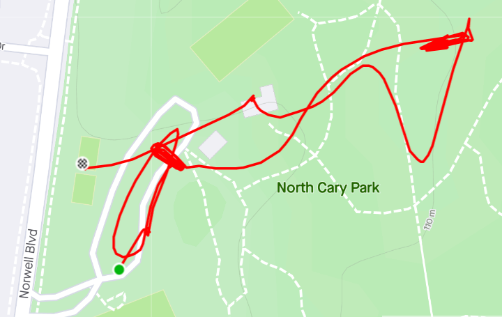

**AO:** Danger Zone (duh)  
**Workout Date:** 05/21/21  
  
Danger Zone was the first Carpex AO that YHC ever posted, way back in October 2017. I had started posting with my 2.0 BOOM! (7 years old at the time) since he was usually wide awake at 5AM. We ran into Burt at The Forge and he encouraged us to come check out his Q that week at DZ. In preparation for my Q, I dug up Burt's old Backblast (see NMS) and had a good laugh. I shared it on Carpex Slack to encourage the mood and even bounced the idea off BOOM! of coming back out. Alas, the M says he "needs his sleep" now that he sleeps at 5AM. Maybe once school is on summer break...

**Warm Up:** (the mumble chatter did NOT require a warm up)  
Give the mission statement, check for FNGs, give the disclaimer, and warm up:  
Side Straddle Hop x20 In Cadence (IC)  
Good Morning x10 IC  
Imperial Walker x20 IC  
Sir Fazio Arm Circles x10 IC Forward x10 IC Reverse  
Monkey Humpers x10 IC  
Standard Merkins x10 On My Down (OMD)  
Mountain Climbers x10 IC  
Downward Dog with calf isolation stretches  
World’s Greatest Stretch

**Main Event**  
**1)** **Bearcrawl/Lunge walk 7s** (Hand Release Merkins and Star Jumps). Cobains to those PAX without gloves.  
**2)** Mosey to back field, since the soccer field was in an active sprinkler situation for field work. Partner up, one partner runs while other does AMRAP exercises. **Carolina Dry Docks, Flutter Kicks, Squats, Sumo Squats, Merkins**, others. Some PAX were super fast and I got thrown off my game a little trying to stay on top of everything. Thank you for pointing this out, Flip Flop.  
3) **Group sprint** the length of the field. Watch for uneven ground. Pierogi is faster than a slightly more cautious Callahan.  
4) Mosey back to picnic shelter and give PAX choice of shelter work or Dora in the parking lot. PAX chose shelter work. **10-15-10 pyramid of Left-Right step ups, Irkins, Dips, Elevated Crunches, and Derkins**. PAX appreciated that I counted an even 16 for LRSUs. PAX were amused by the elevated crunches. I mentioned I once misheard Yukon Cornelius call them old lady crunches. PAX dubbed them Little Gyno Crunches.

<figure>

<figcaption>

[https://www.strava.com/activities/5333347640](https://www.strava.com/activities/5333347640)

</figcaption>

</figure>

**Mary:**  
Freddy Mercury x20 IC  
Dolly x20 IC  
Homer to Marge x20 IC  
(maybe another one or two, I forgot, Cobains)  
Stretching: World's Greatest (again) with pigeon pose mixed in (unknown PAX advised others to hold their abs in so it would still be Mary)

**COT:**  
12 PAX  
Announcements: Chain Gang highway cleanup Saturday, Soccer led by 5 Hole on Sunday morning, Sawgrass Sunday afternon, JoCoGa tomorrow morning, Raleigh’s Memorial Day Convergence 0530 at Garner Station, F3 Wendell (on going) - check a map and see if you know anyone to EH  
Prayers for Tang and his family, others deployed/deploying. Prayers unspoken.  
YHC took us out

**Naked Moleskin:**  
Wow! I'm not sure I've ever had that much mumble chatter as Q (or even as a PAX). I was glad I could participate some. Don't forget to push on those Gynos!  
Burt's original backblast from 2017: [https://f3carpex.com/2017/10/15/boom-chicka-boom/](https://f3carpex.com/2017/10/15/boom-chicka-boom/)  
T-claps to Blowfish on his second post ever after FNGing Monday at North Hills in Raleigh. From one end of the spectrum to the other on mumble chatter.  
T-claps to Loom making it back out into the gloom!  
On-site Coffeeteria is always a win. Most stayed and chatted.  
I'm sure I'm leaving some more fun out.  
This was my forty-seventh #F3Q21 #2021Challenge Q. Next Q is Saturday (tomorrow) at The Farm in NE Wake.  
\-Pigpen

**QIC:** Pigpen  
**PAX:** Blowfish, Blowout, Burt, Callahan, Coney, Five Hole, Foie Gras, Flip Flop, Loom, Pierogi, Pigpen, Wreck  
**Workout Date:** 05/21/21
