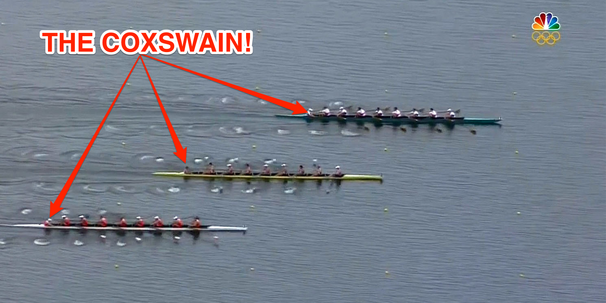
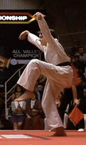

9/7/2017 Callahan, Coney, Goose, Parker, Katniss, Water Wings, (unknown), Smokey, Pet Sounds, Pickles, Disco Duck, Term Paper, Snots, Sosa, Chanticleer, Ma Bell, Dreamliner, Beaner, Earhart, Joe Smith, Angry Elf, Half, Coxswain

There weren't many TTs on TTT but there were 24 PAX that showed up to be lead by Coxswain with a quick start promptly at 5:45 over to the bank for warm-up.

Warm-up: This began with 15 Good mornings signaled in true Coxswain fashion with "STROKE!" rather than "down" or in cadence. Next was the Imperial Walker in cadence that started looking like the Hill Billy on the first few counts followed by 15 Daniel-Sons with arms raised like so:  but no wavy arm things (whatever those were)

10 Mountain Climbers (in cadence) Calf Stretch (10 count by Ma Bell because he was mumble chattering when I was picking who to count) Calf Stretch the other side (another 10 count by Ma Bell because it was convenient) 15 Merkins (in cadence)

Mosey down to the library and find a partner on the way for....

The main thang: Full Circuit - A series of 10 squats, 10 merkins and 10 LBCs in front of the library with partner (together and at the same time) followed by lunge walk from the light post to Charlie Gaddy Lane, run around the full parking lot to the other side of the library and lunge walk from the road to the second light post. Repeat the Full Circuit above reducing the number of each exercise by 1 each time. After completing the 6 count of each exercise the parking lot was cut from the run, shortening the run to just around the library but still reducing the count of each exercise.

In case the above explanation was confusing: 10 squats, 10 merkins, 10 LBCs, lunge walk, run around parking lot, lunge walk to center 9 squats, 9 merkins, 9 LBCs, lunge walk, run around parking lot, lunge walk to center 8 squats, 8 merkins, 8 LBCs, lunge walk, run around parking lot, lunge walk to center 7 squats, 7 merkins, 7 LBCs, lunge walk, run around parking lot, lunge walk to center 6 squats, 6 merkins, 6 LBCs, lunge walk, run around parking lot, lunge walk to center 5 squats, 5 merkins, 5 LBCs, lunge walk, run around library, lunge walk to center 4 squats, 4 merkins, 4 LBCs, lunge walk, run around library, lunge walk to center 3 squats, 3 merkins, 3 LBCs, lunge walk, run around library, lunge walk to center 2 squats, 2 merkins, 2 LBCs, lunge walk, run around library, lunge walk to center 1 squats, 1 merkins, 1 LBCs, lunge walk, run around library, lunge walk to center

Plank hold and 6 inches with arm raises and leg raises while waiting for sixes Circle up with 1 fire drill merkin called by Joe Smith

Mosey back to the church with a fire drill merkins called by YHC and 2 by Angry Elf. Billy Run then circle up at the flag for Boat/Canoes signaled again by "STROKE!" from the coxswain of the morning.

I didn't record whoever was between Water Wings and Smokey in the COT, sorry. Send me a message and I will add you.

Announcements: 9/11 Stair Climb Siler City F3 Starting 10/7 The Odyssey Shirt Orders 10/1 Q School at Bond Park, Time: TBD but probably 2 or 3pm

Prayer Requests: Anyone in the path of Hurricane Irma The guys competing in the BRR
