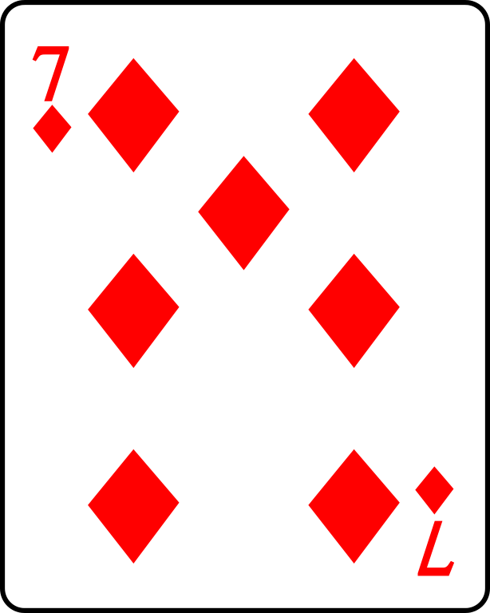

## **Diamonds Are Forever ... or Until You Need a Bathroom Break**

By the time YHC arrived on the scene we already had a police cruiser observing from a distance in the parking lot.  The Commish told him something that apparently made him believe we posed no threat, so he eventually left without hitting the siren.  All license plates are no doubt now on a watchlist, so score one for the PAX who parked offsite and ran it in.

No FNGs so let's go to the Pledge.

Warmup:

Mosey around the side of the deck to the top parking lot and circle up:

- 10 GM IC
- 20 SSH IC
- 10 \[Insert Your Favorite Object\] Pickers IC
- 1 move out of the way to avoid being run over by a car.  I know we are all excited that it is Friday, but props to my lady for getting to school at 05:37
- 10 Sir Fazio IC
- 10 Reverse Sir Fazio IC

We are probably loose enough, so let's mosey over to the upper deck.

Thang One:

7 of Diamonds - Run to each corner of the diamond and perform the stated exercise.  PUT6 or plank hold for the 6 after each round.

- Round 1 - 7 Burpees
- Round 2 - 14 Merkins
- Round 3 - 21 Prisoner Squats
- Round 4 - 28 Mountain Climbers
- \*\* Site Q disappears to take full advantage of the home field facilities \*\*
- Round 5 - 21 LBCs IC
- Round 6 - 14 Homer to Marge IC
- \*\* Site Q reappears \*\*
- Round 7 - Diamond Merkins OMD

This thang taught us that Chicken Little has some counting issues once we hit the teens (shout out to our host Apex HS) and that allowing Pet Sounds to count reps is not a recommended option.

The last time YHC was on the Q, Hello Kitty skipped all of the exercises and just showed up for COT.  This time he only missed a portion of the action.  I feel that we are making progress in our journey together.

Thang Two:

Split into two teams for an Indian Bear Crawl across the length of the parking deck.  Based on the amount of chatter this generated it seemed to be a crowd favorite.  I expect a number of PAX will adopt this and make it their own.   

Bear Crawl OYO back to the starting point and then a mosey back towards the flag.

Thang Three:

A most unsuccessful attempt to close out with Thunderstruck.  YHC thought there would be sufficient volume on his iPhone to pull this off, but apparently Steve Jobs never thought through this particular scenario.  YHC was so focused on doing some Burpees that he actually allowed Old Maid to place his phone in a discarded Bojangles cup from the parking deck in a failed sound amplification experiment.  That is pretty disgusting and likely not in line with CDC protocol.  Nothing left to do but audible to 20 burpees OMD.

A quick Mary with Dying Cockroaches and Freddy Mercs.

COR and NOR

Announcements:

- Krispy Kreme Challenge registration is open.  Sign up for F3 Carpex Team - password "Carpex".
- Thanksgiving morning will be an AO convergence in downtown Cary led by Hello Kitty (bathroom needs permitting).  The workout will be followed by a football game and excessive drinking in Burt's driveway, not at the same time.  More details to come on the latter events.
- Oakwood 24 Hour Run to support Healing Transitions is coming up on December 21 / 22.  If you want to find out more about donations to benefit HT or about running part of the time with Frey Daddy just check in with Banjo.

Prayers and Praises

Thought for the Day - _“Everything you’ve ever wanted is on the other side of fear.”_ - George Addair.

YHC took us out.
