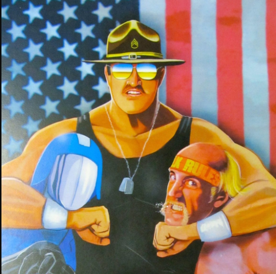

Seeing Ausfahrt you might think "Wow, that guy is so lazy, he never runs anywhere". But while lazy may be true for his personal hygene when it comes to working out the guy is tough as nails.

Some of the newer guys may not know his story. Not long ago he was riding his motorcycle when he was hit by a truck (I think it was a half-ton truck, too!) He was pretty torn up. (No, his face always looked like that, it wasn't because of the accident) That he is still alive is a miracle, in the ambulance for a few seconds I think he wasn't.

Months in the hospital, multiple surgeries, they put so much metal in him that he periodically has mining companies chasing him like paparazzi. Eventually, he was ready for physical therapy to get from the wheel chair to walking again. Anyone who has done P.T. knows it is grueling business. Ausfahrt, true to form, got bored on his "rest day", went down to the PT center and razzed the staff until they let him do more PT. Tin2Iron, baby.

In F3, we pick up the 6. We leave no man behind. So PAX dropped in on Ausfahrt to keep his spirits up. I went with Squatter and Deuce so it seemed only fitting to bring out an exercise I came up with during the lockdown named to annoy Squatter. I wasn't sure how I could get Deuce into the mix but luckily Hello Kitty took care of that by leaving after his EC run to drop a deuce then come (eventually) back for the main event (TYFYL, HK). Here's what went down.

Pledge

Warm Up  

The Thang:  
Sargent Squatter is a multi-series exercise so I introduced it in stages. We did an exercise of Sarge (5x) times for practice, then did the Sarge we'd built up to that point (5x) times, then added the next exercise (5x), and so on. By the end it really sucked which was the goal.

Here is a Sargeant Squatter:

Squat Down  
Bear Crawl Forward to plank  
Merkin  
Shoulder Taps (or if the ground permits, down to chill cut one elbow at a time, then back up)  
Merkin  
Mountain Climbers  
Bear Crawl Back  
Squat Up

(You can kick it up by increasing the amount of merks, taps/chill cuts, and mountain climbers during the exercise.)

I interspersed some yoga in between the builds since T2I is the ultimate IR, so why not mix some flexibility work in with the strength work? Why just pause for a 10 count when you can keep the body moving with some stretching or yoga positions?

We also interspersed PAX choice Mary through the builds. Thanks to Kitty for the cannon ball Mary (like a boat-canoe except on canoe you push out all your limbs like you caught a cannon ball in the gut). Thanks to Tang for Banana Supermans (I don't even know how to explain those but they're fun.)

I also outsourced a couple of Squatter reps out to the PAX so I could make sure the Sarge would be remembered. Then I made the mistake of calling on Chewie who called 7,000 squats. (He was still doing them when we left.) Kitty led his penalty burpees with a wolverine burpee finisher.

Count-o-rama: 2 Respects, 11 Mehs

Announcements: None came to anyone's mind.

Prayers/Praises: WWW praised me for Q-ing T2I but if you truly believe in PUT6, then get then Q a Claymore, Tortoises, HB or T2I. Get in some EC in early if you're worried about hitting your daily step count. Or make the workout tough enough that you'll wish it wasn't limited / no run.

NMS:

I am known as a man of few words. It was great to lead today.
