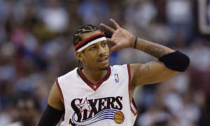

YHC arrived a few minutes early, excited to Q in the gloomiest gloom in Carpex on a Friday morning. I looked around and didn't see a guy in a hockey mask with a machete, but I did see an FNG named Daniel, so he got the F3 disclaimer. As we got closer to 0545 I saw lots of PAX but no site Q's. Finally Oofta rolled up, but without the flag. We let it slide because I brought the Rush Hour flag, and he brought coffee. Time to get after it!

**Warm-Up**

Mosey down to Crescent Green to the parking lot next to the parking deck and circle up for side straddle hops, imperial walkers, Sir Fazios and cotton pickers.

**The Thang**

Mosey over to the bottom level of the parking deck and line up at the first pillar for 4 x 4's. Run to the second pillar, 4 merkins, run back. Run to the third pillar, 8 merkins, run back. Run to the fourth pillar, 12 merkins, run back. Run to the fourth pillar, 16 merkins, run back. Repeato with squats, American hammers, Carolina dry docks, dying cock-a-roaches, squat jumps, star jumps and plank jacks. Recover between rounds with BTTW, people's chair and planks.

Mosey back out to the parking lot and circle up for 10 burpees OYO.

**Mary**

Fellowship mosey back to the flag and circle up for Freddie Mercurys, LBCs, Homer-to-Marge and Have A Nice Day.

**COT**

**Count-a-rama**:  14 **Name-a-rama**:  2 RESPECTs, 12 meh, 0 HATEs **Prayers / Praises**:  No specific prayer requests, so we prayed to be better men who go out in the world and shine the light **BOM**:  YHC took us out

**NMS**

Welcome FNG Practice! He's a Philadelphia native sent our way by Jimmer from F3Raleigh. 

The mosey from the flag to the parking lot is way too long for a warm-up mosey. I've since been told there's a short cut, I'll have to look into that for next time.

The PAX were ready to bet cash money on the last round of 4 x 4's being burpees. Everyone (including YHC) was glad to do plank jacks instead.

I had planned on doing just four rounds of the 4 x 4's, but I was having so much fun I didn't want to leave.

YHC missed the turn on the way back to the flag. Thanks to the rest of the PAX for getting us back on course.

Great job by the PAX picking up the six today.

Earhart suggested moving the start time back to 0530. So keep an eye on that.

Coffee with Oofta, it's a thing.

It's an honor to lead this group of HIM.
