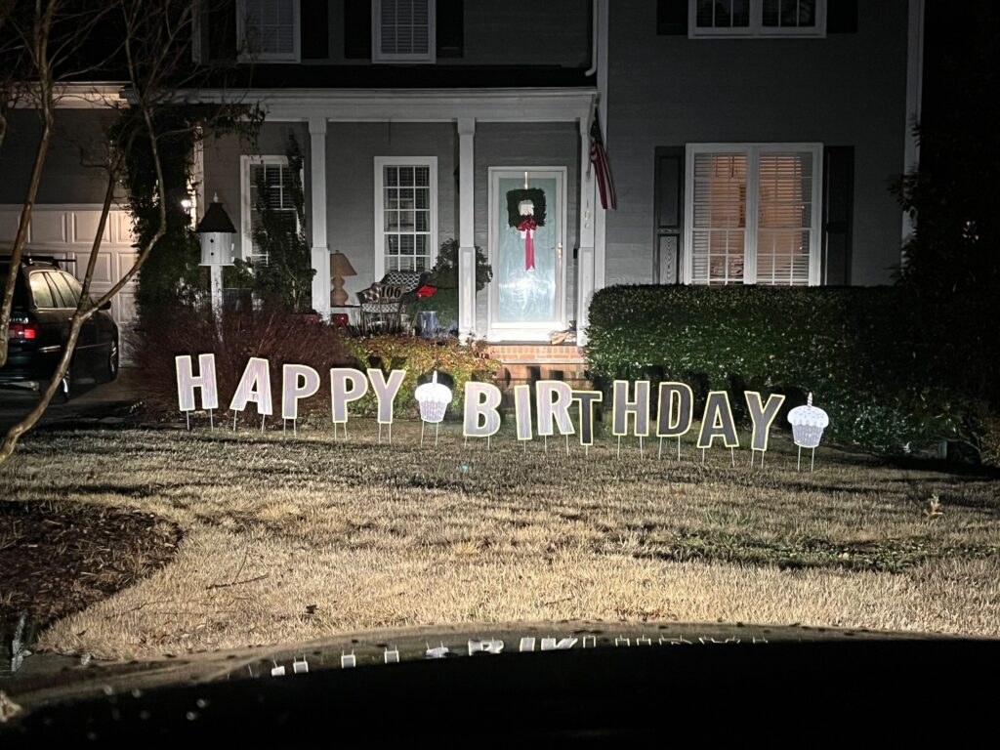

<figure>

<figcaption>

As seen in YHC's front yard

</figcaption>

</figure>

50\. 50 years old. Damn. I remember when my Dad turned 50. The next year, he retired. I am NOWHERE near being able to do that.

I've been terrible at Qing and even posting in the past few months. Haven't posted more than 3 days in a week in a long time. So, I put a challenge out to myself; Q every day during my respect birthday week. Dodging Covid, crazy work schedules, holiday travel, weather, etc., (I mean, how crazy can NC weather be in January?), and the recent Peak City expansion, where I had to make sure my Q-sheet takeover made the jump, here we go.

**Day 1: A-Team, where it all began for YHC**

0535, arrive onsite, right behind CheddarBo who was unlocking the gate. Remembering way back when, when we drove into the park, and parked by the tennis courts. And then parked outside the park in the nice lanes. Only to have those overtaken by bike lanes. And now we're back inside the park, but not at the old new location, in the new new location. That pin drop has been changed more times than Frisco's Slack handle.

0540, Two Factor and Charmin slide in. Then there's WKRP! Poncherello, Snots in his new car (did you know he got a new car...last YEAR? <facepalm>) ChopBlock in the badass Jeep. And there we are!

0543, YHC blasts through the F3 mission, Qdrenaline sets in (I _think_ we did the Pledge? If not, stop reading and stand up and recite with me...)

0545 4 bootcampers set off, and Charmin jumps in with Chop Block and WKRP as they circled the park.

**First** stop was a lap around the upper pickle (complete with slalom through the cones...no Two Factor, we ARE NOT climbing on the mulch pile), then a stop for some GOOD MORNINGS, and some Imperial Walkers, followed by some nice leg stretching (plank into runner's).

**Then** a trip down Powerline hill and back up, followed by 10 Abe Vigodas IC, with great discussion of Barney Miller and Abe's service in the Army in WWII.

**Then** a run down the speedbump hill where we almost got run over by a 3-headlight car, followed by a stop at the original flag location for 25 SSH IC, then 25 Mtn. Climbers IC (pax knew we were going to 50). Believe we threw in 10 Standard Merkins there taboot.

**Next** a trip to the basketball court for some partner shuttle runs to all the lines while we did People's Chair, Shoulder Taps, WWIIs (nod to Abe), and BTTW. Discussion on who used to call the fence BTTWs all the time...Large? Hermes?

**Then** down to the lower shelter for a Lunge Walk 1-2-3. P1 lunge walks to the upper shelter, slaps the table, the lunge walks back to the lower shelter, while we're working through 100 merkins, 200 squats, and 300 LBCs. After several rounds and everyone completing the exact number..amazing...we set off around the lake path, discussing Cub Scout nature walks, Riptide's recent Bald Eagle sightings, and other such topics. At the bottom of Powerline hill, we finished off our other 25 SSHs, then ran up the hill to finish off our other 25 Mountain Climbers. Ruckers came by, and we followed them for a bit as we made our way back towards the front of the park.

**Arriving** back at the upper pickle lot, we got on our 6 for some Freddie Mercury's IC. 50 of them to be exact.

**Ran** a pickle lap, then back for 1 SidePlankStarCrunch left, 1 SidePlankStarCrunch right, then 10 BoxCutters. (whole lotta "HiLiter's not even here!) YHC's big old Q fail was the premature Have A Nice Day in the upper lot, to which the pax politely reminded this geriatric doofus that the flag was back where we parked.

**COT:**

Returning to the PROPER flag location, we finished up with a countarama and namearama. YHC was wished a happy birthday in enthusiastic fashion, Poncherello was freezing, and coffeeteria plans were firmed up.

**Praise/Prayers:**

Praise to all you guys for keeping this fun, keeping me active mentally and physically, as well as spiritually. Praise seeing Charmin out a few pounds lighter from his appendix, praise for you all for answering the call to the gloom this morning.

Prayers asked for my Dad Ashley as this may be his last treatment trial for Myelodysplastic Syndrome (a form of leukemia). He started another (last?) trial therapy today, where a month's supply of120 pills cost $15,000 (with total cost being covered by his insurance and a grant from UNC (praise!)

**NMS:**

Funny what you think of during a workout. "Is everyone having fun? Am I doing this right? Did I forget what I was doing? Do we have enough time for that? Can we get back in time? Is this hard enough? Too hard?" The beauty of F3 is, the pax will give you feedback, verbally or not. And sometimes they won't, and if they don't, that's cool too. It was great being with a small group this morning. It was gloomy, quiet, I could focus on being present with everyone. And for 45 minutes, we forgot about new regions, new Slacks, where the backblast might end up, etc., and just got better together.

I wish I could've been in 2 places at once to hear what the ruckers/walkers were discussing, but I know I was having fun with the 3 pax around me. We discussed the competing AOs to A-Team on a Monday now, but I encourage folks to keep coming out to A-Team. It's so full of features. Beautiful. Peaceful. You don't have to worry about waking folks up.

As I was getting ready to depart for ACP this morning, my wife texted me the following message: **"R-E-S-P-E-C-T! Have a great birthday workout with the F3 crew.** 😘" Before I was even up, my Dad texted me: **"50 years ago today, we were up this time of the morning getting ready to go to the hospital. It was cold and snow was on the ground. let's see how this one turns out. The other was a great success. Have a Happy Birthday Bill!"**

Those two messages made **my** day.

Now go Make It A Great Day!

Old(er) Maid

Strava Link: (note video namearama in the activity summary)

[https://www.strava.com/activities/8362908700](https://www.strava.com/activities/8362908700)
