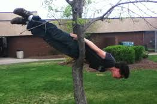

I'd run out of vacation time to get outta town and excuses not to VQ so here we are… Little did I know Dante's would be hosting the Chipolte Qvergence in support of our brothers Liverpool and Water Wings trip to Peru. 43 HIMs posted on a fine spring morning in February, 3 FNGs taboot!

Disclaimer and Pledge. Following the Dante's Peak tradition we mosey down the circle for warm ups, we hardly fit… nice!

**Warm Up**  
SSH, Sir Fazio Arm Circles both ways, the Chinook, Moraccan Nightclubs… . MC is in full force, thankfully some latecomers as well… 10 burpees OYO…  
Good mornings… windmills…  
Sweet! Here comes Burt and Coney (bridge out = burpees) 10 more burpees OYO…  
Let's start with the theme of the day, the Plank simple but effective…  
We clean the floor with Annies and then mosey over to pitch.

**Thang 1**  
Partner up  
P1 does inch worms across the short side of the field. P2 BTTW which Crimson says will take too long…. Yep, he's right… audible to halfway across and on we go…

**Thang 2  
**Run to the top entrance of Apex Nature park, stopping at the "No Parking" signs along the way for 10 Mountain Climbers incrementing by 2 at each sign. PAX found a couple of extra signs to do MCs at YHC questions their reading skills. By now we're spread out across half of Apex… time to re-group…

**Thang 3  
**Plank Circle - 3 minutes is the goal… bail out at 1 minute = 10 burpees… bail out of 2 minutes = 5 burpees. Nice work to many for making 3… Do I hear 5 minutes for next time?

**Thang 4  
**Break into groups of 6ish… 1st person chill cuts at the first parking space, 2nd person at second, etc… Indian hurdle across the lot to the pavilion for thang 5… nope, no time and we wouldn't have fit anyway.

Mosey back to the flag via Bear Crawl bridge (apparently also a Dante's Peak requirement) Shut-In correctly gauges the PAXs reflexive nature as half of them Bear Crawl anyway. We do American Boxcutters (oops) while the bears finish their crawling.

**Mary**  
ABC's - CHIMBOTE!  
Boat/Canoe  
62's (pending exicon approval, it's like 100's but the Q fades in cadence till you get to 62)  
Have a Nice Day

**COT  
**Welcome FNG's - Rowlf, Wells Fargo and Extension Cord

4th Annual F3SouthWake CSAUP Long ASS ATT run.  
Saturday, February 9th  
Multiple distances and starting points - see Slack #carpex-running

**TAPS**  
Liverpool and Water Wings head out for Chimbote today  
Crimson's Father in Law  
Sosa's M - 40 weeks

**NM's**  
That was fun… Qdrenaline is real, 45 minutes goes quick!  
Carpex knows how to show up and support each other, true HIMs.  
Dantes Peak has something for everyone, there should be people lining up to Q here for weeks (or at least next week)!
