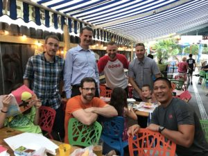
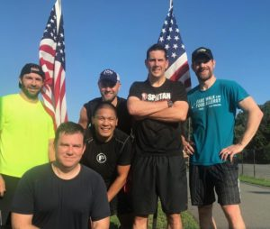

Six months ago, when Crotch Rocket (certainly a name that does **not** comply with modern F3FNG naming standards) visited CARPEx EH'ing guys to help with Expansion efforts to DC, YHC thought "This will be fun!" and volunteered.

Four months ago, when sitting in a hotel room in London at midnight talking with Major Payne about plans for The Capital region, YHC thought "This will be fun!" and reserved a bunch of twitter handles and web domains.

Two months ago, when Arlington launched with more than a dozen PAX posting Day One, YHC thought "This will be fun!" and circled July 14 for soft launch in Fairfax.

And then this month, when Fairfax opened at Lake Braddock, YHC thought "This is fun!" and made plans to come up, Q and support the DC PAX on the 28th.

And YHC was right. It has been a blast.

But getting up there and **meeting** the guys I've talked to for months and **seeing** faces I hadn't yet seen was something else. You know that feeling when you see old friends from your college days and it's like no time has passed? Kind of like [this](https://themuggo.com/2018/07/03/fratres-ad-vitam/) from my man at TheMuggo? Well, getting up to DC and hanging with the DC crew was exactly like that... except I'd never met or seen or hung out with those guys before. And yet, you slide right into conversations like you've been having them for years.

#### First the 2ndF:

The M and I drove up from Cary Friday afternoon. Seeing that door to door is supposed to be 4 1/2 hours, we left right around noon, expecting to drive up, check in, drop off the dog and get to HH with plenty of time to spare. 6 hours later, I'm texting Hightower telling him not leave before we show up. Parking and running through the rain, I'm just hoping I actually recognize someone.

Shouldn't have worried! 8 PAX (Shamrock left early... Maj Payne showed just after this photo was taken), a couple M's and tons of 2.0s enjoyed a solid couple hours of camaraderie.

YHC was even able to score a ride to the Q in the morning, making sure no Uber drivers would be frightened by the sight of a dude with a shovel and flag standing outside a hotel in the gloom. This is DC after all.... suburban DC but close enough.

#### Then the 1stF:

Jenner and Major Payne picked YHC up at 6:15 to make sure there was plenty of time to survey the surroundings. And it's a good thing we got there early. #MtOlympus is YUGE! We planted the flags and waited for the others to show.

At 7AM shart, and with 6 PAX on site, it was time to get started.

##### Warmup

Round the pickle, keeping an eye out for any FNGs or late arrivals. There being none, we circle up for:

- 15 SSH
- 15 GM
- 15 standard merk... Car incoming! Move out the road!

Continue said merkins and some other stuff on the sidewalk.

##### Thang

Form 2 lines of 3 each and Indian Run to the back baseball fields. (See below for execution)

Getting to the prestine baseball field at the back of the complex, YHC finds the first gate to be locked. No worries, let's check out the back. DC PAX start grumbling something but YHC is confident... To no available. All gates are locked and there's not way to pretend that YHC meant to run around the diamond anyway. Time to own up to cluster-Q and double back to the other field where they apparently filmed "The Sandlot". Great film... not a great field.

* * *

Partner up and proceed with a Diamond Dora. Bear crawl to 1st base, lunge to 2nd and mosey home while as a partnership you complete:

- 100 burpees
- 200 LBCs
- 300 squats

Plank it out and 10-count around the circle before...

* * *

We mosey back to that pristine astroturf field we passed earlier. Finding a corner not covered in goose crap we work the core.

Partner 1: Zombie crawl to the second white line Partner 2: AMRAP Freddy Mercury / Hello Dolly / Box Cutters

Flip flop and continue. When done, plank and count before...

* * *

Moseying over to the stairs heading up to the track. Olympus lite?

Partner 1: touch every stair going up ... and coming down Partner 2: star jumps / sumo squats

Take a breather and head back up for ...

##### Mary

Circle up with a beautiful view of the area.

Call your exercise. YHC remembers a deconstructed and swaying boat/canoe that still hurts. Plus some WWII, American Hammers, Flutter Kicks. Superman to close it out.

##### COT

- Started with 6. Ended with 6
- Major Payne, Hightower, Early Bird, Jenner, Sinker, Pierogi
- Announcements: working on filling out Ragnar... Rucking opportunities
- Prayers: Major Payne traveling with the family; prayers for leadership

Coffeeteria at Pete's afterwards. Solid #2ndF to close.

##### NMS

- The guys of The Capital don't seem to either be down with the Indian Run or tire of it quickly. We got maybe a couple rotations in and it stopped. Maybe YHC explained it wrong? Something to work on.
- The Zombie Crawl was a hit... and painful taboot. The guys loved it. Thanks @theismann.
- Great weekend in DC with F3. Solid group. Looking forward to watching it grow
- FiA in Alexandria growing quickly as well. The M had a great time. They posted all over NextDoor and quickly go to over a dozen... need to do the same
- Looking forward to coming back.
