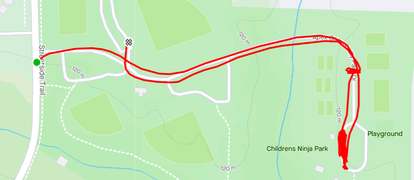

**AO:** A-Team  
**Workout Date:** 06/07/21  
After Slippery When Wet on Friday, I verified with site Q Henny Penny that A-Team was, indeed, a standard boot camp.  
  
The A-Team was one of my favorite television shows when I was growing up. I really wanted to have some inspired routines for this. The first one came pretty easily, **B**urpee-**A**merican Hammer Elevens for the A-Team's master mechanic, **B. A.** Baracus. Solid! What exercises could I come up for Hannibal, Faceman, and Howlin' Mad Murdock?... Well, let's see... MurDOCK... Carolina Dry Docks... MURdocks...MUR...der bunnies? Murder Bunny Dry Docks? That sounds like a nightmare. I promptly escaped those thoughts about as quickly as the A-Team escaped that maximum security stockade in 1972.

**Warm Up:**  
My plan was going to come together, but it had already morphed a few times before warm ups.  
"Show up early for 3 miles of extra credit" became "Snooze and show up in time for 1 mile EC" became "Hey I'll show up with five minutes to spare" became "Holy crap I forgot my shoes again I'll never make it" pretty quickly.  
YHC rolled up with 30 seconds to spare and dropped right into the mission statement and disclaimer.  
With Slippery When Wet still on my mind we went straight into a mosey all the way into the park for warm ups. Totally forgot the Pledge and left our walkers in the dust.  
  
Side Straddle Hop x20 In Cadence (IC)  
Good Morning x5 IC  
Imperial Walker x20 IC  
Sir Fazio Arm Circles forward x10 IC, reverse x10 IC  
Standard Merkins x10 On My Down (OMD)  
Mountain Climbers x10 IC  
Downward Dog with calf isolation stretches  
World’s Greatest Stretch

**Main Event**  
**1)** The aforementioned **Elevens**. Start with 10 Burpees at point A and 1 four count American Hammer at point B.  
**2)** Mosey to the next lot for **Bear Crawl/Lunge Walk 7s** across the width of the lot. Exercises were Squats and Star Jumps.  
**3)** Mosey back to end point, and do **partial BLIMPS** while the six caught up. I confused BLIMPS and BALLS and doubled the counts, 10 Burpees instead of 5, 20 Lunges instead of 10, 30 Imperial Walkers instead of 15. Stop at BLI for Mary.

<figure>

<figcaption>

[https://www.strava.com/activities/5428404604](https://www.strava.com/activities/5428404604)

</figcaption>

</figure>

**Mary:**  
Various Mary.

**COT:**  
10 PAX (2 Walkers, 8 Boot Campers)  
  
Announcements:  
Bootlegger is organizing a Wake relief effort.  
El Duce’s Recovery on the Run 6/12 at Dorothea Dix  
F3 Raleigh Day of Service 6/19 starting at Vatican City  
  
Prayers for Sooey's M's family with her grandmother's passing. Maybe other prayers I can’t remember. Cobains. Prayers unspoken.  
Bootlegger took us out.

**Naked Moleskin:**  
I love it when a plan comes together!  
It was humid. Good mumble chatter and fellowship. Good work, everyone!  
This was my fifty-seventh #F3Q21 #2021Challenge Q (fifty-ninth overall). Next Q is Wednesday at Detention.  
\-Pigpen

**QIC:** Pigpen  
**PAX:** Bootlegger (walker), Compound W, Henny Penny (walker), HGTV, Nothing Special, Pigpen, Smokey, Stella, Suck Up, WKRP  
**Workout Date:** 06/07/21
