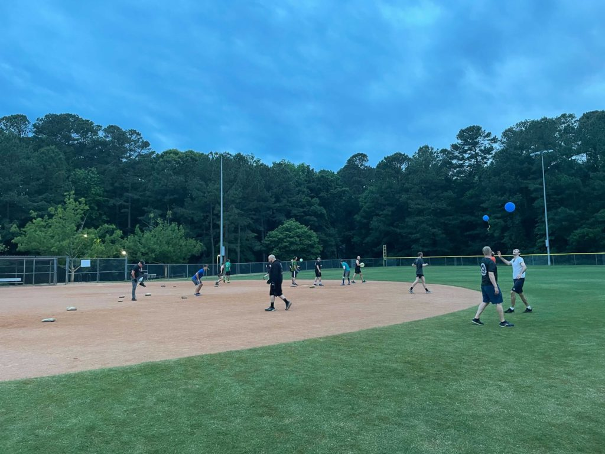

At the elite Tuesday limited-run/maximum pain AO in Carpex, we wanted to do something special today. I am still limited with an ankle but was looking forward to mixing things up a bit. I still had beers leftover from 2.0's birthday, so I brought those...and some of his Bluey balloons for the PAX to play with. I am pretty sure I heard Repeato giggle with glee as those balloons were introduced. Hopefully the group enjoyed a workout a little out of the ordinary!

**Claymore 18 MAY 2021**

0545 - Welcome, Disclaimer, Pledge

0546 - Mosey around pickle then circle up near rock pile

- SSH, mountain climbers, calf stretches, merkins

0550 - Divide into 4 teams for the Thang: Burpee Balloons

- Each team is trying to keep their balloon up in the air the longest
- Once a player touches the balloon twice, they must do 5 rock-your-bodies before they can touch it again
- Continue for thirty minutes at a fast pace. Over time, change rock-your-bodies to 2 burpees, then to sumo squats all while keeping the balloon airborne

0620 - Mary

- Merkins, Superman/Bananas, Burpees, Rocket Squats

0630 - COT

0632 - Beers and Coffee  
“If your actions inspire others to dream more, learn more, do more and become more, you are a leader.” – **John Quincy Adams**
