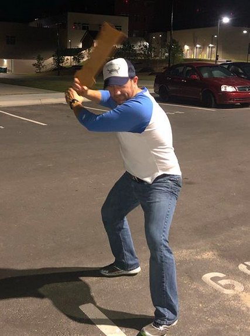

1st F Q's: "Hey we need some more AOs, probably one on a Friday morning."

YHC and Honeycomb, selfishly: "We should start one at the newly re-opened Apex High School" (note: Kitty and Comb can leave their respective houses 38 seconds before start time and get there)

And with that, Dazed and Confused enters the growing and always blotting list of AOs across F3 Carpex. Launch day looked like this:

YHC showed up as Benny from the movie, paddle and all. FWIW, an entire beatdown in jeans wasn't as terrible as I thought it was going to be.

Warm-up:

- Good morning man
- Side Slater Hops
- Randal Pink Floyd Push Ups

The Thang:

- The Seniors are on the look out for some freshman backsides to paddle
- With a partner it's catch me if you can, on the catch get the freshman down into paddle position with monkey humpers. Rotate between MHs and merkins and catch each other six times each.
- The frosh would get their revenge, still with your partner, one guys played the role of O'Bannan doing B2TW and the freshman runs to the top of the parking garage to dump the bucket of pain on O'Bannan. Classic.
- Mosey the pax back to the moon tower for a series of burpee circle, field sprints, merkins and squats.
- Move the pax over to the basketball court for some Mary to wrap us up.

COT: 28 at the newest of the Carpex AO's, welcome FNG Moon Tower, naturally.

NMS:

- Love seeing new guys come out, especially when YHC can take the credit for the EH at a recent Apex HS football game (go Cougs). Welcome, Moon Tower, keep coming out!
- Great new site, let's treat her right, fellas!
- Bojangles 2nd F is LEGIT.
- I screwed up all the names for the 28 of you studs, so tagging the FNG so he at least has it on his resume and in the archives.
