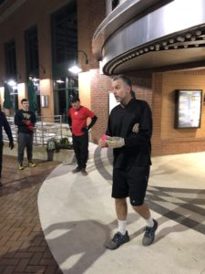

13 PAX hit the streets of Cary for a special edition of Amazing Race. There were only winners in this contest, and everyone showed great spirit and teamwork in completing the challenges. Who knew a scavenger hunt could be so painful?

For something a little different, we gathered in the church parking lot for a quick warmup before learning the rules of the game:

**Warmup**: Good mornings, Imperial Walkers (or hillbillies, Flacco style), Side straddle hops, Willie Mays Hayes (one of YHC's favorites)

Now that we've got that out of the way, your challenge, should you choose to accept it: neon pink index cards are hidden throughout DTC, each with a pain-inducing exercise and a clue to the next location, only to be revealed after completing the exercise. The first PAX to find the clue is to lead the PAX through the exercise and read the clue. We only have about 40 minutes, boys, so get to work.

Station 1 (you're in it...**church parking lot**): 11 plyo tempo merkins (hands and feet leave the ground at top); star jumps until someone finds first clue (You can't fool Angry Elf, he figured out the clue was on the card in YHC's hand before I could complete even 1 star jump...)

_1st clue_ - "hustle over to flex for the ladies, pick up your mail (and a drink) next door"

**Postmaster** - 22 burpees;

_2nd clue_ - "who wants popcorn? take in a really early matinee"

**Theater** - 33 squat jumps (Burt spotted a trend...)

_3rd clue_ - "it's too early for the 75 Piedmont, but make sure you're on time for this guy's "All aboard!" "

**Train station/conductor statue** - 44 plank jacks

_4th clue_ - "shhhhh! Keep the mumblechatter to a whisper, and ask a Respect to explain the Dewey decimal system at your next stop"

**Library** - 55 LBCs

_5th clue_ - "plan your next move wisely, or its checkmate"

**Chess table** - 44 box jumps at fountain (pro tip from Burt: step down, don't jump, from the box, else risk a nasty Achilles injury)

_6th clue_ - "Claude, Vincent, Pablo - they had to start somewhere"

**Arts Center**\- 33 derkins

_7th clue_ - "no, really, pick up your mail this time, and pick up some stamps while you're at it"

**Post Office**\- 22 WW2's

_8th clue_ - "that kids book where you have find the guy in the red striped sweater and cap? Yeah, Billy run there."

**Flag**\- 11 burpees

_9th clue_ - "welcome home, now let's play some cards"

Luck of the draw: choose from the exercise cards to finish out the workout. (Please, don't pick the 22 burpee card!)

- 55 LBCs
- 44 plank jacks
- 11 burpees

And that's a wrap! Saban scored the most finds and got a hearty "Atta boy" as a prize.

**COT**

_Count-a-rama:_ 13 good sports

_Announcements_: c'mon, that was like 4 days ago...I can barely remember yesterday. Sorry folks

_Praise/Prayers:_ Champ upgraded from terminal to grim; pleasure to meet Kean at Refinery, keep him and family in prayers; Burt BIL, John, 3rd treatment in clinical trial; Pickles colleague whose parents attacked at Gaston; Flacco's mom cancer prognosis meeting

**NMS**

- No matter what Ma Bell says, Themed Workouts are the best ever. Fancy Schmancy with heaping doses of pain are always fun.
- Box Jumps at the fountain are a really bad idea. And 44 of them is just stupid. You're welcome.
- Running distances seem so much shorter when driving them at 5am to plant clue cards. Go figure.
- This was great fun, gents, and thank you for playing my reindeer games. Its always a pleasure to pain and entertain.
