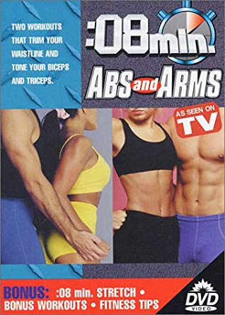

There was no visible pollen at Wolverine on a warm and sweaty Monday morning. There were however 20 PAX passing on the left and hitting the six for an ab-solutely splendid morning!

Warm-up:

- Pledge
- and wait for a just-a-few-seconds late Parker....10 burpees OYO
- and wait for just-a-few-seconds later Sky Blue.....plank hold, half way down. Hold up some arms, hold up some legs....okay let's go!
- Brisk mosey to DDMS, circle up:
- SSH
- Calf-stretch merkins, switch
- Prisoner Squats

The Thang:

- Partner up, then three groups of two HIM partner for an Indian Run to the Park Village kid's club. Every fourth HIM to sprint to the front will drop and lead the group in 20 of their core exercise choice
- Back to your partner at the park.
- First partner does 10 pull-ups, other continuous merkins until tapped, repeat.
- Round 2 is chin-ups and diamond merkins, Round 3 is wide-grip and wide-grip.
- Pulsing Al Gore until all are complete.
- Mosey to the steep slope for partner incline sit-ups. 10 each on YHC's count, then 50 as a team.
- Repeat Indian Run back to parking lot, core of choice every seventh sprinter to the front.
- Watch out for cars.
- Watch out for more cars.
- Don't do merkins on the street
- Backwards lap around the pickle

COT

- 20 Luge in cadence
- Around the circle for PAC's choice of 10 abs
- Have a nice day!
