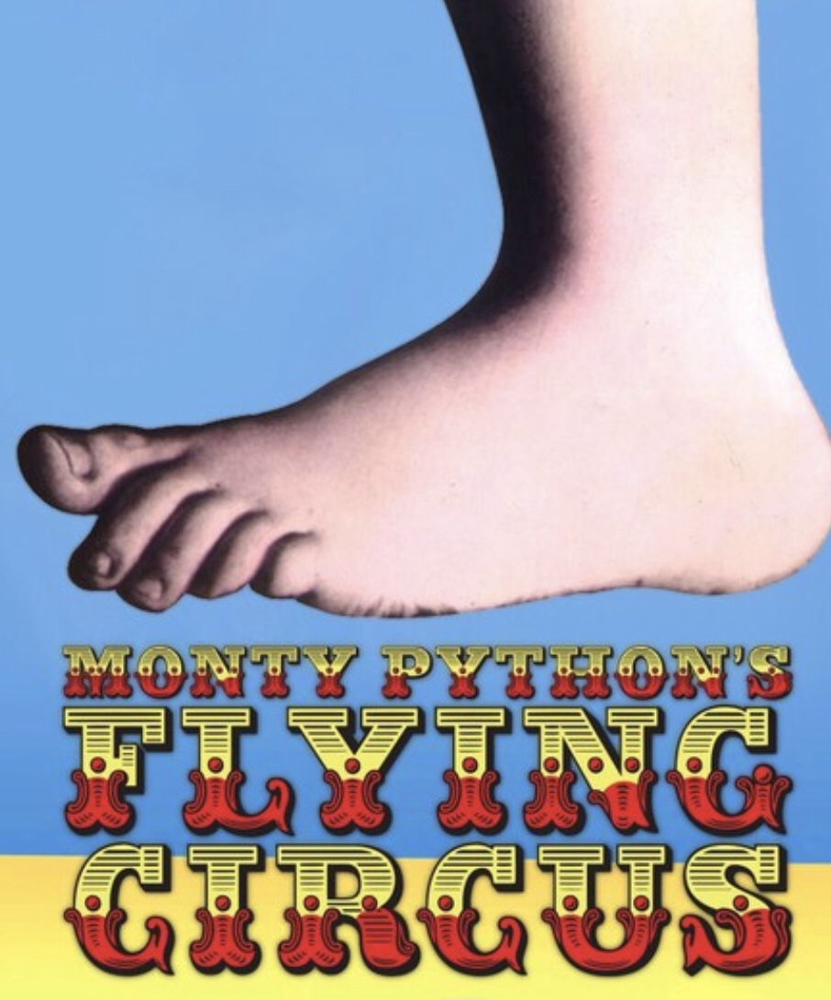

In the ever brightening gloom as we giddy up toward summer, 15 brave and intrepid men made their way to an outpost in the northernmost western AO in Cary, for an early morning beatdown by Carpex legend Petsounds.

Petsounds has other ideas and was thousands of miles away in sunny CA whilst all this was going on, so instead YHC stepped in as a makeweight Q whilst Petsounds googleplexed in Palo Alto.....

**The Warm up:**

5 pet sounds burpees oyo

20 ssh / 20 mountain climbers / 20 merkins (omd) / 20 plank jacks

20 ohd claps / 20 seal claps / 12 sir fozzy fwd / 20 ohd claps / 12 sir fozzy rev

**The thang:**

Follow me on a mosey to the stairs down to the track. We stopped and admired the FINEST stairs in NW Cary, on a thu morning, and whilst we were admiring we split into two groups:

P1 - regular run upstairs, and regular run downstairs, RL hop up, regular down, LL hop up, regular down, bunny hop up, regular down.

P2 - lbc AMRAP.

flapjack

Repeato with

P1 - bear crawl up / regular down twice

P2 - six inch hold

Flapjack

Now we're done admiring its off to the track -

Break into pace groups - unicorns, stallions, Clydesdales for:

3x 100m x 5 pet sounds burpees

Recovery run back to start line.

Repeato with 20 pet sounds lbcs instead of burpees

2 line Indian run to elementary school stairwell - P1 up stairs with 10 lbcs at each landing, P2 lap of track - flapjack.

2 line Indian run to bb court

P1 - BTTW

P2 - suicides

flapjack

Repeato with People chair & suicides

flapjack

Repeato-repeato with Six inch leg hold & suicides

flapjack

**Mary:**

Box cutter

Good morning

Have a good day

COT:

Countarama - 15

Nameorama

Announcements - Carpex convergence May 31, Carpex crazy train June 8th, and others - see slack

Prayers / praises:

\- kaleb - tragic loss of young, talented individual with so much to live for

\- Colorado for healing and Claven for how close to home this terribly event was for his family

\- PBX and family following recent illness and very bad diagnosis for MiL. Prayers especially for his M (Jenn) and 2.0/2.1 (Evan and Jason).

\- Praises for F3 and bringing fellowship and support for men in good times and bad.

Thank you for letting me lead this group of HIMs today - it's a privilege to Q. MIAGD.
