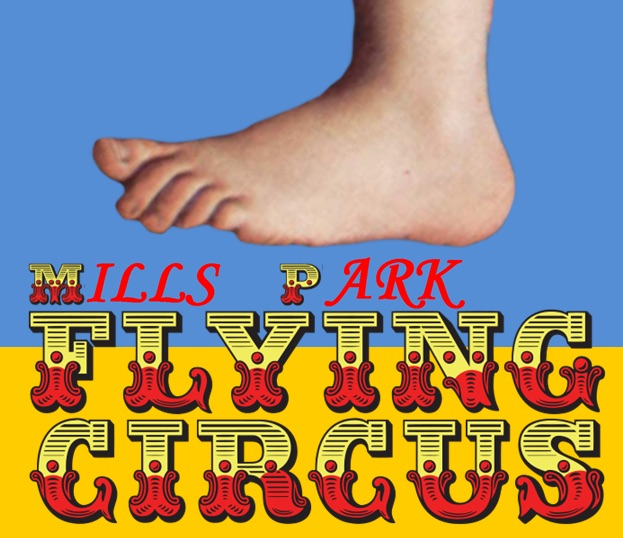

So it rained.  No, I mean it really rained.  10 waterproof HIDA’s, including both site Q’s and the shovel flag turned out for a swimming lesson and freshen up in the gloom.  Beaker (or Biner, whatever) won the prize for most nonchalant warm up and was clearly more than up to whatever volume of water fell from the sky.

As we circled up, the pax reached a consensus that the worlds weather apps were espousing lies - as to a man everyone was expecting a balmy 62 degrees yet it felt more like mid-30’s.  Two DA’s turned up in sleeveless tops (tank top Thursday anyone?) although one (Pbx) widely added a warm coat layer on top.  One dumb ass didn’t (YHC as it happens) 

So after circling up to begin, we were immediately all drenched and head to foot soaked to the skin - there was only one thing to do....follow me on a mosey to the soccer field, where we.....

Thought it ideal weather for some safety training - so after a brief safety announcement, we went round the circle doing until each man had called Fire and each pax had done 10 fire drills.

Having passed out safety certifications, it was time to continue the warmup....

20 SSH 

20 Cotton picker 

20 Plank jack 

20 Mountain climber 

10 Good mornings 

Given how popular the fire training was, the PAX relished their next treat, and jumped enthusiastically right into:

BEARCRAWL INDIAN RUN - soccer pitch width.

What seemed like many hours later, but in reality was about 4 minutes we traversed the soggy soccer pitch where YHC announced the next treat in store was wet weather blimps.

What’s that asked a curious PAX - let me explain....its LIKE regular BLIMPS, but specially modified for WET WEATHER:

Big boy sit ups 5

LBC’s 10

Innovative merkins (people choice merkin) 15

Merkins - HAND RELEASE 20

Plank jacks 25

Supermans 30

Back and forth we we went splashing and crashing about the pitch, until the last Superman was completed, just in time for a quick 10 count and a rinse repeat, starting back at the Indian Run bear crawl.  Oh, how the PAX laughed.  And then got on with it.

Now carrying an additonal 4 lbs per person in excess water soaked into clothes and shoes, YHC senses the men were ready for a change.

So, we moseyed toward the middle school main entrance for a brief Interlude - triple rotate - dips, plank jacks and lbc under the covered walkway.

Next stop was the stairwell and circuit around the small grass soccer pitch, where in our Indian run teams we took it in turns to ascend the stairs with 10 plank jacks at each landing, whilst our friends in the other team did a lap circling the pitch - then flapjack.

Time was moving on....just right for a motivational shout of “6:05 boys” (of course it was 6:21).

Quick mosey to the Picnic shelter for  sprint version of dips, RL step ups and dips again, followed by mosey to the finest stairs in NW Cary on a Thursday morning, where we did three quick circuits descending normally and ascending with L Leg hop, R leg hop, bunny hop.

Finally mosey yo Basketball court for a flapjack of Bttw or people’s chair and suicides

Circle up for a short Mary - box cutter, lbcs, and have nice day 👍   

Prayers / praises - aushfart, swags M, Goose 2.0, WW 2.0, franklin father/family, spoken & unspoken 

Privilege to lead men - thank you!

**Nms** - 

wet

Late start due to coats

Biner drive around & pretend to leave 

Lots of appreciation of wet weather

Geek squads shoes got clean

Goose jacket was so wet it was an insulating layer

Two turned up sleeveless only one worked out sleeveless

- 
