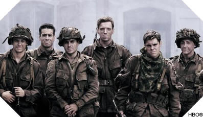

YHC felt a little Gumpy this morning, so I took advantage of the opportunity at Carpex's finest High-Tempo bootcamp to get our run on.

Warm-up:

- Good Mornings in honor of the missing Nature Boy
- SSH

The Thang:

- One line of 9 for an Indian Run towards Mo-Ville Parkway
- One Stop for a set of WW2's
- Back to Indian Run
- Continue on to corner, turning right on Mo-Ville Parkway after a set of merkins, then WW2's
- Back to Indian Run
- Run towards the sun, stopping for a quick set of LBC's, merkins, and WW2's
- Back to Indian Run
- We found ourselves a dam with very tall grass, and an opportunity to do control freak incline partner sit-ups, truly a fun time.
- Back to Indian Run
- More LBC's, merkins, and WW2's....
- Back to Indian Run
- More LBC's, merkins, and WW2's....
- Indian Run back to flag.
- Partner up for Wheelbarrow Derkins

<figure>

<figcaption>

  

</figcaption>

</figure>

Mary:

- Flutter Kicks
- Australian Snow Angels
- Dying Cockroach (Thx Pivot)
- Boat Canoe (following Biner)
- Supermen
- WW2's
- Have a Nice Day!

Conclusions:

- Running is fun
- 120 WW2's on asphalt makes for a sensitive 6
- Everyone is afraid of fireants
- Have a nice day!

Respect - 3

Meh - The rest
