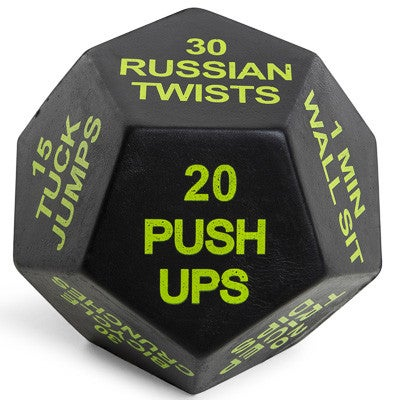

<figure>

<figcaption>

Dodecahedron Of Pain

</figcaption>

</figure>

I had been really nervous about the day I was going to be asked to lead a workout. More or less hoping I would just blend into the background with the rest of the PAX. Mainly just because Im not usually a person who likes to be the center of attention, which its a literal requirement during a VQ. But when the guys I am close with decided VQ week was going to be when they did it, I decided to get over my nervousness and I signed up. Frisco was nice enough to offer to co-Q with me, so that helped a bit! Claymore is not one of my usual spots on Tuesday as I have been co-site Q'ing FMJ for the last few months, but I came out last week to get an idea of what I had to work with. Then, because I am the type of person to do Christmas shopping on December 24th, I waited until last night to really tamp down a plan for the next morning's VQ. I think it turned out alright!

**Warmups**  
SSH  
Good Mornings (because its Crimson's favorite. he does 1)  
Windmills  
Sir Fazio Arm Circles  
Overhead Seal Claps  
Reverse Sir Fazio Arm Circles  
  
Mosey over to the circle..

**Thang 1**  
So a week ago I was at 5 Below with the M and 2.0's and I passed by the workout gear section and noticed these really cool workout "dice".. so my son and I were rolling them on the ground and doing the workouts when it dawned on me that alot of our workouts were on the dice and I had a VQ coming up, so I figured we would try something different!  
  
The PAX circled up and we took turns rolling the Dodecahedron of Pain as Pickles named it. We had to do whatever workout came up on the die. We rolled Mountain Climbers, Merkins, 2 Min Run, Burpees and Frog Jumps. All were done in cadence.

**Thang 2**  
Next we partnered up for a VQ tradition - A Dora with the addition of a pet rock.  
  
100 Curls for Girls  
200 Overhead Press  
300 LBC's with your rock friend.  
Partner runs the pickle in between  
  
Next, I tossed it over to Frisco because he had an idea he mentioned with the workout dice that sounded pretty cool, but apparently in the moment he completely forgot and decided to go with a bit of a confusing run of 4 corners. He rolled the die 4 times and called 20 Burpees, 20 LBC's and something else I cant remember. Mumblechatter piped up at this point lol  
  
Mosey back to flag..

**MARY**  
Homer to Marge  
American Hammers  
Freddie Murks  
Low Slow Flutter - Called by Hamm  
100's - Called by QWERTY

**Announcements**  
  
Oct 5th Charity Golf Tournament for Hopeline - 1PM shotgun start. Deets on Slack  
Sept 28th Rucktoberfest  
  
**Prayers**  
Prayers for The Joker's future M whos going to be traveling alot soon.  
  
Overall, I am really happy I decided to Q this morning and a big thank you to Frisco who helped me plan and took the heat off my shoulders for 10 minutes. F3 has really changed me for the better. I could have never imagined last year this time that Id be waking up every morning at 5am to do what we do.. or climbing 110 flights or running a 5k. Thank you to everyone who has encouraged me and continues to do so. SYITG
