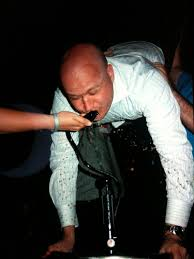

April 10, 2018

It's been one year since YHC first tasted the Gloom at FWD in April 2017, and YHC felt a little celebration was in order.  But how best to mark the occasion with a touch of class  and sophistication?  Would the PAX prefer a tasteful platter of dry-roasted, unsalted, Whole-30-reminiscent almonds?  Or mayhaps a pre-breakfast kegger?  After unsuccessfully /polling the PAX on Slack (better watch your back @Slackbot) and then successfully polling the PAX on GroupMe (long may it reign), kegs beat almonds and YHC knows that the first rule of partying it to give the people what they want.  And as a wiser man than myself once said, "careful what you wish for."

YHC rolled into the finest Tuesday AO that doesn't require a toll payment and a passport a few minutes ahead of 0545, brandishing 2 shiny, fully-filled, and only slightly-leaking sixtel kegs, ready to show the PAX the true meaning of celebration and what a real kegger throwdown looks like.  Grins turned to frowns when YHC produced only a wry smile in lieu of a keg tap.  Not to worry, all will soon experience the joys and pains of hucking 5.0 gallons of sweet carbonated nectar around the neighborhood.

WARMUP

Divide the PAX into two teams.  Everywhere we go, your team keg comes with.  If the keg-bearer falters, help a brother with his burdensome load.

Mosey to the nearby small pickle for a lap including high knees and buttkickers.  Circle up for a celebratory IC round of: Good Mornings, Imperial Walkers, Cotton Pickers, Merkins, and Mountain Climbers.

THE THANG

After confirming no PAX are yet inebriated, off we go for a long keg carry across Cary Parkway and over to the office park.  YHC was extremely impressed throughout the workout at the willingness of the PAX to carry the full kegs around at speed, generally keeping up with the back of the pack while moseying.  They are awkward to carry any distance, but the PAX were in a partying mood apparently.

Upon arrival at the big pickle, the teams did a series of keg-me-if-you-cans: the team runs to the far end of the pickle, with one PAX carrying the keg and bringing up the six.  Upon arrival at the end, AMRAP the called exercise until the keg shows up.  Swap the keg-carrying duties and repeato.  Exercises: low slow flutters, jump squats, wide grip merkins, WWIIs.  (This generally worked great, except for Ollie.  Ollie carried the keg the length of the pickle faster than half his team ran it.  I think Ollie might actually run faster while carrying a keg than not.)

We then interrupt this program for an impromptu Burpee Blowout: do as many burpees as you can in 60 seconds, goal is 15, reach is 20.

Then resume keg-me-if-you-cans: Freddie Mercuries, LBCs, diamond grip merkins, and Catalina wine mixers (you know, for the wine crowd).

Next exercise is team keg suicides: the team holds plank while one PAX grabs the keg and carries to the first light pole; next PAX brings it back; next PAX carries to next-furthest light pole; you get the idea.

One more surprise Burpee Blowout - much more fun the second time around - grab your keg and your team for the mosey back.

After arriving back at the park, obligatory billy run to the flag, and circle up for some Mary:

35 LBCs for the number of years of YHC's age; 12 American Hammers for the number of months of YHC's F3 participation; and 26 dying cockroaches for the number of pounds YHC has lost in said time span.

COT

No announcements and brief prayer requests.

YHC attempted to express his deep and sincere appreciation for the men of F3 and for the journey of the last 12 months.  I am a significantly better person now than I was then, physically, mentally, and spiritually.  Also, I can now do double digit numbers of pullups without throwing up on myself, and I can run double digit numbers of miles as long as there are other PAX along that I can share and crack up with.  Unfathomable stuff for me only 12 short months ago.

Luke 12:48 says "From everyone who has been given much, much will be demanded; and from the one who has been entrusted with much, much more will be asked."  We are all extremely fortunate to be here in this place, and to be able to get out in the gloom and make each other better.  This experience is not by happenstance, and I try my hardest not to take that lightly.  We are given much.  This life works best when we give it back.  It is squarely on us to support each other, to share F3 with the many other sad clowns we see every day, to set an example for those around us, and to answer when asked.

Please know how extraordinarily significant each of you have been in my life over the past 12 months.  Cheers to the next 12 months, and to the gift of each and every next day that we get to wake up and post.

See you 'round the keg.
