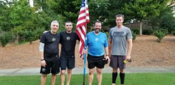

****

It was November 2014 when YHC and Michelob first posted to Ateam. At our one year F3aversary in November 2015, then Site Q’s Denali and Grease Monkey handed off the shovel flag to us to man for the next 2.5 years. We supposed it was time to share the honor with some HIM who hadn’t had the opportunity to do so yet. McCants already had the Q for today, so YHC requested it from him under the guise of “I’m leaving town and wanted to Q before I leave” – He bought it :-)

 

13 HIM showed up at the front gate, no FNG’s, so YHC grabbed the flag and we took off toward the back. We stopped along the way and planted the flag (Or leaned it up against something, we need some rain!) for a mobile warmup.

**Mobile Warmup**

16 SSH

14 Hill Billies

8 Good Mornings

10 Hackey Sacks

5 Pike stretch each side

10 King David Toe Touch

 

**The Thang, “Big Suicide”**

PAX circled up at the top of the parking lot. In this workout, we advanced the flag through the park. The first person to the flag grabbed it and moved it to the next stopping point. YHC went into an all out sprint and grabbed it the first time, and nearly broke the thing. YHC is pretty sure Largemouth grabbed it all the other times.

10 Merkins at the back parking lot

10 Say Hey Willy @ the Base of the Hill

10 Merkins at the back parking lot

10 Freddy Mercurys at the top of the hill – Called by Smokey

10 Merkins at the back parking lot

10 Midget Squats at the 1st stop sign – Called by Theisman  (See what I did there?)

10 Merkins at the back parking lot

10 Burpees at the 2nd Stop Sign – Called by Michelob

10 Merkins at the back parking lot

10 LBCs – Called by YHC

Run around the loop, stop at each of the spots along the way and repeat the exercises and circling up near the flag at the front gate.

 

**Mary**

Quad stretch, each side

Piriformis stretch, each side

Butterfly squat

Hamstring Stretch each side

10 burpees OYO

Here's Michelob's Strava - https://www.strava.com/activities/1646110909

**Announcements**

Michelob and I handed over the Flag to Theisman and Smokey. It’s been an honor to serve the F3 community, and an honor to be glommed in with Michelob. Being associated with him in any sentence that is fitness related is humbling!

Convergence Wednesday at SNS

**Prayers**

Travel for the Foland Family

Imp’s sister’s Dog went missing.

EOG for the kiddos.
