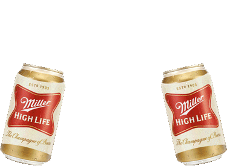

The idea for this Q started a few weeks ago when Sooey preblasted something about not wanting to drink alone at Off the Rails the next morning. My degenerate brain took that to mean that he was planning to bring alcohol of some sort the following morning. Turns out Sooey just didn't want to post alone on a cold morning, but the seed of a beer-themed workout started to grow. Then last week at Off the Rails, Sooey mentioned that story to Disco Duck who was equally enthusiastic about some sort of beer-themed workout. So when I checked the Q sheet earlier this week and saw the spot open I dropped my name down and started thinking. No time like #not-dry-January to make it happen, right?

I settled on doing a themed Dora with a B, E, E, and R named exercise and was leaning towards grabbing some bricks or other smallish coupons (12oz minimum), but there's not easy rock pile near Off the Rails. Burpees to start (naturally), but was drawing a blank on exercises that start with the letter E, so I consulted the [Exicon](https://f3nation.com/exicon/), but no luck there (surprisingly few E's). Guess I'm making some stuff up. Excellent. What could go wrong?

I had a small number of pavers at home and then I swung by Hell's Bells on my way to the AO to pick up some of the small pavers I remembered they had, but the seem to be gone, so I grabbed a bunch of the cement oil cans they have instead.

Rolled into the Hunter Street parking lot at 6:27 to a bigger crowd than I'd expected, so I start counting heads and comparing them to my coupons. I'd planned on everyone having one in each hand, but more PAX showed up than anticipated. Luckily the coupons were a little bigger than I'd planned so it all worked out.

6:30: no site Q's and no flag, but a lively group. No FNGS, so we go over to my car and everyone grabs coupon.

Mosey over to parking lot by the softball field and circle up for warm ups.

- side straddle hops
- morrocan nighclubs

It's not icy where we've circled up, so it's time to teach the PAX a few exercises.

- Evil Twin : this is a jump squat where you spin 180 degrees in the air - trying land your feet in the same spots (forward/back = 1)
- Earl Gray: grab your coupon in one hand. Hold a squat and bring to coupon to your face like your taking a sip of tea. switch the coupon to the other hand and repeat (L/R = 1). ideally you're keeping your elbows out to work your obliques, but many of us modified to be more of a curl.
- Rocks Up / Rocks Up: Like a Homer to Marge, combined with a coupon'd WW2... start in Homer to Marge position with your arms straight out behind you holding the coupon. Thrust your hips up while lifting the coupon up over your body (keeping your arms straight).

We did a few of each of those then paired off for the B.E.E.R.'s:

- 50 Burpees
- 100 Evil Twins
- 200 Earl Grays
- 300 Rocks Up / Rocks Up

The pickle was the loop by the bathrooms/soccer field.

We pounded our B.E.E.R.'s until all were done (with a little planking until the 6 came in) and grabbed our coupons to head over to the skate park for Mary (with a stop at the flag pole for the pledge).

Mary: LBCs, Low Slow Flutter, 100s

Swagger back to my car to exchange the coupons for 12oz of Miller High Life (the champagne of beers)

COT standing behind my car drinking beer (most, a few demurred).

Cans and solo cups (thanks Disco Duck) all made it to the trash cans and at least half the PAX went to Starbucks (the Miller High Life of coffee).

Great way the start the weekend, gentlemen!

