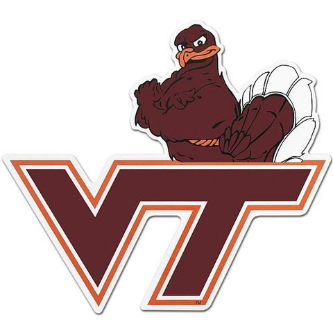

Ten PAX made it out to their favorite Thursday morning AO, Back in Black for a Hokie-led beatdown. After my Kryptonite chat with Burt, I decided something Hokie related was in store for my Q. At 515 AM, we kicked it off with the Pledge, and off we went.

### Warm up

Warm up run to the middle of the Dude Solutions parking lot.

- Good Morning
- Side Straddle Hops
- Calf Stretch (both sides)
- Merkins

### First >> Rock Pile

Mozy to the Rock Pile and grab a Non-traveling rock:

- Curls (30)
- Behind the Necks (30)
- Shoulder Press (30)

### Second >> HOKIE (A DORA variation)

Grab a partner, execute a HOKIE with the suicide running back and forth across the first three peninsulas with the following exercises:

- H >> Homer to Marge (100)
- O >> One-Legged Burpee (Alternate Legs) (100)
- K >> King of Hearts (Suicides w/ 3 peninsulas as markers)
- I >> Imperial Walker (100)
- E>> E2K - Oblique Crunch (Alternate sides) (200)

### Third >> Head home to MARY (Mostly)

Run to the parking lot and close out with PAX-led MARY:

- American Hammers
- WW2's
- Plank Jacks
- Alternating Shoulder Touches

### COT

No Announcements. Prayers for old friends, our families, and these times we are navigating right now. NYBD III following where Lookout made an appearance. Enjoy the greatest entrance in college football below.

https://www.youtube.com/watch?v=DkwedgEH3gs
