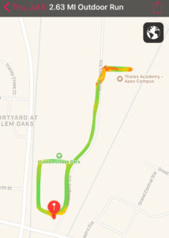

YHC picked up the Q for July the 5th as a replacement for missing my birthday Q a few weeks back due to IR. I did not account for the post 4th of July hangover being fully present. Never mind, great way to start the morning. Expecting a light crowd, pleasantly surprised to see 12 other HIMs show up (14 total counting YHC and of course my side kick).

At 5:45 sharp, we did a warm up jog around the short loop back to the skate park for warm up.

Warm up:

- Good Morning x 5
- Windmills x 10
- Plank Jacks x 10
- Sir Fazio Arm Circles (both directions) x 10

Thang 1: Dora 1-2-3

Partner up for Dora. Partner 1 run the short loop while partner 2 starts Dora. Flip flop when partner returned for running the loop.

- 100 x merkins
- 200 x LBC
- 300 x Squats

Scout run to school for Frisco. Since Frisco reminded me BH was the site where he first posted I decided to repeat some of his first workout to show him how far he has come in 2 months.

Thang 2: 7's at the school

- Burpees
- Star Jumps
- Bear crawl back across the parking lot to road at the end

Partner run back to the flag. I like the partner run, I feel like this is something I could have possible made up. The idea is to run the same speed as your partner and chat some to encourage a little 2nd F.

Mary:

- PAX call various Mary exercises

Prayers/Announcements:

- Prayers for safe travel, Smokey and M to Costa Rica and others on the road
- The caring place this Sunday - I mean a few hours ago ;). There is a sign up for future opportunities every other Sunday.

NMS:

- Welcome FNG Blue Jay!
- Congrats to Crimson, Frisco, and Hottie Totty on their first 6 pack. This technically happened two days after I should have posted this but hey I know the future.
- Speaking of, sorry this BB is late. I was traveling for work last week and had a ton of stuff come in for Thursday and Friday.
- It is always a pleasure to lead. We stayed close to the flag today but still managed 2.63 miles!

