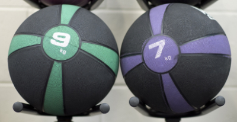

## The Back Story

Now that I have my [first Q under my belt](https://f3carpex.com/2021/07/09/whos-your-uncle/) and celebrated my birthday taboot, it was time to commemorate three years of me being a part of this great thing we call Carpex. Three years ago, [Sosa](https://f3carpex.com/tag/sosa/)'s diligence in EH'ing me for months (seriously) finally paid off and I showed up to Thomas Brooks Park for my first post. [Red Ryder](https://f3carpex.com/tag/red-ryder/) was the Q that day at Field of Dreams. I was late due to not knowing where I was going at 0520 and never ever being in that part of town before. The PAX understood but we all did burpees for my shortcoming. I continued to post until I tweaked my calf and was out of a few weeks. Then came back and brought an EH of my own, [No Bars](https://f3carpex.com/tag/no-bars-fng/). From there, things get a bit dodgy and I'll save that for another BB. :-)

Coming up with this Q gave me a chance to reflect on things over the last three years and made me formally realize things that I already knew but never really declared.

One of the most prominent things was that I hate "beatdowns". I know that's somewhat blasphemous in F3 circles but I don't care. I'm about working out with good guys, enjoying their company, and having fun doing it. It's hard enough getting out of bed before the sun's up and getting to the flag by 0530. Not everyone is a morning person so moods tend to be lower this time of day than, say, if we hit a local brewery in the afternoon.

Call me crazy but that's my observation. I realized that, looking back over the last three revolutions around the sun, almost all of my favorite Q's were those that at the very least involved doras - but really the ones that I keep talking about are the ones that take time and planning – and have a game/team aspect to them. Guys like [Pom Pom](https://f3carpex.com/tag/pom-pom/), [Chewie](https://f3carpex.com/tag/chewie/), [High School Musical](https://f3carpex.com/tag/high-school-musical/), and other go above and beyond to put some thought and some heart into these things to ensure the PAX start their day off with not just a fit body but a pleasant disposition. Appreciate you guys for that, BTW.

So, that's what I want - all the time. And that's what you should expect from me moving forward. I may not be the guy that Q's every week but when I do, you'll know I'm bringing my best stuff. My goal is to provide a solid Q with exercises that will work parts of your body you might not always use at the other workouts while making you happy you came out. It takes time and, sometimes, research.

And this time, I was able to do this with my favorite PAX, [Spicoli](https://f3carpex.com/tag/spicoli/). In the event you didn't enjoy any of this workout, you can firmly place blame upon him. :-)

### Warm-UP

My Co-Q and I led a light warmup in the center of the field at [Off The Rails](https://f3carpex.com/category/f3/fitness/off-the-rails/) consisting of:

- Good Morning
- Arm Circles (forwards, and backwards)
- Jumping Jacks (sometimes referred to as the Side Straddle Hop)
- Steam Engines (sometimes referred to as Imperial Walkers)
- Merkins
- And a quick mosey around the field

Now that the PAX were all warmed up, it was time to get down to the good stuff. PAX counted off by three's and established teams of six-ish. I also asked that each one bring a gym towel/sweat towel - which most did.

### Thang One - Shuffle Ball

According to my in-depth research, strong pelvic abilities and explosive upper body strength are characteristics sought after by significant others\*. So I decided to introduce some medicine balls into the mix and the PAX did the following:

- Each team lined up side-by-side with PAX about four feet apart.
- Last PAX in the line throws it to the person next to them
- He does two merkins and races to the front of the line
- The receiving PAX turns and throws it down the line, does two merkins, and follows the PAX who threw him the ball
- When the PAX got to the end of the field, they turned around and came right back to where we started
- First team to the finish line does 20 merkins. All others do 20 burpees.

### Thang Two - Over/Under

I also found that having full range, strong abs helps you digest your food better\*. So I decided to put these medicine balls to work again and the PAX did the following:

- Again, the PAX were caused to line up but front to back about two feet apart
- The first person takes a ball and passes it back over their head to the person behind them
- The person behind them passes it below through their legs
- Alternate until the last person gets it and runs to the front of the line and repeats the cycle
- First team to get to the other side of the field does 20 merkins. All others do 20 burpees.

### Thang Three - Plank Roll

Being able to support your body off the ground while using one hand to push a weight to the side is how ninjas train\*. Once again, we made use of these medicine balls and the PAX did the following:

- PAX line up a foot or so apart and get into plank, side-by-side
- First PAX rolls the ball under their body to the next person who keeps it going
- First PAX does two merkins, gets up, runs to the front of the line, and gets in plank position to receive the incoming ball
- First group to get to the other side of the field does 20 merkins. All others do 20 burpees.

### Thang Four - Towel Tag

The ability to change direction quickly while keeping an eye on your six has many practical applications such as, ice hockey, waiting tables in a busy restaurant, or riding the NYC subway\*. Since medicine balls promote none of this, they were put away for the day and the PAX were asked to break out their towels that they brought. Here's how this played out:

- Each PAX tucked their towel in the back of their shorts
- Everyone faces each other in a designated area
- When the game starts, PAX attempt to snatch each others’ towels. If someone grabs your towel, you buy your way back in with 20 LBCs. Then you get back up and retuck your towel and go on the hunt for another.
- Last five minutes the penalty for having your towel snatched was 5 burpees - no buy back in
- In the end, there can be only one and they determined the exercises for Mary

### Thang Five - Mary

By some strange stroke of luck, YHC snatched the final towel off of [Schroeder](https://f3carpex.com/tag/schroeder/) to become king of the hill. Because of this, I got to choose the exercises for the last 5 minutes of Mary. Being the benevolent Q that I am, I opted to offer of few of these choices out to some of the PAX. That proved to be a mistake as several chosen exercises were quite hard. Lessons learned.

### COT

**Count-a-rama**:  19

**Name-a-rama**:  3 Respect, 15 Meh, 1 Hate

**Prayers / Praises**:  Prayers offered for [Garbage Plate](https://f3carpex.com/tag/garbage-plate/)'s father (and family), [Tang](https://f3carpex.com/tag/tang/) (and his family), and [Shank](https://f3carpex.com/tag/shank/)'s son, Walker.

**BOM**:  YHC took us out

### NMS

- \* I have no data, research, or even hearsay that any of those statements marked with a \* are facts
- The notion that YHC was able to win at towel tag was either the PAX showing sympathy for me **_OR_** that you should never give up on your dreams
- [Overflow](https://f3carpex.com/tag/overflow/) is a beast. At one point I think I long snapped the medicine ball to him through my legs and he blasted by me like a fullback through the 1-hole. I think he gave us our only lead in that game with that move, albeit short-lived.
- Don't get a tetanus shot the day before you Q a workout. YHC crashed hard and it destroyed most of what would be a perfectly good Saturday.
- For the PAX who didn't pick up on it, there were three different sized medicine balls: 12lb, 10lb, and 8lb. This was as much by design as it was circumstance. I was using them as equalizers. Teams that were more dominant were getting the 12lb while those who lagged behind got the 8lb. I think it worked pretty well. The balls didn't change teams so that made my job easier.

##### BOLTON: OUT
