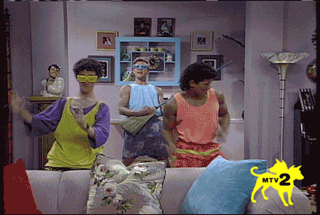

I love @jeremyfoland sending out the weekly "Who's Qing" tweet because about every 4th week or so I look and say, "Oh, I'm Qing this week."  And speaking of Hotspot, we'll get back to him a little later.

Good crowd of 21 PAX today, including 2 FNGs from out of state.  The FNGs came with Grease so I knew they'd be _athletes_ and were probably use to being _in action_.  Gave the disclaimer and we were on our way.

**Warmup**

- Mosey to the volleyball parking lot across the street (don't worry, I hate sand in the gloom.)
- SSH x 25, GM x 10, HB x 10, Plankjacks x 10

## The Thang

**Thang 1:  Bayside High School Is Awesome**

5 sets of exercises stopping at each island to complete the exercise.  Each island goes up in reps like this.

1s - **B**:  Burpees (1,2,3,4,5 reps) 2s - **H**:  Hand release merkins Diamond Merkins (2,4,6,8,10) 3s - **S:**  Squats (3,6,9,12,15) 4s - **I:** Imperial Walkers (4,8, 12,16,20) 5s - **A:**  American Hammers (5,10,15,20,25)

Writing it out last night I knew I needed an acronym to remember the exercises.  Being a kid of the 90s, the Bayside Tigers came to mind quickly.  Zack, A.C., Kelly, Screech, and the gang.  Due to last night's rain, however, I called an audible on HRMs (sorry Large) and went with Diamonds (as in Dustin Diamond?  anyone?  whatever.)

Anyways there's your #ProTip:  Make acronyms and leave the weinke in your pants.

**Thang 2:  Partner Work**

Mosey to the left of the school down to the speed bump and find a partner.  There's a nice wall with no windows to put your \[umm\] _feet_ on.  About to call the Thang 2 when all of a sudden there's a 200% increase in traffic!?  Apparently this is Hotspot's track on Tuesdays at 0545?!  This guy has more #OffTheBooks workouts than all of Carpex combined I'm pretty sure!  Has anyone invited him to Full Metal Jacket before?  Seems like he's a good candidate.

Where were we?  Right, Thang 2:

P1 + P2 do 5 Aussie Mountain Climbers (#signaturemove) then a lap around the pickle? lollipop? Hotspot loop? Then return and repeato with 10 reps, then return repeato 15 reps. Next. P1 Shakiras left side, P2 run the loop and back, flapjack P1 Shakiras right side, P2 run loop and back, flapjack

**Thang 3:  BLIMP Sprints**

That's what I'm calling them but YHC's sprint was missing the thing that gives it the name "sprint".  Umm what's the word, oh yeah, _speed_.

Inflating BLIMP on the track with 100s and 200s between each set:

5 Burpees - 100 meter sprint 5 Burpees, 10 Lunges - 200 meter sprint 5 Burpees, 10 Lunges, 15 Imperial Walkers - 100 meter sprint ...etc... Burpees, Lunges, IW, Merkins, Plank Jacks\*

\* All while making sure the inside lanes were open for them runners on the track.

Some chatter about no squats to make it BLIMPS so we did 30 Squats at the end and then mosey'd back to the flag. \*\*Be sure to read the NMS for some things I noticed this morning during this\*\*

**COT**

Count and Names, welcome FNG Rudy and Dollywood!

Announcements and prayers were light - Sour Mash 2.0 in car accident but walked away (praise!) Some CRU family battling cancer Grease took us out!

## NMS

- Thanks all 20 of you that came out.  Some were there to name the FNGs, some were there to check FMJ off their carpex challenge sheet, some only showed up for COT, and some Q shopped and thought I'd be the easiest.
- No matter the "why", though, you showed up and you worked out.  Well done!
- CD even came just for the COT!  Rough sleep made him miss the beatdown but wanted to meet Grease's FNGs.  Always good to see CD in the gloom no matter the hour.
- Yes, that was the most Imperial Walkers I've ever done in a workout.  Check that off your list now too.
- **But the main thing I wanted to point out from today was this...** 
- The 6 was never alone today.
- That deserves its own bullet point.
- Even FNG Rudy picked up the 6 during the track work!  We thought we lost Rudy but no he, on his own, went back for the 6 and brought him to the pax, that was awesome to see!
- Then on the run back to the flag, which isn't close, the entire group of 21 finished at the flag together with every man circling back for the 6.
- That's my "why" for Carpex fellas.  We are one big family and I love it.

SYITG Shut-In

