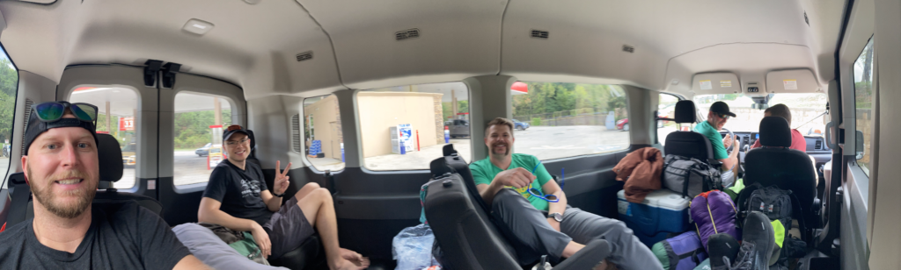
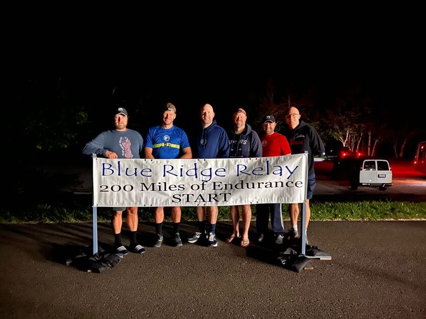
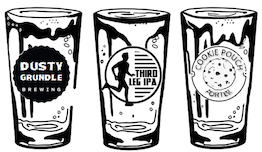
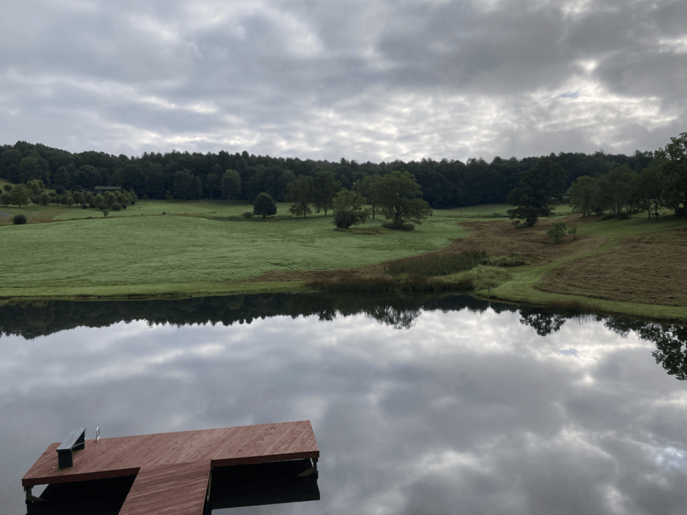
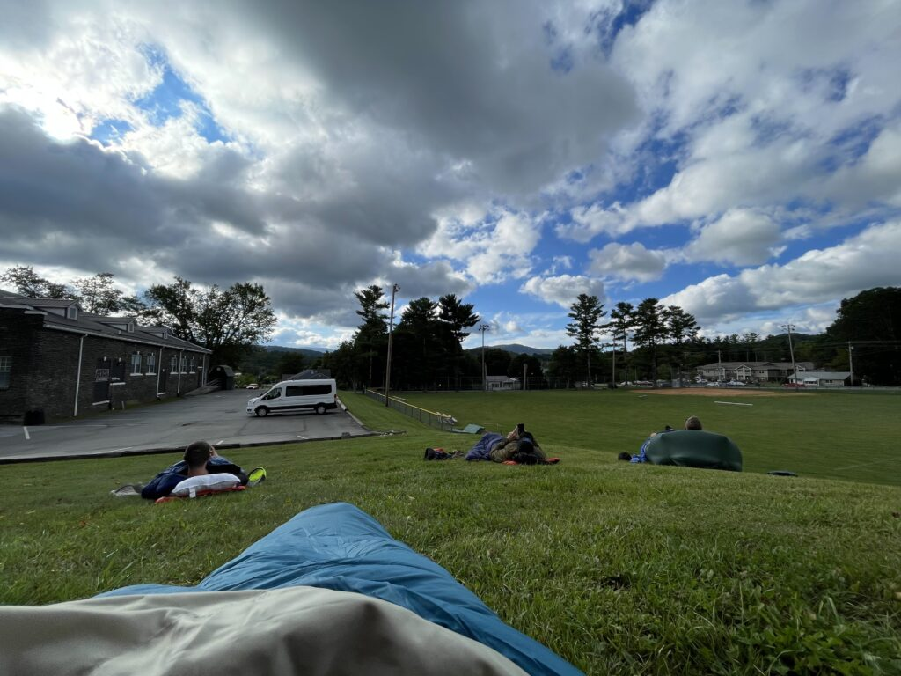
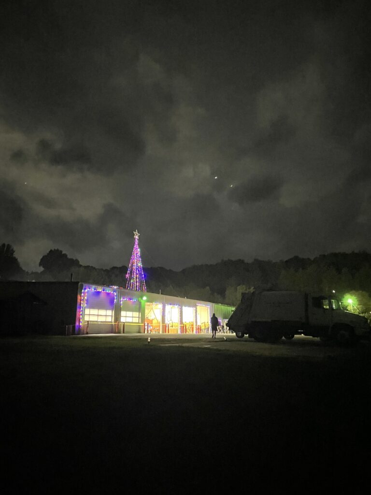
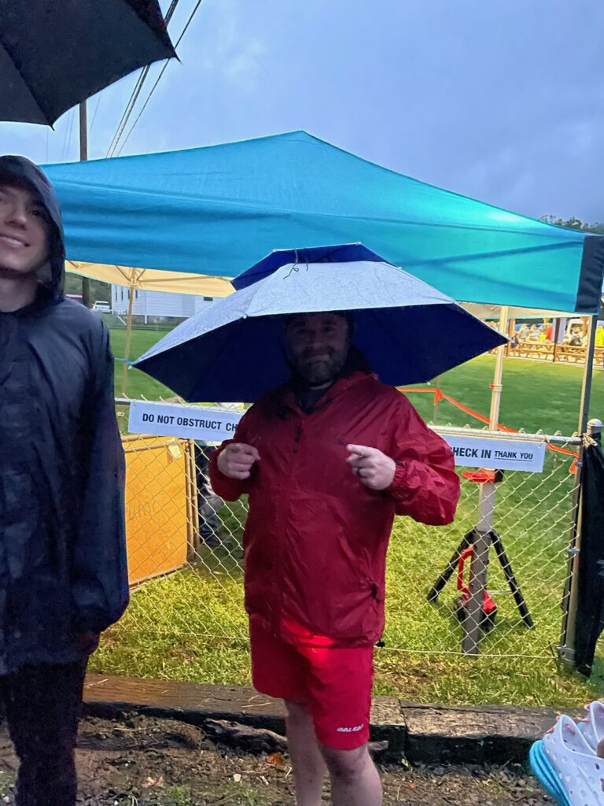
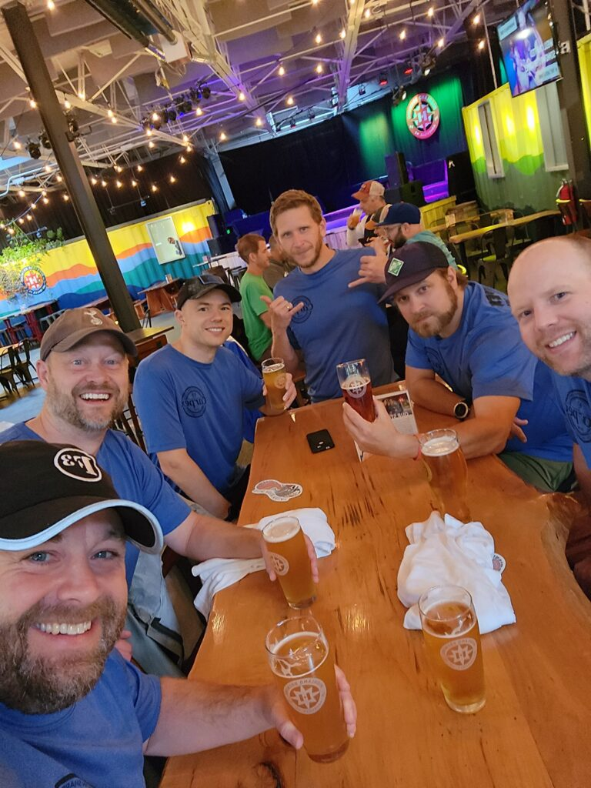

The Blue Ridge Relay felt different this year. Maybe it was the return of the slapbands for runners at the exchange zones. Maybe it was because every team seemed scrambling to backfill people leading right up to the day-of. Maybe it was because unlike in past years, there was a genuine race to the finish (and race to the bottom) amongst Carpex teams. Maybe it was because so many people are swearing up and down they aren’t going to do it again next year.

Whatever the reason, YHC decided this most lauded event in the Carpex calendar deserved a proper backblast. And since I don’t have mad video editing skillz, this will have to do.

## Contents

In this post, we’ll cover the following topics. Feel free to jump around to what interests you.

- F3 Carpex results across teams.
- Team photos and video collages.
- Chronological synopsis of the _F3 Carpex Beer. Run. Repeat., My Third Leg is Hard, the Cookie Pouches, et cetera_ team experience.
- Comparison of my personal leg results from last year to this year.

## F3 Carpex Results

Of 153 teams, 148 finished. F3 Carpex fielded 7 teams, and SCary fielded 2, and several Carpexers were on a S. Wake team, for a total of 10 that we’ll rank here. Skipper also participated in one of the first three teams to ruck the BRR, the 9-man Rogue Ruckers.

<figure>

<table><tbody><tr><td><strong>Carpex</strong></td><td><strong>Category</strong></td><td><strong>Overall</strong></td><td><strong>Team Name</strong></td><td><strong>Total Time</strong></td><td><strong>Average pace</strong></td><td><strong>Members</strong></td></tr><tr><td>1</td><td>6-man, 5th in Ultra</td><td>22nd</td><td>Strugglebus</td><td>27:26:12</td><td>07:55</td><td>Mr. Safety, Old Maid, Revere, Saban, Sky Blue, Steaks, Yahoo (Driver)</td></tr><tr><td>2</td><td>6-man, 7th in Ultra</td><td>31st</td><td>Beige Bros</td><td>28:10:01</td><td>08:08</td><td>Chanticleer, Denali, GTL, Largemouth, Michelob, Squatter, Wonderbread (Driver)</td></tr><tr><td>3</td><td>9-man, 29th in Open</td><td>53rd</td><td>F3 South Cary Legacy</td><td>29:20:19&nbsp;</td><td>08:28</td><td>Bagels, Bluewater, Captain Jack, Chops, Francois, Hoppin John, Kiffin, Mayflower, Staubach</td></tr><tr><td>4</td><td>11-man, 38th in Open</td><td>69th</td><td>F3 South Cary Men's Division</td><td>30:25:12</td><td>08:46</td><td>Chipper, Half, Hermes, Jiggly Puff, Joe Smith, Kool-Aid, Nabisco, Oofda, Shipyard, The Super, Vegemite</td></tr><tr><td>5</td><td>5.5-man, 13th in Ultra</td><td>75th</td><td>Pick up the Six Man</td><td>30:43:26</td><td>08:52</td><td>Cardiac, Happy Gilmore, Kwikstop, Man Ram, OneDirection, Entitlement (1/2 runner, 1/2 driver), Prodigal (driver)</td></tr><tr><td>6</td><td>9-man, 51st in Open</td><td>87th</td><td>18 F3ET</td><td>31:45:15</td><td>09:10</td><td>16 Bit, Bobby Boucher, Brexit, Fanny Pack, Hasslehoff, Hotspot, Huggies, Nemo, Wild Turkey</td></tr><tr><td>7</td><td>12-man, 9th in masters</td><td>93rd&nbsp;</td><td>Traveling Circus</td><td>31:50:06</td><td>09:11</td><td>Badlands, Cadence, Clementine, Crockpot, Franklin, HSM, Homer, Overflow, Pivot, Sooey, Trike, Two Factor</td></tr><tr><td>8</td><td>12-man, 64th in Open</td><td>109th</td><td>Beer. Run. Repeat.</td><td>32:51:54</td><td>09:29</td><td>Bumper Sticker, Chicken Little, Clockwork, Decal, Hamm, Lucky Charms, Peaches, Pongo, Schlitz, Short Circuit, Triple Lindy, Wahoo</td></tr><tr><td>9</td><td>6-man, 16th in Ultra</td><td>114th</td><td>Repeato’s Redemption Runners</td><td>33:09:25</td><td>09:34</td><td>Banjo, Build-A-Bear, HIPAA, Hello Kitty, Lookout, Water Wings, Repeato (Driver)</td></tr><tr><td>10</td><td>9-man, 73rd in Open</td><td>123rd</td><td>Peak City Hill Hunters</td><td>33:46:17</td><td>09:45</td><td>Blue &amp; Out, Dowry, Egon, Honeycomb, Imp, Rooney, Silver Fox, Stella, The Joker</td></tr></tbody></table>

<figcaption>

F3 Carpex and SCary 2022 Blue Ridge Relay Results

</figcaption>

</figure>

## Team Photos

https://www.facebook.com/f3carpex/posts/pfbid0rDYz9AW5A1wgErqjS54U2wcEGgNsUYr9h4nMiM72HztMT1FSUqDFVJgZh7e7pSqpl

<figure>

https://youtu.be/QOx2Ugi5Gb8

<figcaption>

Hello Kitty's compilation video from Team Repeato's Redemption Runners.

</figcaption>

</figure>

<figure>

https://youtu.be/J\_vapTopuU8

<figcaption>

Beige Bro's BRR 2022 compilation video, brought to you by MyPillow

</figcaption>

</figure>

## Chronological Synopsis of Team B.R.R.

Every team is different, from the people and the places you stay, to the number of runners and what that entails in terms of downtime and breaks in between legs. Hopefully, this chronology will help newcomers get a good idea of what the race is like. I will try to keep it as intelligible as possible, but I’ve had to edit a lot to keep it PG.

**Wednesday** 

A regular, productive workday that started off by posting at the POGL’s peak stretchy AO, 7th Inning. Meanwhile, the Travelling Circus team from (mostly) West Cary was already heading westward.

**Thursday**

Our team’s vans left at two times, one in the early morning, one after lunch. Those of us who left after lunch supposedly worked a half-day. 

My morning consisted of a mad dash to pack something loosely resembling [this packing list.](https://docs.google.com/spreadsheets/d/1ITC9H0BdA9z2Dx74mZ8Mu9UaytzwhdRqyXhnYHqALZU/edit#gid=0) After picking up the van, we reconfigured the seats for optimal space…this was the first year I was in a “tall” van with the extended roof, and it felt palatial. So much room, in fact, one could practice yoga.

The drive was mostly uneventful, and included a beer run wherein the driver almost forgot to get beer. Upon arrival at the cabin, I joined the rest of the early van in the hot tub for a few drinks while the oven was preheating. Wahoo made barbecue, sweet potatoes, and salad, while I once again contributed banana pudding, this time with a cheesecake and bourbon twist. While it wasn't Peruvian chicken or some fancy Pad Thai worthy of past team chefs Pivot and Ramsay, it was well-received nonetheless. After dinner, I went back in the hot tub then took a refreshing dip in the pond, and cut myself off after 4 beers and 3 bourbons around 10 o’clock, but some of the others in Van 1 of the team did not. In retrospect, I would probably not go as heavy on the drinks but would absolutely do the hot tub/pond combo again.

**Friday**

If you’re in Van 1, you get both the joys of kicking off the race at the start line, as well as of waking up at 3:30am to make it there in time (at least if you’re a slow team, which tbh I would recommend). While others made whatever last minute preps they had, YHC enjoyed a leisurely meal of two breakfast burritos, an orange, hot tea, and something else. Then we piled into the van, where I discovered that the Boy Band does indeed sing. Their repertoire includes Celine Dion, early nineties rap, and plaintive odes about morning wood, or the lack thereof.

At the start line, the photographer was kind enough to leave Hamm with 10 seconds to get ready to run, and then we were off to an excellent start that gave new meaning to, “It’s only downhill from here.” I am not sure any of us enjoyed our first legs. Hamm said he grew bored and started skipping. I personally was worried how I’d run two more. I know Schlitz was rethinking his decision to stay up so late to support his beloved Bills. Maybe Triple Lindy enjoyed his first legs; I don’t think I heard him complain all weekend, despite doing most of the driving, to boot. Anyways, by the time we rolled into the first van exchange zone at Frosty’s Christmas tree farm, the sun was well up and I only then realized we hadn’t decorated our van.

Although there is a prize for best-decorated van at each of these relay races, to my knowledge, Carpex has never won one. I would love to be corrected if I’m wrong. I’m not sure what it would take to win one; perhaps stringing up soiled underpants like the Muddy Undies team did this year. I had to ping the BRR folks to learn who this year's winner was, some team called Zenspeed that I don't even remember seeing. If I had to crown a Carpex winner, it would be the Travelling Circus. Although I will say, Team Beer. Run. Repeat. had the best stickers.

We zipped back to the cabin for a quick shower and nap, or hot tub/pond for some of us. In a 12-man, you have about 3 hours of downtime at this point, and it’s right around lunch so you avoid the worst of the heat of the day. By the time I started running again, it was the golden hour before sunset, and I had a long run (10.5 miles to Grandfather Mt.) to enjoy the views, which included waterfalls, valley vistas, rapellers, and even a mid-point pep rally by my teammates. I just barely managed to avoid getting killed by Revere’s now-legendary dash, and caught Mr. Safety looking for once underprepared at the exchange. Not one to be shaken up too easily, Safety quickly regained focus and blazed past Chicken Little, not even stopping to wave or say, “Hello.”

The next van exchange continued the musical theme of the day with a dance party of yesterday and today’s Top 40 hits at the elementary school, led by the unquestionable MVP of the entire race, the effervescently friendly and perpetually encouraging brunette dancer from, I believe, the 9-person Lactic Asses team of SC. The music, alas, died too soon, and Van 1 headed to our second and last break of the race.

**Saturday**

There is a fire station that has showers, baked potatoes, Christmas lights, and a ton of parking. I can’t vouch for the first two, but the last two are nice. The rain even mostly held up as we laid out on camping pads and inflatable air lounges (thanks, HP!). Some random stranger even took Schlitz’s abandoned chair, which made for a disorienting wakeup. I know that no one in Carpex would ever, but for the love of all that’s holy, do NOT use your brights, blare music, or get in a fight with your teammates while people are trying to sleep at this exchange.

It’s the wee hours of the night. The rain is pouring, no one wants to get out of the warm, semi-dry van. It’s dark. It’s almost cold. You’re exhausted and your legs are on fire. Call me crazy, but I love this part of the race. If I could run without any vests or lights, I probably would. Especially since we found the foam rollers, I feel energized and ready to run my last leg of the race. It goes well, but afterwards is a blur. It’s still dark out, and there are many more hours to go.

At the final van exchange, I momentarily thought I was hallucinating when I saw Chicken Little dressed up like a mushroom, but no, that was real. I think it was a defense mechanism from when François sic’d a dog at him. We collected our van’s final runner and then headed off to breakfast, which was the Pig and Grits, a suggestion from Prodigal. I proceeded to make up for the caloric deficit I was running by ordering a full breakfast of two sunnyside eggs, two sausage patties, two biscuits with sausage gravy, grits, a pancake with fruit toppings, and four cups of coffee. Apparently some consider this excessive. I did turn down Hamm’s leftover toast, but only because it was cold.

Whether it was the drinking, the fact that I had harder legs by 10+ mi and 1,500ft+ elevation this year, the full breakfast, that it was raining so we had to stay indoors, or all of these factors combined, I don’t remember feeling so utterly spent at the end of the race last year. We waited at the brewery for three hours that felt longer than the entire three days to that point. (Of course, the other van that was still running didn't appreciate the pictures of breakfast and beers we sent them.)

I think I tried to chit-chat with people, but I mostly just remember sitting at the table willing myself not to eat Badland’s birthday cupcakes that were left in our table’s care for entirely too long. (Sidenote, if it’s your birthday the weekend of September 11th, and you like people making a big fuss and hundreds of people singing you wellwishes, then this is the race for you.) I eventually lost that battle, but not after a valiant effort.

Unlike some teams who still had some pep in their step, we did not join our last runner, Bumper Sticker, as he brought the race home at the finish line. He came in looking strong, especially considering that he had had to push out the stuck van from the mud just before he ran his last leg. We took the ceremonial finish line picture, with our team’s signature move of the season, the bird, flying high and proud. Proving that we were just here for the party, we even stayed to hang out with Pivot, whose team left him shirtless and vanless for about thirty minutes.

And then finally, we were done. We headed home, you think? Not quite. From the brewery, we went to a hotel, where we rallied and showered enough to stagger around Asheville from a decent Mexican restaurant to a shitty Applebees bar, where Peaches tried to blame us for ordering some nasty white zombie ale when there was perfectly good Millers Lite on tap. Somewhere in between, one of us got meat sweats and sent a desperate plea to pick up the six that was much feted but unheeded. Back at the hotel, about half of us finished what was left of the bourbon and discussed next year’s plans, while the more sensible half of us finally turned in. The sleep was glorious; the next day’s hotel breakfast, while not quite as excessive as Pig and Grits, was much needed. And we were finally on the road again home.

## Breakdown of the legs I ran

This comparison could be helpful for those who haven’t done BRR to see the range in terms of mileage, elevation, etc. for a typical runner (Runner 5 from 2021) to the hardest runner (Runner 4 this year in 2022) on a 12-man team.

The first year I ran, I didn't know what to expect. I had a great time, and it made me truly believe what people say in the group, "If you can do this, you can do the BRR." I think Runner 5 is a great "first time" runner. As you can see, the elevation gains and losses about equal out, and the start times are wonderful if you're on a slow team that starts around 5:30 in the morning.

<figure>

<table><tbody><tr><td><strong>#</strong></td><td><strong>Distance</strong></td><td><strong>Ascent</strong></td><td><strong>Descent</strong></td><td><strong>Course rating</strong></td><td><strong>Start time</strong></td><td><strong>Actual pace</strong></td><td><strong>Projected pace</strong></td></tr><tr><td>5</td><td>4.8mi</td><td>404ft</td><td>325ft</td><td>Moderate</td><td>09:08</td><td>8:14</td><td>8:16</td></tr><tr><td>17</td><td>2.9mi</td><td>247ft</td><td>225ft</td><td>Easy</td><td>19:50</td><td>7:14</td><td>8:15</td></tr><tr><td>29</td><td>7.7mi</td><td>340ft</td><td>350ft</td><td>Hard</td><td>05:21</td><td>7:36</td><td>8:07</td></tr><tr><td></td><td><strong>15.4mi</strong></td><td><strong>991ft</strong></td><td><strong>900ft</strong></td><td></td><td></td><td></td><td></td></tr></tbody></table>

<figcaption>

2021 BRR details of legs, Runner 5, 12-man, projection based on 8:00 pace

</figcaption>

</figure>

This second year, I had a little more experience under my belt in terms of a variety of races (BRR, CSAUPs, MFRFSP, SMR) and injury/recovery, so I took a different approach to preparing, adding in longer runs at various times of day. During the race itself, I was worried about pushing too hard because I knew I had longer, harder legs left. As such, I focused just on keeping my breathing and heart rate steady around 150bpm. Overall, I enjoyed these runs maybe more than last year, especially the "Grandfather" leg 16, which was right around sunset and had so many beautiful views!

A sidenote for those considering the Smoky Mountain Relay next April, I was surprised that these 3 legs of BRR were more total mileage than the 5 that I ran at SMR. However, SMR had an extra 1,000ft of gain and 1,700ft of descent. For more details on that race, check out [this backblast](https://f3carpex.com/smoking-the-smoky-mountain-relay-2022/).

<figure>

<table><tbody><tr><td><strong>#</strong></td><td><strong>Distance</strong></td><td><strong>Ascent</strong></td><td><strong>Descent</strong></td><td><strong>Course rating</strong></td><td><strong>Start time</strong></td><td><strong>Actual pace</strong></td><td><strong>Projected pace</strong></td></tr><tr><td>4</td><td>6.9mi</td><td>755ft</td><td>379ft</td><td>Hard</td><td>07:50</td><td>8:07</td><td>8:55</td></tr><tr><td>16</td><td>10.5mi</td><td>1222ft</td><td>493ft</td><td>Very Hard</td><td>17:28</td><td>9:06</td><td>8:59</td></tr><tr><td>28</td><td>8.4mi</td><td>692ft</td><td>280ft</td><td>Hard</td><td>04:19</td><td>8:38</td><td>8:50</td></tr><tr><td></td><td><strong>25.8mi</strong></td><td><strong>2,669ft</strong></td><td><strong>1,152ft</strong></td><td></td><td></td><td></td><td></td></tr></tbody></table>

<figcaption>

2022 BRR details of legs, Runner 4, 12-man, projection based on 8:30 pace

</figcaption>

</figure>
