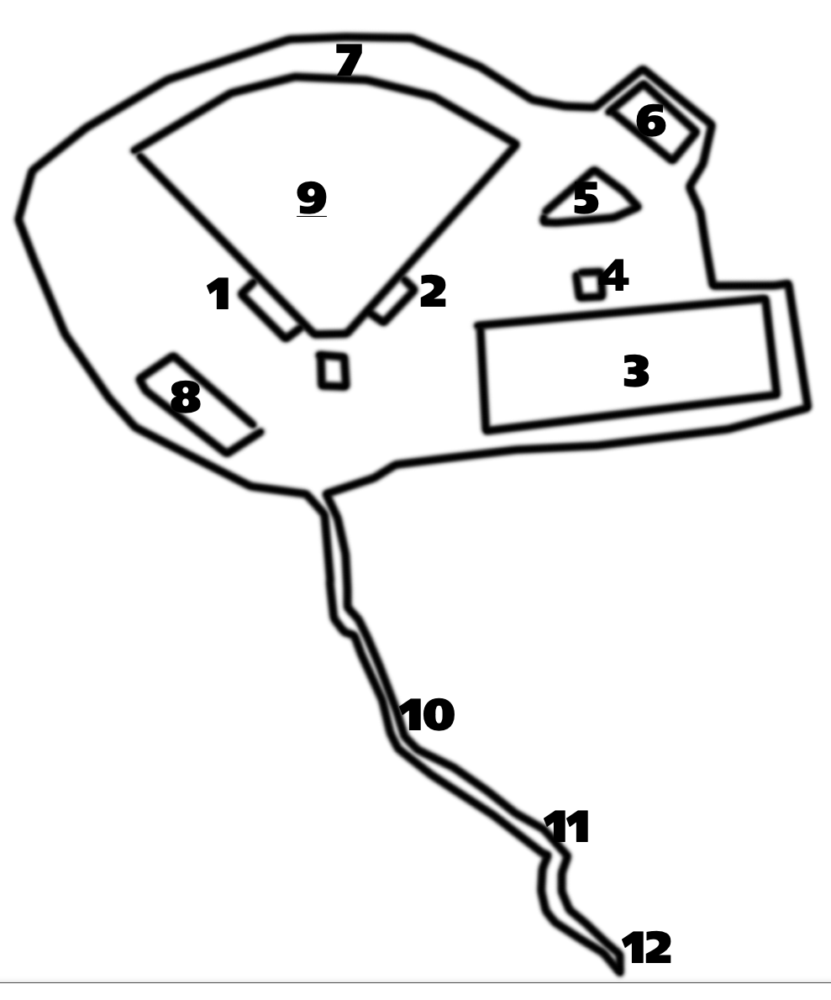

Mozy to large lot

**Warm Up**

SSH x 15

IW x 13

GM x 10

Plankjacks x 15

**The Thang**

Parking lot divided into 3 main sections and for each section, we went up and back around each island, doing exercise at each corner, starting with 2 and increasing by 2 each turn. Run the length of the sections, travel in another manner for each width. See below for approximate map. We got up to around 20 for each exercise.

Section 1- Merkins, Bear Crawl, Lunge Walk

Section 2 – LBCs, Burpee Broad Jump, Lunge Walk

Section 3 – 180 Jump Squat, Crab Walk

Bataan Death Match – combination of Indian Run and Catch me if you can. Traditionally done with Burpees, but we subbed in Hand Release Merkins. 3 groups. Last Pax does the HRMs and then catches up, tapping the last guy and heading to the front. The person tapped now does the merkins, etc.

Circle up for a round of merkins – YHC plan was to go until exhaustion. We did 50.

Mozy to shovel flag

**Mary**

LBC x 30

LSF x 20

Makhtar N'Diayes x 15

Have a nice day x 45 seconds

**Announcements**

Q school this Sunday, 2 pm meet up at the Kiosk in BP. CD and CK have the Q

There is nothing going on October 7, but if you can do Kryptonite, you can do whatever is not going on October 7.

**Prayers and Praises**

Burt’s 92 year old uncle

Luke in VA

Grease Monkey’s M and the awful effects of her continuing battle with Lyme Disease

Free Bird and their newborn son

**NMS**

I had planned to do Kryptonite a while back when there was still some hope of partial daylight and really wanted to hit one of the green ways, but decided to go safe and stick in the lighted lots.

Had fairly good control of the Pax until we divided into our 3 groups for the Bataan Death Match and Burt decided to huddle up with his group and plan how they were going to be beat everybody in whatever we were about to do.

Asked for silence during Have a Nice Day and the only mumble chatter was Hermes announcing he would bring the Makers Mark today. I approved of this comment.

Great to see new faces for Kryptonite and while we logged 2.5 or so, all of it was at a reasonable pace.

Awesome to see Free Bird posting. Thankfully he kept his shirt and shoes on.

Pierogi has a bad a$$ jeep with no doors or roof. Earhart showed it no respect.

Getting worried about Sooey and Crimson. 2 weeks in a row, Sooey has posted without his bro at Kryptonite. If there is anything we can do to help you guys work it out, let us know.

Want to reiterate Shut-In’s comment about Carpex. So grateful for F3 and in particular our local contingency. I am sure that other regions are similar, but I know we have got it great and let’s keep it it that way.
