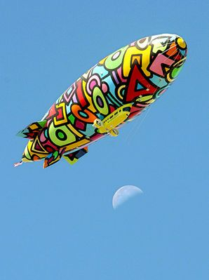

On Monday this week, Slim Shady made me a deal that if I Qed Lion's Den, he would go ahead and get on the Q sheet for Wild Wild West. So here we are. I had thought about just running back last week's Back In Black Q, but that seemed like cheating and then the M decided last night was a good time to take down the Christmas decorations, so I never did get a chance to put the thought I wanted to into the plan, but BLIMPS was close enough to last week so there it was. 8 showed up for the Boi Band EC run, although there was only 1 band member in attendance. Anyway, we got a couple miles in before the ME, and that was a good thing. Here's what we did:

**Warmup:** 0530 and in comes Clockwork on 2 wheels. No FNGs so we run through mission statement and the pledge and we're off. We take a quick mosey lap around the far parking lot and circle up in front of the church doors for:  
5 penalty burpees for Clockwork's tardiness  
SSH x 15 IC  
Good Mornings x 8 IC  
Sir Fazio Arm Circles x 10 IC  
Seal Claps x 10 IC  
Imperial Walkers x 10 IC  
Plank Jacks x 10 IC  
Calf Stretch L/R x 10 silent count each side

**Thang 1:** Mosey to the top of the hill for some 4 corner BLIMP action. Start with burpees and then add the next exercise in the next corner.  
Burpees x 5  
Lunges x 10 (Yes, L-R=1 Water Wings!)  
Imperial Walkers x 15 IC  
Merkins x 20  
Plank Jacks x 25  
Squats x 30  
Once our BLIMPS were inflated, of course we needed to deflate them so we went in the reverse order going back down.

**Thang 2:** From the top of the parking lot, the Pax lined up across 3 sets of parking spaces and bear crawled to the bottom of the lot performing 1 merkin at each line they crossed. (Thanks to Yoda for this one). Mosey back to the flag for some Wahoo led Mary.

**Mary:** As stated above, Wahoo led the Mary as I was helping attend to a Pax that was feeling dizzy. I did catch a few exercises. Something that sounded like Superman/banana? Some Freddy Mercury x 20 IC and then of course the signature Wahoo move of 5 burpees OYO.

**COT:** 16 Pax. Announcements- Banjo repoprted the "Do Epic Shit" challenge is back for 2021! Details soon via Slack. Duck Donuts Dash Feb 6. Prayers/Praises- Steaks as he recovers. Chicken Little and Henny Penny's friend Matt passed away too young leaving behind his wife and 3 children. Prayers for his friends and family. YHC took us out.

**NMS:** As mentioned previously, we had a Pax that had to stop due to feeling lightheaded during the workout. Just remember to listen to your body and modify as needed. It sounds like there may have been some contributing factors to the cause and not just the workout itself, but make sure you stay hydrated and eat (if that's your thing). Thanks to the great site Qs and others that hung back and made sure he was OK and running to get him water. And always remember to pick up the 6!
