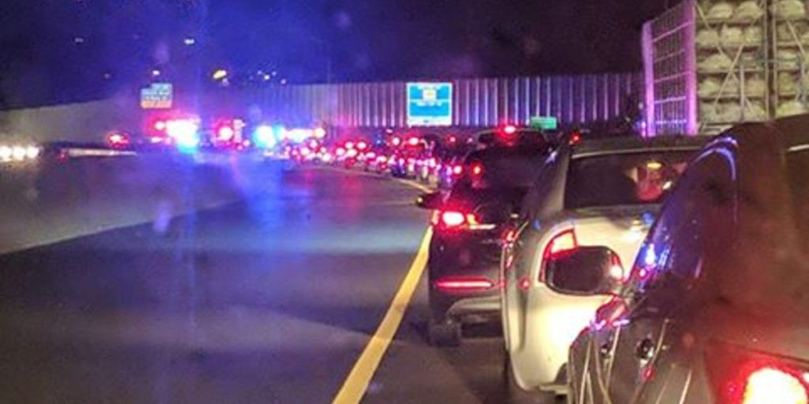

Fun fact: BiB may be the earliest AO in CARPEx but it barely holds a candle to the AOs outside of Charlotte where 0500 is the norm. Now, before you get all jealous about the three (or one) quarters of an hour they gain on us, there is a simple reason they start so early:

Yup... traffic sucks in Charlotte. Like.. a lot. 5AM is about the only time you can get from point A to point B without points C... D... E... F... G... H... (you get the picture) getting in the way. All of them about 6' apart.

Which brings up an important point.

We have it good here in Cary / Apex / Morrisville / The Triangle. Really good. Think about it. What are we possibly missing?

- An IKEA? Just raid Coney's place. His daughter finally out grew her insurance coverage and that old college loft has to go somewhere!
- A professional sports team? Hurricanes > Panthers.  
    Yeah... I know there's also the Hornets.... but I did have to look them up online.  
    \*\* And I was reminded that we also have the Courage. Two time champion NC Courage. Yes... Courage (+Durm Bulls) >> Hornets.
- A Wegmans? Yeah... we have at least two. I have not been to one but I hear they are nice.
- A world renown Nantan? Let's be honest. I'll take our man Matt over the Country Lawyer any day. Unless that day includes needed legal counsel. In which case I will take McCants.\*

The point is - we have it good. Really good. Take for example a Thursday morning. You want a Boy Band? Check out Hot For Teacher. You want a mustache ride? BO is the place to be. You want to experience a bit of an international flavor? The Ministry of Funny Walks is where you want to be.

And if you want to get your workout out of the way and enjoy a coffee and the best damn bagel this side of The Swamp... then Back in Black if the only game in town.

## Warm up:

Mosey to the bricks in front of Koka. Examine the fine art on the gate. Get to work with:7x GM, 7x Abe Vigoda, 21x SSH, 21x IW, 21x Plank Jacks, 21x Merkins.

## Thang:

Starting at the greenway by Koka, head counter-clockwise around Regency Parkway stopping occasionally for some pearls. We added a set of something new each time:

1. 15x Squats
2. 15x merkins
3. 7x IC Bonnie Blairs
4. 15x dips
5. 15x IC Freddy Mercury
6. 15x CDD
7. 15x L/R step ups

Ended with an Indian Run back to the flag.

## Mary:

No time

## COT:

- Started with 5. Ended with 5
- Announcements: Coffee & Bagels.
- Prayers: IRs & peace & communication

## NMS:

- Fantastic group of dudes Thursday morning. Enjoyed getting to know HGTV, Cauli and Snip better. And great to see Capt Jack out again.
- The conversation over coffee at NYIII was spot on. It's too easy to avoid the tough conversation but the four of us dove in and I learned some things and got to thinking about some others.
- Taylor Ham & Egg on a Jalapeno Bagel .... mind blowing.

\* I would have taken Joe Smith but I haven't seen him in a while. I think he's still in the pit at the [Mighty Mighty Bosstones](https://youtu.be/7VPcFyduRAs) show.

\*\* Thanks Bartman!
