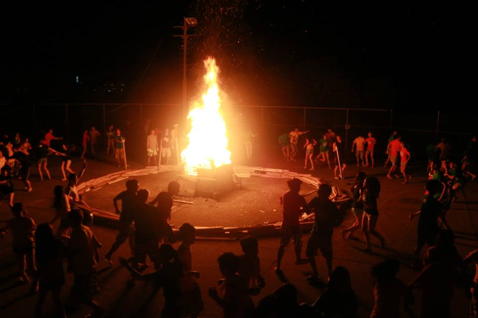

Ever since it's gotten so that it stays dark well past 6:30, I haven't seen many groups venture into the gloom murk pitch blackness that is North Cary Park. To hell with that -  this is @F3DangerZone! So I set up a very cute campfire in the  field to entertain the troops.

After making sure everyone who wanted one had a headlamp, we're off.

\[caption id="attachment\_387094" align="alignnone" width="960"\] _Image only slightly not to scale._\[/caption\]

### Warmup

- 25x SSH IC
- 10x GM IC
- 25x Smurf Burt-jacks IC
- 10x MC IC

### Thang

Mosey down to the bridge for a little through the tunnel Bear Crawl Inchworms to the other side. I think about half the PAX made it through the 3rd crawl.

Count-o-rama shows 17 so YHC is odd-man-out. Grab a partner and a partner rock and follow the glowing blue shoe out to the field where aforementioned campfire is set up.

As a partnership, complete a traditional 50-75-100-125-150 BOMBS sequence switching when Partner 1 completes 25x reps with the rock (curls, rows, extensions, raises, curls again). BOMBS in the gloom, rocks by the yellow glow of the campfire.

Since some of the PAX are superhuman and finished the full sequence before @burtcarpex, @flipflopcarpex and I even got to the "S", called 10x repeato for all the speed mutants.

### Mary around the Campfire

- 25x right-side oblique crunches IC
- 20x regular LBCs IC
- 25x left-side oblique crunches IC
- 10x (I think) side plank star crunch somethings care of @caslotta, each side

Return the rocks, lunge walk across the bridge and mosey on back. It's 6:30.

### COT

17 PAX on a beautiful, cloudless DangerZone morning.

Prayers for Flacco's grandmother who fell. Prayers for @flipflopcarpex's friend, AJ, who lost his brother this week. Prayers for @angryelfcarpex's grandmother who also fell and broke her hip - having survey (late GroupMe addition)

Announcements: F3Dads this weekend; Capital Ruck also; Werewolf coming with the full moon - watch the TwitterMe feeds; Christmas get together in December - M-friendly... 2.0-unfriendly. Get a sitter.

### NMS

- The dark side of North Cary is mighty purtee lit up by the stars... although my night vision never really kicked in with the @caslotta-approved 1,000 Lumen headlamp on!
- Welcome Wax-On from the other side of the tracks!
- Is it Large Mouth or Largemouth? Going latter...
- Is it Jigglypuff or Jiggly Puff? Going former...
- Is it Flacco or Flaco? ...  Obviously the former...
- Don't get me started with the Hi-Liter variations...
- Getting better with the Qs... only forgot a few most of the "Recovers"
