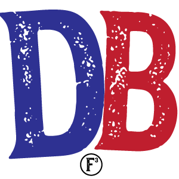

I went to Q school a couple of weeks ago. Since I am out of town and will miss the start of VQ week I decided to step up early and get this thang done. In my posts leading up to this I took lots of mental notes. Most of them were forgotten before the first exercise (do you really have to say 'Recover'?).

Thanks to those who helped with time keeping as my FitBit bit it this morning.

- ECPs were performed. I know not the names nor numbers. Ask Theisman
- I was on the edge of Intimidation myself when HIM after HIM arrived in the gloom. 25 strong! Great showing!
- We started slowly as we mozied to side of church, circling up for

### WARMUP

- Good Morning x10
- SSH x10
- Sir Reginald Fazio Arm Circles forward x10 & backward x10
- Merkins x10
- Plank Jack x10
- Mountain climbers x10
- Imperial walkers x10

Run to lower light, start classic rock music random play.

### THANG 1

Partner up for **Dora Dentist**

- Partner count: Dora 100 Merkins, 200 LBCs, 300 Squats
- Partner not doing Doras mozy to picnic tables for DDS x5 (Dips then Derkins then Step Ups)
- Plank until the 6 is finished

### THANG 2

Mozy to hill

- **BBB 11's** (These were very popular and reduced mumble chatter significantly)
    - Boxcutters at top
    - Burpees at bottom
    - Bearcrawl Up the hill

Somewhere in the middle of these BBB's there was a suggestion to add a 4th B - Ballbusters. But I don't know if I can write that on a backblast.

Mozy around pickle back to flag

### MARY

- Freddie mercury
- Dying cock-a-roaches
- Have a Nice day

### ANNOUNCEMENTS

- Odyssey Oct 20. Sign up on F3Carpex.com. Sag wagon help needed.

### PRAYERS

- Pet Sounds helped with hurricane Florence cleanup on Monday. Removed moldy wallboard & flooring for an 80 year old woman who is now in a shelter. She has no insurance and is not sure if they will demolish her house .
- Spartan with work worries
- Others I can't recall and those unspoken
- YHC took us out

It was a pleasure to plan a Tortoises Q and attempt to follow the plan. Some of the HIM present made me change the BBBs from 7's to 11's to keep you moving. Thanks for the encouragement and reminders Disco Duck and Earheart.

Note for VQ's: don't forget to 'recover'

Thanks to Chinese Downhill (sadly not present) for his relentless encouragement to face the early  gloom and get involved in F3.

The endless rewards of being a part of this group of HIM cannot be described without experiencing it.
