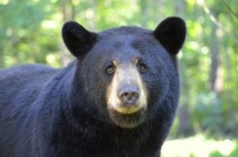
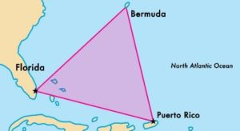
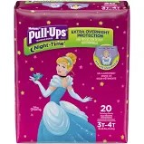

23 met in the sticky gloom at TB Park.

**Warm Up**

Pledge of Allegiance, disclaimer, and 22 men begin what was supposed to be an easy pace Indian run to the front lot.  We've got an FNG arriving at 5:47 so Sosa makes sure he gets to the warmup circle.  The obligatory 10 burpees commence.  Your standard fare of SSHs, Good mornings, Sir Fazio and Hill Billies.

**Thang 1**

Partner up, 100 Merkins, 200 Monkey Humpers, 300 Fluttering Supermans

Mosey down to the soccer field.  Peer pressure from Ascot and Hi-Liter gives us ascending burpees at each light pole.  BTTW until all PAX arrive

**Thang 2**

 

BearMuda Triangle, number off 1-3.  Since Hi-Liter wants to go to 4, we do more burpees until the PAX can follow directions.  Each group goes to a cone, start off with one burpee, bear crawl to the next cone, 2 burpees, etc.  You get it, we do 2 rounds which means we finish with 6 burpees at the final stop.

Mosey to the shelter, each PAX complete 15 pullups.  We've got some left, so 5 more each.  Take the long way back to where we started.

**Mary**

Here's the audience participation part.  PAX choice until the clock runs out.

**COT**

3 Respects, 2 Hates

Announcements: The only one I remember that was mentioned was Kubota's BBQ fundraiser at Scott's Mill Clubhouse, Friday July 20th.  All the cool kids are going.  It wasn't mentioned, but don't forget to sign up for TPC Sawgrass.

Prayers/Praises: Goose's son, Disco's M, Liverpool's family, PAX traveling.

YHC took us out.

Welcome FNGs Solder & Bolton.  Well done!

**NMS**

- Great job hanging in with us FNGs.  Bolton knows that we start at 5:45 sharp.  Leave no man behind, but leave no man where you found him.  It's great to see Solder, a young HATE starting his day right.
- Lot's of chatter, YHC modified a bit and doled out some additional burpees for those challenges.  We could have gone with the standard Dora of 200 squats, but so much talking led to monkey humpers.
- Iron sharpens iron, be a little better today than you were yesterday.
