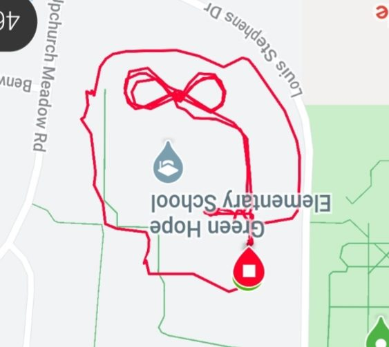

All right, maybe not. But the GPS made an interesting pattern and there were a bunch of He-Men out at Gran Torino this AM: 10 Boot Camp, 6 Runners, and 4 Ruckers. Disclaimer disclaimed to FNG Steve

**Beaker's beginnings (The Warm-Up)**  
Mosey around the school, stopping along the way at some spots along the way for:  
Accelerating Side-Straddle Hops  
Sir-Fazio Arm Circles  
Wille-Mays Hayes  
Daisy Pickers  
Mountain Climbers

**Beaker's Beatdown** **(The Thang)**  
Part I - Everyone in a low-plank hold for instructions. Partner up. Partner 1 runs the Figure-8, with 1 Burpee at the intersection while Partner 2 did AMRAP Shoulder Tap Merkins (Tap-Tap-Merkin). Flapjack. Repeat with Imperial Walker and Squats (Knee-Knee-Squat) and 2 Burpees at the intersection. Finish with the BCHH (Slack or GroupMe pronunciation is OYO). Boat-Canoe-Hammer-Hammer. 3 burpees at the intersection.  
Part II - Mosey back to the front playground where there was a basketball court that seemed beastly and a perfect spot to make up for the failure to complete Noah's Beastly Ark at FOD. 6 exercises, repped 6 times, at 6 stations.  
\-Gorilla Walk with 6x Monkey-Humpers at each  
\-Bunny Hop with 6x Squats at each  
\-Bear Crawl with 6x Carolina Dry Donkeys at each (not a typo - from the bear crawl, start a CDD, then kick your legs up so that your arms are slightly flexed during the Donkey kick, it is a great exercise)  
\-Duck walk with 6x Little-Man Jumping Jacks at each  
\-Crab Walk with 6x Low-Country Crabs at each  
\-Dragon Walks with 6x Merkins at each.

**Beaker's Bellies (The Mary)**  
Despite calorie burns in the 500s and heart rates in the 170s, Pivot informed me we did not have the mileage to qualify as high-tempo, and that our FNG would be disappointed. So, I audibled to a Hussein Bolt Mary and the PAX got a few extra steps in.

**Beaker's Beatitudes (The COT)**  
20 total: 10 for Boot Camp, 6 for Run, 4 for Rolling Stone  
Welcome FNG Schroeder - a High-tempo for a first go is a great achievement, we'll see you out more in the gloom, I hope.  
Announcements:  
\- New AOs popping up like daffodils right now - BOLO. Joga (Jogging, then Yoga) at Carpenter park on Monday at 0530  
Prayers:  
\- Liverpool for healing  
\- Carol (Pet Sounds' co-worker - who I just read passed away this morning) - for solace in the face of an aggressive return of breast cancer. For peace and comfort to her husband.
