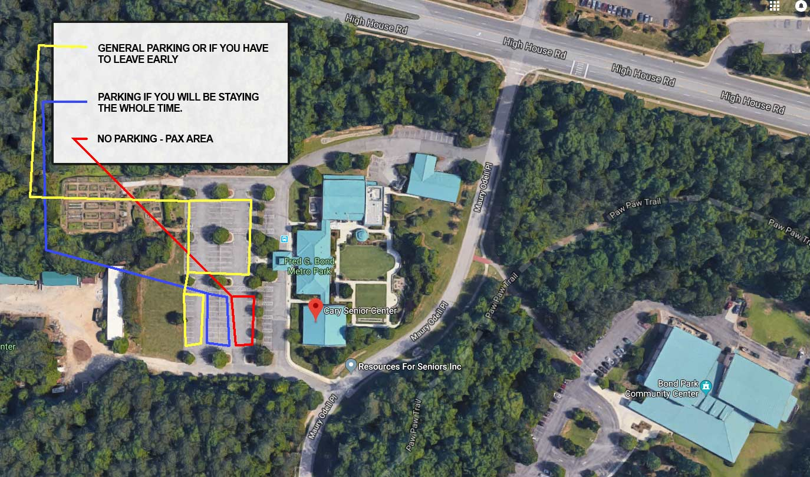

Wednesday is normally a pretty busy day in Carpex but this Wednesday, June 20th, is going to be chaotic!  Here is your guide to all 3Fs:

### 1st F:

- **0435**~0500 (start) **- 0630**:  The Maynard:  The Maynard is a monthly mini-CSAUP run that is 10.7 miles and only two left turns.  [**Here's a _little_ more info**](https://f3carpex.com/2017/06/20/the-maynard-preblast/).  Finishers stroll in about 0625 (Pick your start time to get you back by 0630 is key.  Staggered starts every 10 mins: 0435/0445/0455/0505)
- **0505-0540**:  Insomnia:  Insomnia is a regular standing 4 mile EC run.  Leaves at 0505 sharp.  Puts you back at the flag for your next AO:  Vesper / Shankin not Stirred / Tortoises
- **0545-0630**:  Regularly scheduled AOs
    - Tortoises:  This AO is converging at Bond Park this week.  It's a limited run bootcamp.  Less running = more exercises to build bulging biceps.
    - Vesper:  Two groups set out on a 4 mile or 5 mile run.  Typically with the Maynard happening the groups that go out run down the Maynard guys in reverse and trek back with them.
    - Shankin Not Stirred:  This is the your regular normal Bootcamp Beatdown happening in Bond Park.

If everything goes as planned all Pax will converge back at the flag(s) by 0630 for one giant COT.

### 2nd F:

- **0640-0650**:  When COT concludes there will be drinks and snacks for all.  Hang out and fellowship.
- Around 0655 we'll gather everyone's attention to start 3rd F
- **NOTE**:  If you can't stay for all of Chinese Downhill's talk don't worry.  Stay as long as you can and then slip out.  Don't leave at 0650 if you can stay even another 10 mins.  Hear his story for those 10 mins!  This announcement will be made before he speaks as well.  We know schedules are busy so it won't be rude to leave while he's talking.

### 3rd F:

- **0655-0715**:  CD will have the floor and share with us his F3 testimony!
- **0715-0730**:  Clean up/Leave the park better than we found it.

### parking:

- If you know you need to leave before 0700 try and park on the backside of the parking lot (yellow).
- If you know you'll stay the entire time fill up the front row spots (red).

