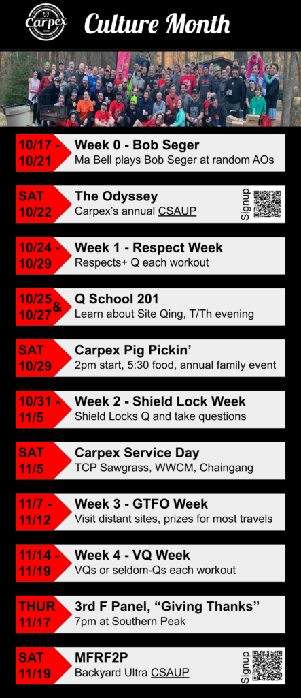

You might have heard a lot about culture month, and participated in past years. Here, you can find out more about the nitty-gritty details of the events that just won't fit nicely into a Newsletter or Slack post because there are so many things going on.

The purpose of Carpex Culture Month is to inspire us to reinvigorate male community leadership by celebrating, showcasing, and accelerating our region's commitment to 1st (Fitness), 2nd (Fellowship), and 3rd (Faith) Fs. While these events are peer-led as with everything in F3, the SLT does want to thank the QICs for their flexibility as we tried to coordinate everything to fit together into a month-ish block of time.

## Week 0 - Bob Seger

**What**: Ma Bell shows up to play Bob Seger music at the workout.

**Why**: Everyone needs a hype man! Think of this as spirit week; you are encouraged to revel in the goofiness of Carpex. Are there other Carpex shenanigans you'd like to celebrate this week? Maybe a Larry appearance or Everyman Jack bath? Freed to Lead!

**QIC**: Ma Bell and whoever else

**When**: 10/17-10/21

**Where**: Random AOs

## Kickoff - The Odyssey

**What**: Carpex's annual completely stupid and utterly pointless (CSAUP) event. Such events typically last about 4 hours, as we run to various sites where Qs prepare a special beatdown. Leading the way, the SAG crew provides support from site to site, by biking the routes, directing traffic as needed, setting up water/aid stations, and more.

**Why**: It all begins with 1st F, and CSAUPs are designed to push ourselves physically and tactically. Also, did you see HK's t-shirt design? SICK

**QIC**: Badlands and Bogo for ME, Pet Sounds for SAG, and many, many others along the way.

**When**: Saturday, 10/22 at 0600

**Where**: Launch from [BO](https://www.google.com/maps/place/110+Waldo+St,+Cary,+NC+27511/@35.7866686,-78.7829235,17z/data=!3m1!4b1!4m5!3m4!1s0x89acf3a5dd77ca4d:0xa11ccd5016489b9f!8m2!3d35.7866686!4d-78.7807348)

**Signup**: Add your name to the Google Sheet, which you can find on Slack or the Newsletter.

## Week 1 - Respect Week

**What**: Respect and Honor Pax lead the workout.

**Why**: Kicks and giggles, I think.

**QIC**: 1st F Qs Pierogi and Pom Pom

**When**: 10/24 - 10/29

**Where**: Each AO throughout the week.

## Site Q School 201

**What**: Current, former, and potentially future Site Qs gather to arm wrestle over which site is the GOAT exchange ideas, raise questions and safety concerns, and identify what works/doesn't work when leading an AO. You can also check out this great [Site Q guide](https://docs.google.com/document/d/10E2sNYlreR3HQcwWpOuyKCSU8_0jwpbN2CUJ9EaK9FU/edit?usp=sharing).

**Why**: To accelerate our sites across the region and improve our leadership skills.

**QIC**: 1st F Qs Pierogi and Pom Pom, and M.A.S.H. enthusiast Bronx Bomber

**When**: Tuesday, 10/25 at 7pm, and Thursday, 10/27 at 7pm

**Where**: Fortnight or other Cary location TBD for Tuesday, and Southern Peak or other Apex location TBD for Thursday

## Carpex Pig Pickin' Picnic

**What**: One of Carpex's annual 2nd F events, this family-friendly event features a good ol' fashion pig pickin' with potluck-style side dishes. It is hosted at a beautiful piece of land nearby in Chatham county featuring a huge field, small lake and pier, walking trails, port-a-johns, and plenty of parking.

**Why**: To enjoy a time of fellowship and to convince the Ms, family/friends, and ourselves that this isn't a cult, or at least it's a _healthy_ one.

**QIC**: Riptide and 2nd F team

**When**: Saturday, 10/29 starting at 2pm, food served around 5:30pm

**Where**: Check Slack

## Week 2 - Shield Lock Week

**What**: Members of a Shield Lock take turns leading the workouts. Other terms for Shield Lock can be a Get Better Brother (GBB).

**Why**: For you to heckle 4 Qs instead of just 1 at a time! Also to provide a venue either during the workout or afterwards at COT and coffeeteria for you to ask questions about what a SL is, why you want one, how to form one, maybe even how to leave one, share what works/what doesn't for yours and learn from others, and everything else in between, like do you really vacation together, get matching tattoos, and chip in to buy a SL hot tub? Also check out the [Stuff Worth Trying podcast episode](https://f3nation.com/stuff-worth-trying-podcast-episode-10-shield-lock/) on Shield Locks.

**QIC**: Parker and Steaks

**When**: 10/31 - 11/5

**Where**: Various AOs. If you're in a Shield Lock, sign yours up for a site or two on the Q Sheet.

## Carpex Service Day

**What**: Put our community leadership into practice by engaging in a service project in the local area.

**Why**: Maybe you've been a regular servant-leader at these events throughout the year, or maybe you've just heard a lot about them but haven't HC'd and showed up yet. Grab your SL, GBBs, or 2.0s and show up for one of these service projects!

**When**: Saturday, 11/5

**Where**: Various opportunities:

- Chaingang meets 10am at the Mr. Tire on the corner of Jenks and Hwy 55 in Apex for "Adopt a Highway" roadside cleanup. 2.0-friendly for age 13+. See Bagels for more info.
- Western Wake pickup at the Lowest in Apex off Hwy 55, which you can schedule at your convenience. 2.0-friendly. See Silver Fox or Kwik Stop for more info.
- TCP Fall Cleanup, meets at various addresses at 2pm. Check on Slack or with Parker for more info.

**Note:** Can't make this date? There will be another service project, "Rebuilding the Triangle," led by F3 Scary secessionists, likely Saturday, 11/19, but the date is still TBD.

## Week 3 - GTFO Week

**What**: Post at a different AO than you normally do each day of the week. Prizes provided by Burt and sponsored by Lennar Homes (or something like that) will be awarded for most distance travelled from your home that morning to an AO within Carpex or a neighboring region.

**Why**: Because Cally is gettin' lonely in Dollywood! More seriously, Carpex is a bit of a sprawling region, with an ever-expanding list of AOs, and this will be a great way to mix it up with the Cary, West Cary, POGL, and maybe even Scary guys. This can also be a nice way to challenge your Q or fitness skills by doing a workout in a totally new location or in a totally new style, like Hi-tempo, Ltd. Run, or trying something new.

**QIC**: Franklin and Burt

**When**: 11/7 - 11/12

**Where**: Various AOs.

## Week 4 - VQ Week

**What**: Pax who have never Q'd, not Q'd in awhile, or not Q'd a particular site or type of AO led the workout.

**Why**: Another time-honored tradition to encourage us to put one of founding principles, that the group is peer-led in rotating fashion, into practice. This can also give all of us a chance to reflect on proper form, effective cueing techniques, and more generally what we like about workouts and Qing.

**QIC**: Franklin, Squatter

**When**: 11/14 - 11/19

**Where**: Each AO throughout the week.

## 3rd F Panel on Giving Thanks

**What**: Hear from various religious leaders to promote a united perspective on Giving Thanks. The plan is for a Catholic Priest or Seminarian to speak about the Catechism, the church, and their view of Giving Thanks. Then, a Protestant elder will speak on the Attitude of Gratitude followed by a Hindu leader speaking about How Prayer is used for Gratitude. To conclude our time, we will hear a testimony from a Pax, Punch Card, about thankfulness.

**Why**: Reflect upon various aspects of giving thanks to help us Get Right before the Thanksgiving and holiday season.

**QIC**: Bootlegger

**When**: Thursday, 11/17 at 7pm

**Where**: Southern Peak in Apex

## Concluding CSAUP: 3rd Annual Mike Fiorito Race for Second Place (MFRFSP)

**What**: Backyard Ultra wherein the goal is to complete 100 total miles: 5 miles each of the five workdays leading up the race (25 miles) and 75 miles the day of the event. Starting at midnight of the day of the event, you complete a 5k (3.125mi) lap called a "yard" at the start of each hour. When you complete that hour, you have time to rest, recovery, and prep for the next yard at the top of the next hour. You can run, ruck, walk, or some combination of those each yard. There will be a fire and port-a-johns provided. Otherwise, you bring your own stuff, like chairs, sleeping bags, food, etc. and camp out.

**Why**: It is a ton of fun, very challenging, and you will exceed what you thought you were capable of doing in some way. I will say that personally when I participated for the first time last year, I learned so much about myself, my "why," and also many of the values of this group of not leaving anyone behind, accelerating, learning about leadership and community from each other, and more.

> **_“If it doesn’t challenge you, it doesn’t change you.”_**

**QIC**: Squatter

**When**: Saturday, 11/19 at 12am midnight; you will probably want to show up Friday, 11/18 after work sometime, or at least by 11pm.

**Where**: 10109 Morrisville Pkwy. Apex, NC. All running will be done on The American Tobacco Trail, and I'm sure Squatter has some surprises to spice up the routes a bit!

**Signup**: Add your name to the Google Sheet, which you can find on Slack or the Newsletter.

## Promotional flier

Spread the word!

