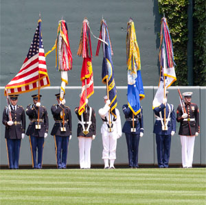
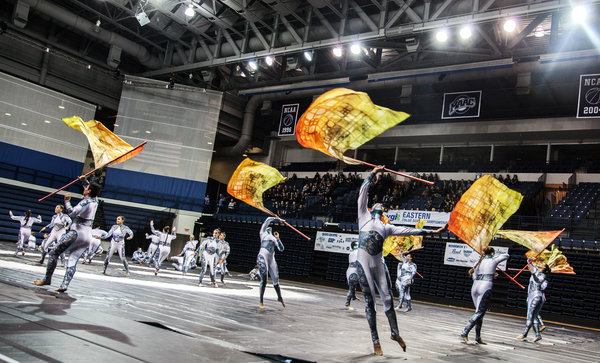

The time has come for the guard to change at Wolverine.  Bogo and Pivot completed their time at the helm.  They did and amazing job, continuing what Hi-Liter and Biner so graciously began two years ago.  The workout and transition went something like this.

Well, maybe it was a little more American.

Maybe not quite that patriotic and brave.  More like this.

Yes, the workout today was based on the GHHS Color Guard conditioning routines which are set to music.  Fortunately, Wolverine is one of the darkest of all the glooms.  I’m sure we looked pretty silly out there.

Anyway, this is what we did.

**Disclaimer**

**Pledge**

**Warm Up**: Mosey to the basketball court. Good Morning x10, SSH x20, Windmill x15, Imperial Walker x15.  The Q was a little off with the calls this morning.  That’s ok though.  The mumble chatter was there to keep him in line.

Here’s where things got different.

**Thang 1**: Arms – to **Heads Will Role** by _Yeah Yeah Yeahs_

- Arms straight to the side throughout.
- Shoulder Tough – Head Touch (each arms) x16, x8, x4, x2, x1
- Arm circles forward (small, medium, large) x16 each
- Arm circles backward (small, medium, large) x16 each

**Between Thang**: Runners partnered up for Catch Me if You Can.  One lap around the path w/ 5 merkins when caught.  Non-runners walked with and did merkins.

**Thang 2**: Legs – to **Shrooms** by _San Holo_

- Squats x25
- One Leg Squat with back leg kicked back and to the side (like a bowler or Apollo Ohno, without the hop) x25
- Fire Hydrants (each side) (hands and knees, lift one leg like a dog at a fire hydrant) x8
- Donkey Kicks (each side) (hands and knees, lift one leg back and up) x8
- Combination Fire Hydrant then Donkey Kick (each side) x8

**Between Thang**: Same as before

**Thang 3**: Abs – to **Run the World (Girls)** by _Beyoncé_

- LBCs x16
- Right foot on left knee x16
- Left foot on right knee x16
- Dying Cockroach (both feet straight up) x16
- V-up x16
- Left leg in V, right leg bent inward x16
- Right leg in V, left leg bent inward x16
- Diamond (feet together on the ground, knees apart) x16
- Legs straight on the ground x16
- Lay on right side, crunch up x16
- Lay on left side, crunch up x16
- Back to regular (LBC) x16

**Between Thang**: Same as before

**Thang 4**: Core – to **Don’t Stop Believin’** by _Journey_

- Non-stop Homer to Marge

**Between Thang**: Same as before

**Mary**: Box Cutter x20, Have a Nice Day!

**PAX Count**: 22 / 2 FNGs

**Announcements**: (a) TCP this Sunday (b) Odyssey on 10/5

**COT**: Taken out in prayer by Water Wings.

2nd F followed in the parking lot to celebrate the Site Q transition.
