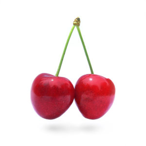

**Pre-Blast**

This being my virgin Q and my first time at SNS, I truly appreciate all the support and advice from the PAX.  Special thanks go to Angry Elf for the pep talk the night before and for planning the Thang with the pain sticks.  I do wish I had made it to Q school. It is amazing how much I didn’t pick-up naturally from two months of just doing the workouts. The mumble chatter was justified, and it kept me in line; particularly, when I would call one exercise and then let the QDRENALINE turn it into something else entirely. Yes, there was a jar of cherries and a box of toothpicks. Well played.

**The Warmup**

No FNGs present.

Pledge of Allegiance at the big flag

Run to the Community Center w/ High Knees

Capri Laps w/

- Carioca both ways
- Side Shuffle Hop both ways

Circled up for some:

- Good Mornings x10
- Daniel-Sons (Crane position alternating knee lifts) x15
- Chinook Squats (three arm circles then squat) x15
- Imperial Walkers x20

**The Thang**

Count-a-Rama (22)

Paired-up for Worst Dora Ever

- 100-Pain Stick Clean and Press w/ a slam
- 200-Merkins
- 300-Beast Press things

One pain stick was harmed in the execution of this thang.

With the same partner, Catch-me-it-you-can w/ 3 Burpees, back to the shovel flag.

**Mary**

- LBCs x20
- Mountain Climbers x20
- Side Plank Star Crunches x10
- Fazio Arm Circles (or whatever they are called) x20
- Have a nice day

Some Vespers joined with us during the Mary.

**COT**

Count-a-Rama - 33

Name-a-Rama – see above

**Announcements**

- New Thursday Morning AO beginning Oct. 18, Back in Black, 5:15, standard issue vanilla bootcamp at Koka Booth.
- New Friday Morning AO beginning Nov. 2, Grand-Torino, 5:30, high temp bootcamp at Green Hope Elementary.
- Picnic Sunday, Ritter Park, 4:00, $10 per family, bring a side dish
- TCP Sawgrass Sunday 2:00
- Odyssey, Oct. 20

**Prayers/Praises**

Borland gave high praises to Angry Elf and all the F3 guys, for their excellent work can continued support with the F3 Carterico and F3 Cape Fear relief effort. Audio of this praise has been posted to the #0\_disaster\_relief channel on Slack.

It was an honor to lead this morning.
