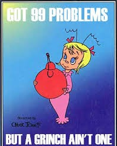

I roll out of bed this morning to the sound of fairly substantial rain.  I immediately ping my bookie to go heavy on the under for today’s 150 Carpex attendance target.  But by the time I arrive at Whoville the rain has cleared, and we are left with a warm and glorious morning.

Clementine rolls in 90 seconds early, which seems to stun the Whoville regulars.  On a side note, I am not sure if Clementine’s Hasselhoff banana hammock infinite loop pre-blast is one of the greatest things I have ever seen or one of the most disturbing.  9 are on time for the 0530 start.  Including Geek Squad who is enduring his second Q from YHC in 48 hours.  All veterans.  Pledge.  Mosey in a circle around the parking lot to get loose.    

- 6 GM IC
- 25 SSH IC
- 15 HB IC – There is some discussion here as to whether or not the Hillbillies are going to get offended and come to cancel our exercise.  I assure the crew that I am from Tennessee and therefore have full freedom to use the term.
- Calf Stretch
- Runner’s Stretch

Now that we are loose, we form up in two lines for Indian Runs + around the campus.  The “+” is a set of Merkins, Squats and WW2s each time the line cycles through.  The rep count starts with 1 and increases by 1 with each stop.

After making our way around campus for a bit we circle up for 25 LSF IC and line up for the Pain Train.  These are street light suicides, with each light having a specific exercise performed when the light is passed in either direction.   

- 1 - 5 Merkins
- 2 - 10 Squats
- 3 - 15 WW2s
- 4 - 20 CDDs
- 5 - 25 Jump Squats

We have time for one full cycle plus an abbreviated bonus ride.  Props to West Cary for absolutely crushing the Pain Train.

Everyone grabs some wall for alternating one-minute segments of People’s Chair and Chilcutt, while we discuss the Rambo and Rocky movie franchises and drop some Airplane quotes.  Alas, no one mentions the Hoff.

Mosey back to the flag for 25 LSF IC and Have a Nice Day.  TCP Sawgrass is firing up on Sunday.  Get at Hermes.  YHC took us out.
