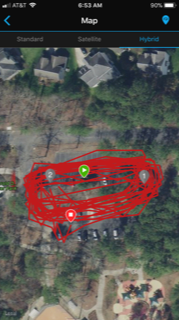

I guess it was more like an oval. I got there early to check out the park and Hermes and Billy were already waiting.  10 Pax showed up and Joe Smith placed the flag.  We started off on our first lap as Fluoride rolled in.

**Warm Up** 

Jog lap 1 and on lap 2 we did butt kicks, high knees, and karaoke.

Circle up for 10 x GM and 15 x IW.

**The Circle of Death** - the plan was to get as many laps as possible but work in different exercises.  I didn't tell people the name until the end so as not to scare anyone0.

Count off in 1 and 2s.  When I call a number they sprint the loop to catch the other group. Then told the pax to listen up for exercises.

Indian Run - 2 laps

The first group's "all you got" didn't work out so well. I think everyone sprinted so no one caught up.  So we did slower things while one group sprinted, such as:

bear crawls, lunge walks, crawl bear, backward lunge walk, inchworms - everyone started them and then one group sprinted the loop

Throughout the running we stopped and did: 10 Burpees,  50 SSH, 20 mountain climbers, 20 CCDs, 20 donkey kicks, 20 quick feet, 20 calf raises, 10 Man Makers, 20 squats, 20 Hill Billies

Indian Run - 2 laps

All you got 1 lap

Then we stopped and did some **Mary**

10 IC Reverse LBCs, 10 IC Flutters, 10 IC Hello Dolly's, 10 IC Heels to Heaven, 20 Outlaws, 6 Inch hold for 5 secs around the group, 20 IC American Hammers

Recover! We did about 2.3 miles in the parking lot.  Should be about 20 laps or so.

**COT**

Count-o-rama and Name-o-rama - 11 with a few Respects

Announcements - F3 Dads, BO convergence on Thanksgiving, Christmas Party

Prayers/Praises - Termpaper's Cruise

YHC took us out in prayer - It is a good time of year to be thankful and reflect on our blessings.

My memory verse for the week is: Romans 6:23-24

"For all have sinned and fall short of the glory of God, and are justified by his grace as a gift, through the redemption that is in Christ Jesus."

Typing it out helps me memorize it and figured I would share. It is the number one thing I am thankful for.

NMS

- Box of Death was a workout we did for ultimate frisbee so I copied it.
- I think Flip Flop did it once too
- Fluoride asked if we were going anywhere. Well yes, in a circle
- All left turns
- We need more Qs at FWD https://f3carpex.com/q/
- SO to Smokey for dealing with all the running
- Thanks for letting me lead!
