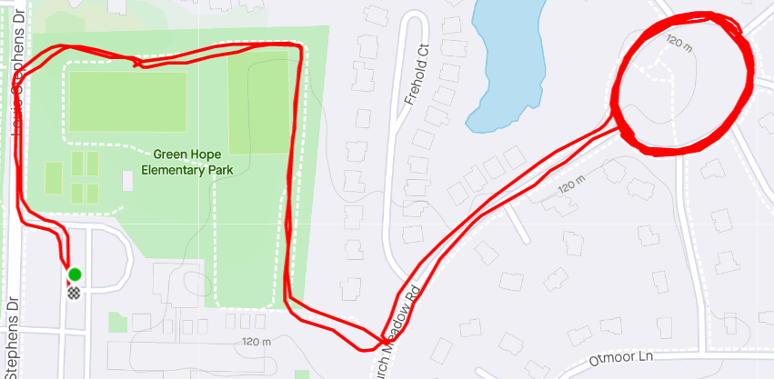

**AO:** Gran Torino  
**Workout Date:** 07/30/21  
I got to witness Gran Torino from afar when I Q’d Rolling Stone back in May. Those fellas got in some serious mileage just doing laps in the parking lot. I’ve been putting off my Q, waiting until I was “ready.” How many times have we said/heard that at F3? I was originally scheduled to Q Crazy Ivan today but got unintentionally bumped off the Q Sheet there for Q Swap Week. Looking to fill the open slot for my Birthday Q Week, I found Gran Torino vacant. I thought, “(unprintable) it. Let’s do it.” And here we are.

**Warm Up:**  
State the mission, check for FNGs(0), and give the disclaimer.  
I passed the corporate audit, or at least Hello Kitty kept it to himself.  
Warm Ups part of the Main Event.

**Main Event:**  
**1)** A Pony Express-inspired trip to Circle on the Green. Stop at quarter mile intervals for warm ups.  
**1a)** Mosey up Louis Stephens onto the Greenway and stop by the soccer field for:  
Side Straddle Hops x20 In Cadence (IC)  
Good Mornings x5 IC  
**1b)** Mosey on the Greenway to Birch Meadow Rd for:  
Imperial Walkers x20 IC  
Sir Fazio Arm Circles forward x10 IC  
Sir Fazio Arm Circles reverse x10 IC  
Mumble chatter expressed disappointment that Fazio himself is so shy about the exercise named for him.  
**2)** Mosey up Birch Meadow to the far side of Circle on the Green and partner up for **Elevens**. Partners run opposite directions around the circle and when they meet, perform what ever exercise/rep they are on. Start with **WW1s** x1, then run to the meeting point for **Burpees** x10. Continue through the full set of Elevens.  
**3)** Mosey back along Birch Meadow to the Greenway. **Squats** x10 On My Down (OMD)  
**4)** After deliberation about whether to head back to start or finish the plan, we finished the plan. Mosey back along Greenway to the soccer field. **Squats** x10 On My Down (OMD).  
**5)** Mosey back to start for COT.

<figure>

<figcaption>

[https://www.strava.com/activities/5710122347](https://www.strava.com/activities/5710122347)

</figcaption>

</figure>

**Mary:**  
None.

**COT:**  
9 PAX for Gran Torino, 1 PAX for Rolling Stone.  
  
Announcements:  
**1)** South Wake/Carpex Q Swap Week(s): Tomorrow is last day of Carpex Qs. Join YHC at Ground Pounder. Next week is the South Wake invasion.  
**2)** New SE Raleigh AO (Brother’s Keeper) opens 7/31**  
3)** F3 ENC’s Sasquatch (CSAUP) also 7/31  
**4)** Carpex is taking donations for a care package for Monkey Wrench  
**5)** Carpex picnic 10/2  
**6)** F3 Nation 10 Year in Wilmington 10/8-10/10  
**7)** Carpex Odyssey 10/23  
  
Prayers spoken and unspoken.  
YHC took us out.

**Naked Moleskin:**  
We got our miles in! Strava estimates for the group were right around four miles.  
T-claps to Chanticleer for the socks, and to Bartman for the coffee at Crema!  
This was my eighty-fifth #F3Q21 #2021Challenge Q (eighty-eighth overall). Next Q is Saturday (tomorrow!) at Ground Pounder in South Wake for the final Carpex Q of Q Swap week. It will also be Birthday Q #6!  
\-Pigpen

**QIC:** Pigpen  
**PAX:** Biner, Nothin Special, Lucky Charms, Hello Kitty, Chanticleer, Michelob, Saban, Ma Bell, Pigpen (plus Bartman the rucker)  
**Workout Date:** 07/30/21
