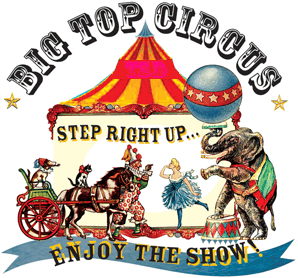

A beautiful morning at the finest AO in NW Cary. Welcome to the Circus. Ringmaster Geek Squad led the day’s events. 15 showed up on time. Unfortunately Nature Boy was late. After the pledge, we were penalized with 5 burpees to allow Nature Boy into the Circus.  

#### At ring 1: Warm Up

- 5 Good mornings
- 5 Wolverines OYO
- 5 Windmills
- 10 ea Fazio arm circle forward, reverse I
- 10 Merkins

#### At ring 2: Thang 1

- Mosey to track
- 25 Merkins
- Lunge walk curve
- 25 jump squats
- Backward run straight
- 25 mountain climbers (L/R = 1)
- side shuffle curve
- 25 Hello Dolly
- Repeato

#### At ring 3: Thang 2

- Mosey to stairs
- Divided into two groups

Group 1

- At base of stairs do 5 merkin
- Bear crawl first set of stairs, 5 merkins on the landing
- Repeato to the top
- When at the top, do 5 Wolverines
- Run back down
- Flip flop

Group 2

- 5 each merkin, jump squat, mountain climber and hello dolly
- Repeato until group 1 finishes
- Flip flop

#### At ring 4: Thang 3

- Mosey to parking lot.
- Plank shuffle Merkin - line up on parking lot stripe, get into plank position, do 1 merkin, plank shuffle to next stripe, 2 merkins and so on until 5 merkins are completed.
- Then reserve starting with 5 merkins down to 1 merkin.

#### At ring 5: Thang 4

- Mosey to basketball court
- Group 1 Balls to the wall
- Group 2 Crawl Bear to 1/4 run back, Backward lunge to 1/2 run back, backward run to 3/4 run back, run to full and back
- Flip flop

#### At ring 6: Mary

- 20 LBC in cadance
- 20 Freddie Mercury in cadance
- 20 Hello Dolly in cadance
- 20 WWII
- Have a nice day!!

Announcements - Sunday at 2 - TPC Sawgrass @ 201 Urban St, Cary

Prayers/Praises - None spoken
