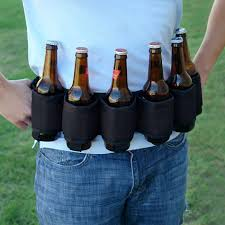

YHC's goal for the SNS beatdown....don't stop moving, and engage the core! My challenge to the PAX and future Q's is to engage the core, and step up the numbers....it doesn't have to wait for Mary!

<figure>

<figcaption>

Though a fine 6-pack...this is NOT what we are talking about!

</figcaption>

</figure>

- **Warm up**
    - Quick jog to the community center parking lot, backwards run in a circle to capture the 6
    - SSH
    - Merkins
    - Calf Stretches w/wide-grip merkins
    - enough....let's go!

- **Thang 1**
    - 7's with a twist
        - From the intersection of Metro Park Drive and Bond Park Drive, we travel two light poles on MPD for one Dive Bomber Merkin.
        - Back to the intersection for 20 LBC's
        - Run two light poles up the hill on BPD, 6 burpees.
        - Back to the intersection for 20 LBC's....complete the 7's with 20 LBC's every time you hit the crossroads.
        - After 220 LBC's...the PAX were ready for more burpees!

- **Thang 2**
    - Dora 1-2-3
        - We ran (no mosey today) to the dam, a little stop along the way to pick up the six, and also some squats to keep our legs warm.
        - Partner up for Dora (no swiping)
            - 100 Merkins
            - 200 WW2's
            - 300 Squats
            - One partner us running the steps to the top of the dam and back while Player 2 gets after it!
        - We had to cut it a little short, time went by very quickly this morning!

- **COT**
    - Run back to the flag, backwards up the big hill.
    - Ma Bell led merkins at the Circle
    - Have a nice day!
    - Several announcements to include Bible Study following at La Farm, Memorial Day workout, and anniversary workout on 5/31
    - YHC took us out in a giant ball of man, as we joined Vesper and the many PAX who braved the Maynard on this crisp and clear May morning.
    - 1 Hate, 31 Meh, 5 Respect

- **NMS**
    - Though not a "high-tempo" AO, the PAX at SNS got after it this morning! We did an unofficial 4 miles, and all pushed out of our comfort zones! Push your brothers hard, push yourself harder, but be smart! If you're injured, get well and don't overdue it...if you're not injured try to keep it that way, and always try to push through those barriers....most often your body can pusher further than your mind tells you! Prodigal out...
