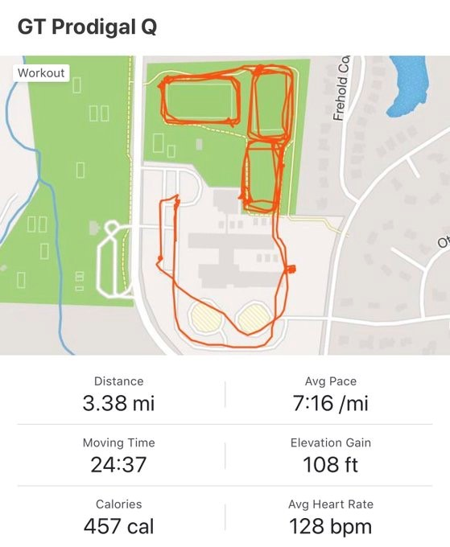

We moved, we sweat, we got going like a turbo vette! It was a swampy morning at Gran Torino, so we just jumped into it.

Warmup:

- Good Mornings - Pretty weak on the Nature Boy imitations
- SSH
- Merkins
- LBC's
- Merkins
- We're off

The Thang:

- 4 groups of 2, one group of 3 on the soccer field. We ran opposite directions around the perimeter of the soccer field, and met for 10 LBC's. Turn back the way you came until you meet again for 20 LBC's. Keep the same process until you complete a round of 50.
- Next Soccer field, same story....only this time with Supermen
- Next Soccer field, same story....only this time with WW2's

Mary:

- 50 flutter kicks in cadence
- 20 Australian Snow Angels in cadence
- Mosey to the flag for some Biner led boat canoe
- And what's a workout without some WW2's to finish!

NMS - Fast and strong group this morning, and we covered some good ground. Have a great weekend!!
