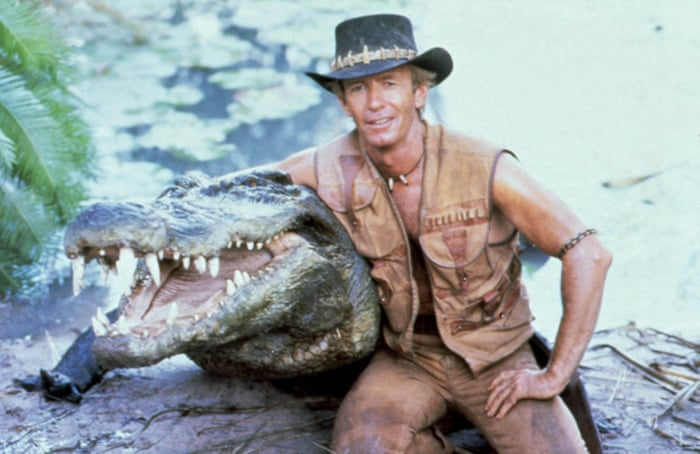
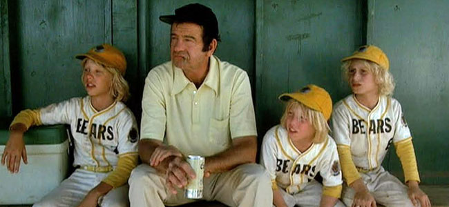

<figure>

<figcaption>

Nature Boy and Hi-Liter posing after the beatdown.

</figcaption>

</figure>

It was an anxious crowd (or maybe an anxious Q for his first full beatdown Q) at Field of Dreams this morning, excited to see what was in store down in the gloom.

Warm Up:

- Pledge of Allegiance....respect the stars and stripes!
- Quick mosey to the first lot, pick up the 6, circle up with side straddle hop, and your standard merkin
- Mosey uphill to the next parking lot, once again get the 6, side straddle hop, and wide grip merkins
- One more fast mosey to the last parking lot for more side straddle hop, and the diamond merkin.

<figure>

<figcaption>

It's time to break up into 4-HIM teams

</figcaption>

</figure>

The Thang:

- Line up Husky to Slight to make teams of 4 or 5, mosey to the turf soccer field.
- With your team, run to first corner of soccer field, 10 burpees per person
- Team to second corner of the field, 20 Australian Pull-Ups per person (80 or 100 per team) (insert groan/crying here)
- Team to third corner of field, 30 Australian Snow Angels per person
- Team to final corner of field, 40 Knerkins per person....plank it out!

The Thang 2:

- With your team, line up single file on the sideline of the field. First person sprints to other side, 10 merkins and 20 squats, sprint back and tag your teammate. Teammates not sprinting are pulsing squats, cheering on their brothers. First team to complete and end in plank wins!
- Team Husky either didn't listen well or doesn't plank well.....team light-weights for the win!
- Next round, same thing with 10 LBC's...once again light-weights for the win....fat guys got tired but salvaged the bronze.

The Thang 3:

- Mosey to the parking lot, 10 lunges followed by 10 merkins. Repeat until the end of the pickle.
- Backward run lap around the lot, unless you are Nature Boy, who has perfected the inverse backward mosey.

Mary:

- Circle up with 20 WW2's, 20 Luge, 20 Flutters
- Nature Boy led us in Homer to Marge
- Sky Blue went overboard with Boxcutters
- Biner took us home with the American Hammer (I don't think he likes Australia).

COT:

- Count-a-rama: 18
- Name-a-rama: 5 RESPECT, 12 meh, 1 HATE
- Announcements: Hi-Liter TCP Sawgrass kicking back up
- Prayers/Praises/BOM: Hi-Liter took us out.
