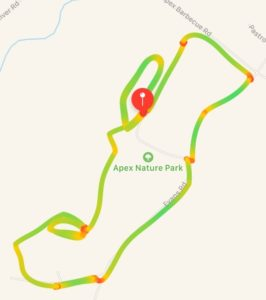

Perfect weather greeted a group of 19 PAX this fine morning at Dante's Peak, Carpex's premier Friday AO. YHC was continuing with Scout Week, this time focusing on the Webelos Walkabout Adventure. The Webelos Walkabout is a 3 mile hike in nature. We encountered snakes, star (jumps), spider (man/peter parker), big beautiful rocks, and brotherhood this morning!

In full discloser, there was a lot of mumble chatter on slack about how much distance we would cover this fine morning. Disco Duck has promised to exceed our 3.32 miles next Friday by having a shorter warm up and mary.

**Warm up:**

- SSH x 10
- Imperial Walkers x 10
- Sir Fazio Arm Circles - Forward x 10
- Mountain Climbers x 10
- Good Mornings x 10

Mosey up the hill to the corner of Evans and Apex Barbecue.

**Thing #1**

Partner up with a buddy. Scouting is designed to create a sense of brotherhood so YHC asked the PAX to stick with their buddy for the duration of the workout.

Catch me if you can to the athletic field entrance, with partner A doing 5 x merkins then run to catch partner B and swap.

Black Snake run to the nature park entrance. Black snake is like an indian run with the PAX weaving through the line as they make their way to the front.

**Thing #2**

7's with your buddy. Star with Star Jumps at the gate and Peter Parker (Merkin Optional) at the fire hydrant.

Partner run to the rock pile. That is run together with your buddy.

**Thing #3**

Rock work - grab a non-traveling rock per group. Buddy 1 runs the loop around the pond while buddy 2 does curls, tricep extensions, overhead press, rock rows. 100 each as a group.

Run with your buddy back to the flag. Remember we are on a hike, take some time to enjoy nature and bond with your buddy on the hike!

**Thing #4**

Running low on time, YHC had to modify the Burpee mile to the Burpee 3/4 mile and reduce the burpee count each lab from 12 to 3.

**Mary**

Hotspot called some Shakira while we waited on the 6 to finish the Burpee 3/4 mile.

American Hammers x 10

Have a nice day

And like that we were at 6:30!

**Announcements:**

- Memorial Day Convergence - Thomas Brooks Park (FOD) 7:00 AM Monday
- Crazy Train June 9
- Plan to attend 3rd F event after SNS at Bond Park on June 20

**Prayers/Praises:**

- Ascot's M
- Disco's M

**NMS**

- Scout week is a lot of Scouts. Appreciate all the support PAX!
- Crimson created a new word - Q-dren·al·ine. The excitement one feels prior to leading a workout. I think he was annoyed that I was much more awake than he was!
- If you were at my Christmas Train Q this was basically the same workout. See what I did there!
- 3.32 miles is respectable for a 45 minute workout. Top that Disco!
- I also kept my reputation for running.
- Make it a great Memorial Day weekend! Don't forget to honor our nation's fallen heroes! And for our Veteran's - Thank you for your service!

