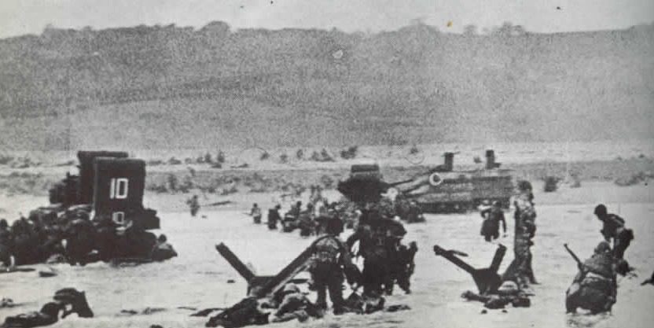

AO: Phoenix

Date: 6 June 2020

QIC: Wrench

PAX: 1-4, Big Red, Callahan, Cataracts, Defib, Earhart, Gump, Hipster, Huckleberry, Kermit, Kwik Stop, Side Out, Sooey, Texas Ranger, Wrench, WWW

6 June 1944, 0630 American forces land on Omaha Beach. These men had what was deemed an impossible mission, with only one possible outcome: succeed. Being a history buff, seeing this date open, knowing that the hill is there at Phoenix, and knowing some about that invasion, a workout in honor of those brave men that day, many years ago, was the least I could do.

At 0630, 6 June 2020 14 men stand in a parking lot at Bond Park in Cary. Gump had already launched on his Maynard run. NO FNGs, mission statement, enlightened the PAX of the theme, pledge to the flag and we moseyed.

Arriving at the hill, warm ups:

10x GM

10 count runners stretch each side.

Thang 1: Belchers. Work way across the field then charge the hill. (Start on your belly, Q says go jump up like finishing a burpee and Sprint 10 paces, back on belly. Repeato.)

Thang 2: Bear crawl 10 paces, 10 Squats. Continue to base of the hill, working across the field. Charge hill. 10 Squats at the top.

Thang 3: Crab walk 10 paces, 5 Peter Parkers, working across field, take hill. 5 Peter Parkers at top.

Thang 4: Alligator walk 10 paces, 5 WW2s, across the field, charge hill, 5 WW2s at top.

Thang 5: Everest Walk 10 paces, 2 navy seal burpees to small hill, then charge the field and hill, 10 NS Burpees at top.

Mosey back to the flag for a PAX called Mary. LBCs, American Hammers (of course), Hello Dollys, and Hipster's sideways crunch thing that was no fun.

Callahan took us out in prayer.

Announcements: Tin2Iron Hard launch, QSource and coffeeteria Thursdays at Sovereign Grace. Thanks WWW for leadership.

Prayers/Praises: 1st responders, Ninjago, Yogi and his son transition. Others on Slack.

NMS:

\-I broke the main rule of Q-ing, if you can't do it, don't Q it. I did so for 2 reasons: one to push myself to do it (I did it, but it was bad). One because those men had an impossible mission and succeeded, least I could do is push myself here.

\-Almost 2 merlots, but nothing. Cally said the IPAs were a bad idea.

\-Kwik Stop = machine.

\-Hipster on his second or third post calling exercises. Outstanding. They were horrible, so it was good.

\-More new faces getting back out in the Gloom. These men pushed themselves, pushed me, and pushed each other.

\-Texas Ranger kept his shirt on until the end, good thinking because the grass on the field is not naked grass.

\-9 for 2ndF coffeeteria at Breuggers following. Was great to get back into that swing as well.

\-15 sweat angels seen after Mary into countorama and Nameorama.

MIAGD!
