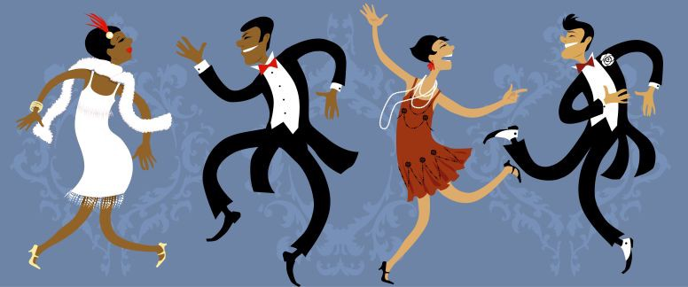
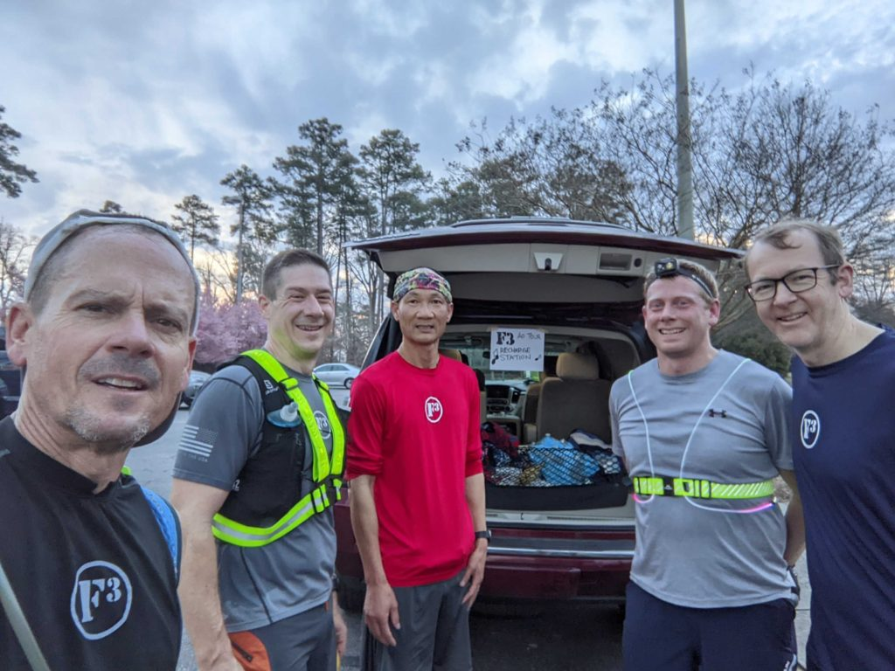
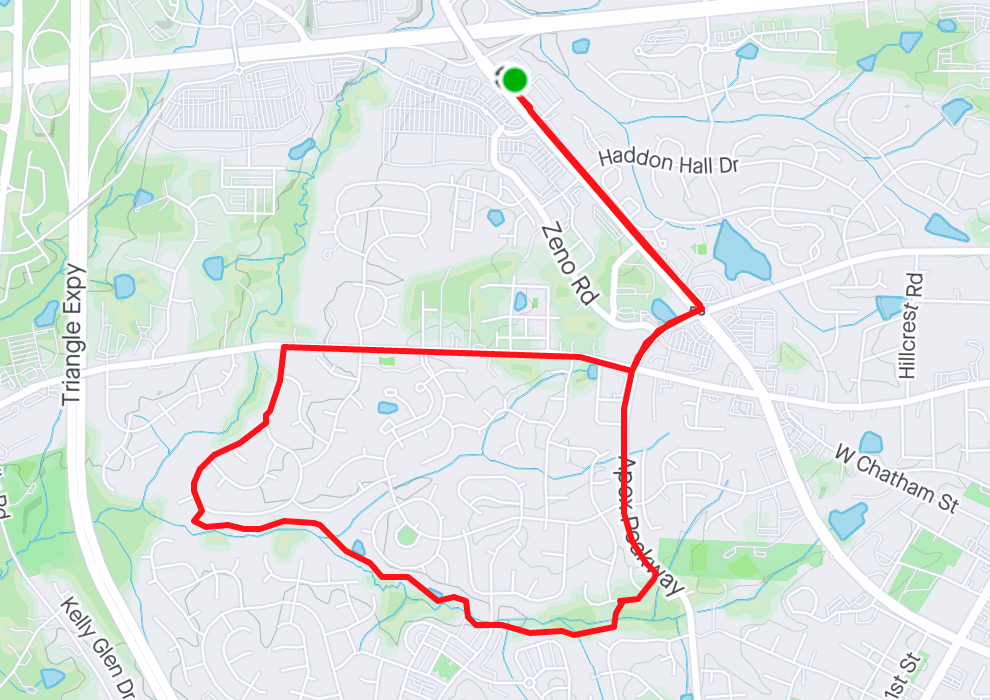

YHC first posted at F3 on March 6 2020 at Gran Torino, EH'd by good buddy Torpedo. Fast forward to 2022 as mask mandates are easing and the weather is getting warmer, it felt like a perfect time to challenge myself and Q all week. The idea of a "Decades" music themed series of workouts has been in my mind for awhile, so I grabbed slots on each day. Inspired by the "8 pack" box in the Carpex Challenge, I reached out to Sooey for interest in a "Super Slowzy" to ease into the week. Confirmed, preblasted, created a 5mi route, and found some big band tunes to get us going.

One wrinkle: Banjo had preblasted an EPIC AO TOUR - running through all 30 official Carpex sites. I really wanted to join him for this and timing looked promising to catch them at my home AO of Full Throttle. Thought the runners could use some refuel, I grabbed some bananas, water, etc and made a "refuel" sign for the SUV. Seeing the timestamp on AO selfies and calculating time to get to Slowzy start, called an audible and moved up to Gran Torino. Runners seemed appreciative and was great seeing Gump join the crew too.

Banjo AO Tour: Gran Torino stop

  
On the way to Starbucks start location, saw Geek Squad pull out in front of me and wave -- knew I'd at least have some company. Rolled in at 6:59 to see some traditional Slowzy runners; no Sooey though. Recalled I had messaged out a start time of 705-710 to give me time to get from GT, so we waited a few minutes - and sure enough he joined us.

I deliberately had planned a different (and shorter) route to get some time on a greenway. Little did I know we'd end up getting a full "Hollywood PAX Tour" with Sooey listing off dozens of F3 guys' homes we ran by. We called out to Snooki's M and their dog - she seemed confused and did not respond.

It was fantastic to be outdoors, away from the hustle and bustle, and get some solid time with Geek Squad, Sooey, and Deuce. This pace allows for great mumblechatter, and I really enjoyed the 20's/30's 'big band' soundtrack.

Slowzy 5.2 mi route

Joined some of the rest of the Sunday crowd (Hi-Liter, Shut-In, PBX, Rooney, Red Ryder) briefly, grabbed a coffee for the M, and headed home to get to church. Fantastic way to start the week!

Decades Week continues tomorrow at Measure Twice with a Fabulous 50's theme.

Playlist (on shuffle):

https://open.spotify.com/playlist/6Kns1PUPmjXB21m4a66Tje
