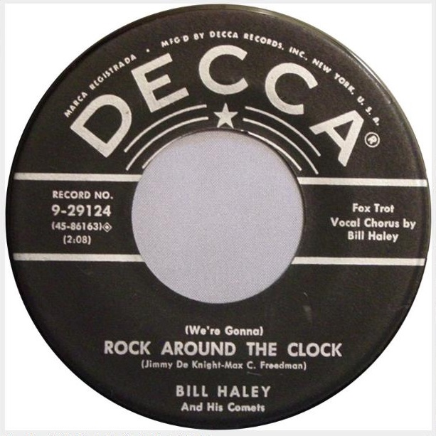
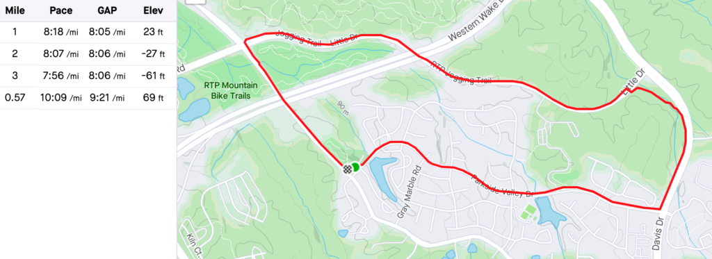
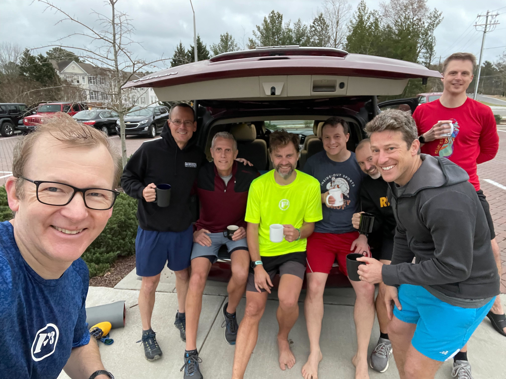

Day Two -- and the first "official" AO day. As a new site Q for Measure Twice, felt like a perfect setting to continue the week. The site moved from the original Carpenter Park location (hence the AO name) to Northwest Park, technically in Morrisville. This is primarily due to access to RTP Trails, which normally would have fallen on this day. After some pre-blasting to the regulars to ensure no mutiny, YHC decided to stick to the regular paved loop. This was in abundance of safety as I was concerned playing music would be a distraction. Also the Strava art is a bit like a waving flag, so there's that.

## Thang 1: Run

Solid PAX attendance - 7 runners plus Banjo as a walker recovery after his AO tour. Geek Squad blinded us in a hot pink shirt and quickly earned the moniker Beacon of Color. Possible future FNG name "Beacon." Ma Bell was grinning from ear to ear for the warm weather. Sadly no Peaches after his HC, no FNGs and no flag, so quick disclaimer and off we go to "Rock Around the Clock." Pierogi set a blistering pace ahead of us which pushed us to the sub 8 minute mile, or maybe it was the novelty of the 50's tunes that got us going.

Favorite tunes on the run included Yakity Yak and the original version of Jump, Jive, An' Wail. Sky Blue mentally added a few to his playlist, although I don't know how he can run any faster. Pivot also commented on the duration of the songs...I'll leave it at that. Posting splits below which are some of the fastest for YHC at MT. Great to be accelerating after 1 year ago I was heading towards surgery for a torn meniscus.  
  
Stole a page from Banjo's playbook by calling a backwards run up the hill. Shows 69' elevation but felt like much more. Got about halfway before having to modify, which is better than last time. New personal goal: Make it the entire hill by EOY.

## Thang 2: Broga

Yoga has always been a bit intimidating for me, even though I consider MT my primary AO. I am terribly inflexible and self-conscious, and I know some guys like Banjo really want to hit certain muscle groups. In preparation I went back to my text message notes with a yoga instructor buddy of mine who had coached me for my VQ. However, I ended up just winging it a bit with progressive rounds of versions of sun salutations / runner's stretch / warrior. Extended pigeon, butterfly, child's pose, and some other things thrown in. Was thinking I had a few min to go when I got the hook from Torpedo -- and finished right on time.

COT included prayers for Banjo's and YHC's dads, for peace in the world and others I'm forgetting.

Trunk coffeeteria was fantastic. Pierogi challenged us with the NPR Sunday Puzzle on what word starts with "kw" sound but doesn't have Q, U, W, K....Torpedo says COIF; later I came up with CHOIR. Great morning with these HIMs.

100% Trunk Coffeeteria

Playlist:

https://open.spotify.com/playlist/2Fnl0D8PG1T9HrExCSUNrM?si=453a6bc281764a82
