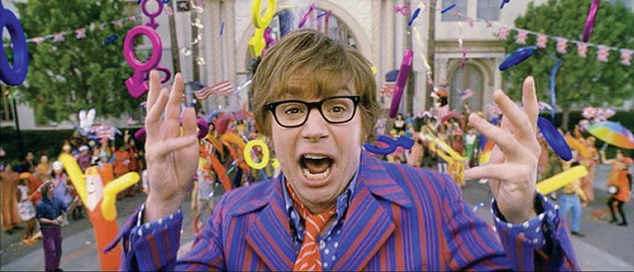
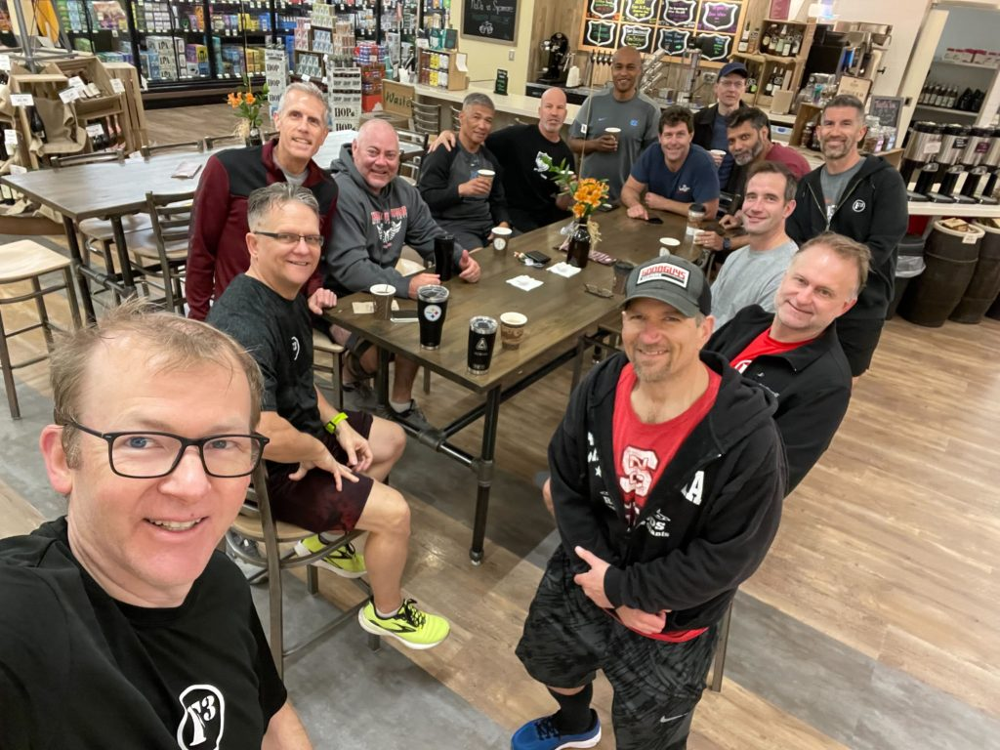

  
YHC's anniversary tour continues at Field of Dreams. Theme today is '60's. Fantastic playlist in queue plus this is usually a well-attended AO, so especially excited for this one and arrived 30 min early to reacquaint myself to the site.

Overflow had his earbuds in expecting a solo EC - he ended up joining YHC along with Sunshine and PBX for a couple miles - great mumblechatter as to be expected with 75% Steves. Lots of construction going on...tax dollars at work. Overflow apparently did not get his name from over filling a glass as as a bartender. PBX needs a sticker like OBX, and Sunshine is a morning person.  
  
ME: Group up, pledge, mission/disclaimer. No FNG's.  Bring out a basketball to pass around as we mosey up to the Austin Powers theme song to high parking lot while mall walkers head off.  

## Warmup

Good mornings to "Hear Comes the Sun," windmills, IW, merkins, and ~50 SSH's until "Paint it Black" ends. Little did PAX know that soundtrack would be a preview of future teams. Mosey back through lots to basketball court. Camp Gladiator has a larger speaker but crappier music.  

## Thang 1: 60's Music Trivia

Break up into 2 groups: Beatles vs Rolling Stones.  One PAX from each faces off at halfcourt for Name that Tune.  Winning team runs large pickle while losing team does burpees AMRAP.   Some PAX need to rewatch Forrest Gump.  Pom Pom crushes it until Term Paper blows us away knowing Wild Thing in half a second.  Modified from burpees to some other exercies as well. Geek Squad doubles down for the billion points and Beatles come out victorious.  Still unclear if Trike interfered with the game. Mall walkers seemed confused.

## Thang 2: Ring of Fire

Mosey to soccer field for Ring of Fire...while listening to Ring of Fire by Johnny Cash. Was especially excited for this one. In a circle, plank hold while PAX do single merkin in sequence, then repeato to 2, 3, 4.  Finished with Fire by Jimi and some Freddy Merc's at the flag as a preview for tomorrow.

## COT

Lots of announcements.  YHC accidentally let the cat out of the bag about a Carpex "Scary takeover." Term Paper looked scared, Franklin gave YHC the "SHADDUP! It's a surprise!" look, and S.Cary slack apparently blew up later.  

Prayers for TP's daughter, Banjo's dad, Ukraine, peace, and much more.  Praises for a glorious morning and an opportunity to humbly lead such fine HIMs.  MIAGD!

Strong crew for coffeeteria afterwards:

Today's Playlist:

https://open.spotify.com/playlist/6SoQz3HSzCvdZ15P3IwI7L?si=f3ff32396c694bd0
